## Глава 1

## Метод координат

## 1.1 Величина направленного отрезка. Теорема Шаля. Декартова система координат на прямой.

- Отрезком называется часть прямой, ограниченная двумя точками. Отрезок называется направленным, если указано, какая из граничных точек является начальной и какая конечной (Обозначения: $\overline{A B}$ - направленный отрезок; $|\overline{A B}|$ - длина направленного отрезка).
- Отрезок называется нулевым, если его начальная и конечная точки совпадают.

Длина нулевого направленного отрезка равна нулю.

- Прямая линия с указанным на ней направлением называется осъю.
- Пусть дана некоторая ось $\Delta$, и на ней расположен направленный отрезок $\overline{A B}$, величиной которого на оси $\Delta$ называется число, равное:
$$
A B=\left\{\begin{array}{l}
|\overline{A B}|, \overline{A B} \uparrow \uparrow \Delta, \\
-|\overline{A B}|, \overline{A B} \uparrow \downarrow \Delta ;
\end{array}\right.
$$

Свойства величины направленного отрезка:

1. Величина $A B$ противоположна величине $B A$.
2. Длина $|\overline{A B}|$ равна модулю величин $A B$.

Теорема Шаля. При любом расположении трех точек $A, B$ и $C$ на оси справедливо равенство $A B+B C=A C$.
-

1. Пусть точка $B$ лежит между точками $A$ и $C$, тогда направленные отрезки $\overline{A B}, \overline{B C}$ и $\overline{A C}$ сонаправлены. При этом $|\overline{A B}|+|\overline{B C}|=|\overline{A C}|$.
    (а) Если направляющие оси совпадают с направлениями отрезков, то $|\overline{A B}|=A B,|\overline{B C}|=$ $B C,|\overline{A C}|=A C$. Следовательно, $A B+B C=A C$.
    (b) Если направляющие оси не совпадают с направлениями отрезков, то $|\overline{A B}|=$ $-A B,|\overline{B C}|=-B C,|\overline{A C}|=-A C$. Следовательно, $-A B+-B C=-A C \Rightarrow$ $A B+B C=A C$.

2. Если точка $C$ лежит между точками $A$ и $B$, то, по доказанному выше, $A C+C B=$ $A B \Rightarrow A C=A B-C B=A B+B C$.
3. Если точка $A$ лежит между точками $B$ и $C$, то $B A+A C=B C \Rightarrow A C=-B A+B C=$ $A B+B C$.

Теорема остается справедливой, даже если некоторые точки совпадают. $\square$

Пусть на прямой $\Delta$ дана точка $O$, заданы единица масштаба и определенное направление.

- Говорят, что на прямой $\Delta$ задана декартовая система координат. При этом ось △ называется координатной осъю, а точка $O$ - началом координат.

Пусть точка $A$ - некоторая фиксированная точка на прямой $\Delta$.

- Координатой точки $A$ называется число, равное величине $O A$ направленного отрезка $\overline{O A}$. Обозначение: $X_{A}$.

Точки, расположенные по одну сторону от начала координат, имеют одинаковые по знаку координаты. Полуось, на которой все точки имеют положительные координаты, называют положительной полуосью. Аналогично с отрицательной полуосью.

Теорема. Для любых двух точек $A$ и $B$ на $\Delta$ выполняется: $A B=X_{B}-X_{A},|\overline{A B}|=$ $\left|X_{B}-X_{A}\right|$

- Рассмотрим величину направленного отрезка $\overline{A B}$. Тогда, по теореме Шаля, $A B=$ $A O+O B=O B-O A=X_{B}-X_{A}$ $\square$

Пусть на оси $\Delta$ заданы 2 различные точки: $A$ с координатой $X_{A}$ и $B$ с координатой $X_{B}$.

- Говорят, что точка $C$ делит направленный отрезок $A B$ в отношении $\lambda$, если $\lambda=\frac{A C}{C B}$. При этом число $\lambda$ называется простым отношением трех точек $A, C, B$.
1. Если точка $C$ лежит между точками $A$ и $B$, то направляющие отрезки $A C$ и $C B$ сонаправлены. Следовательно, знак у них одинаковый и $\lambda>0$. При этом говорят, что точка $C$ делит направленный отрезок $A B$ внутренним образом.
2. Если точка $C$ лежит вне отрезка $A B$, то говорят, что она делит отрезок $A B$ внешним образом. При этом отрезки $A C$ и $C B$ противоположно направлены (не сонаправлены) и, следовательно, $\lambda<0$.
3. Если $\lambda=0$, то $A C=0$, следовательно, $|\overline{A C}|=0$ и точки $A$ и $C$ совпадают.
4. Если точка $C$ лежит за концом отрезка $A B$, то $\left|\frac{A C}{C B}\right|=\frac{|A C|}{|C B|}=\frac{|\overline{A C}|}{|\overline{C B}|}<1 \Rightarrow \lambda<$ $-1(|\overline{A C}|>|\overline{B C}|)$.
5. Если точка $C$ лежит перед началом отрезка $A B$, то $|\overline{A C}|<|\overline{B C}|$, тогда $-1<\lambda<0$.

Заметим, что $\lambda \neq-1$, так как в этом случае $-1=\frac{A C}{C B}$. Следовательно, $A C=-C B \Rightarrow$ $A C=C B \Rightarrow A$ и $B$ совпадают, что противоречит выбору $A$ и $B$.

Теорема. Координата точки $C$, делящей направленный отрезок $A B$ в отношении $\lambda$ равна

$$
X_{C}=\frac{X_{A}+\lambda X_{B}}{1+\lambda}
$$

- Из определения деления отрезка в данном отношении следует:

$$
\begin{aligned}
& \lambda=\frac{A C}{C B}=\frac{X_{C}-X_{A}}{X_{B}-X_{C}} \Rightarrow\left(X_{B}-X_{C}\right) \cdot \lambda=X_{C}-X_{A} \Rightarrow \lambda X_{B}+X_{A}=X_{C}+\lambda X_{C}=X_{C}(1+\lambda) \Rightarrow \\
& X_{C}=\frac{X_{A}+\lambda X_{B}}{1+\lambda}
\end{aligned}
$$

## 1.2 Декартова прямоугольная система координат на плоскости, в пространстве (ДПСК).

- Декартовой прямоугольной системой координат на плоскости называются две взаимно перпендикулярные координатные оси с общим началом координат. Осъ Ох называется осъю абсцисс, Оу - осъю ординат.
- Система координат называется правой, если кратчайший поворот от оси $X$ к оси $Y$ против часовой стрелки, иначе левой.

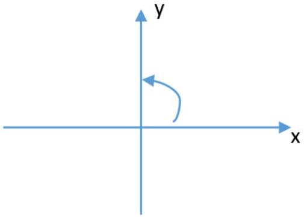
Правая ДПСК

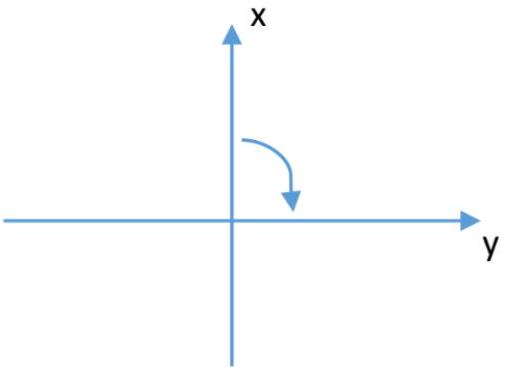
Левая ДПСК

Пусть $M$ - некоторая точка плоскости, $M_{x}$ и $M_{y}$ - проекции на оси $O x$ и $O y$ соответственно.

- Декартовыми прямоугольными координатами точки $M\left(X_{M}, Y_{M}\right)$ называются величины направленных отрезков $\overline{O M_{x}}$ и $\overline{O M_{y}}$ на координатных осях, то есть $X_{M}=$ $O M_{x}, Y_{M}=O M_{y}$.

Пусть $A\left(X_{A}, Y_{A}\right)$ и $B\left(X_{B}, Y_{B}\right)$ - две различные точки на плоскости.
Теорема. Длина направленного отрезка $\overline{A B}$ равна:

$$
|\overline{A B}|=\sqrt{\left(X_{A}-X_{B}\right)^{2}+\left(Y_{A}-Y_{B}\right)^{2}}
$$

- Построим проекции точек $A$ и $B$ на координатные оси. Обозначим через $C$ точку пересечения проекций.
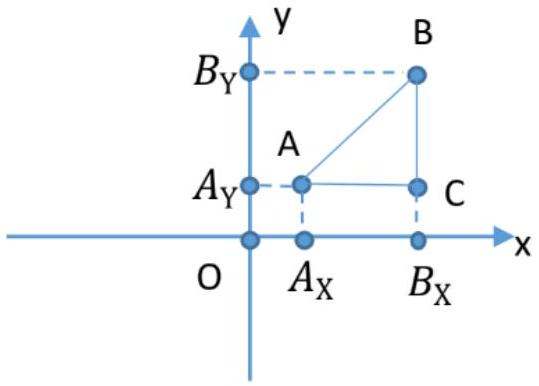
По теореме Пифагора $|A B|^{2}=|A C|^{2}+|B C|^{2}$. Тогда $|\overline{A B}|=\sqrt{\left|\overline{A_{x} B_{x}}\right|^{2}+\left|\overline{A_{y} B_{y}}\right|^{2}}=$ $=\sqrt{\left(X_{A}-X_{B}\right)^{2}+\left(Y_{A}-Y_{B}\right)^{2}}$.

Рассмотрим случай, когда отрезок $A B$ параллелен $O x$ (или $A B$ параллелен $O y$ ). Тогда $Y_{A}=Y_{B}$ и $\sqrt{\left(X_{A}-X_{B}\right)^{2}+\underbrace{\left(Y_{A}-Y_{B}\right)^{2}}_{=0}}=\left|X_{A}-X_{B}\right|=|\overline{A B}|=\left|\overline{A_{x} B_{x}}\right|$. $\square$

Проведем через точки $A$ и $B$ некоторую ось. Тогда имеет смысл понятие «деление отрезка в данном отношении».

Теорема. Координаты точки $C$, делящей $\overline{A B}$ в отношении $\lambda$, равны:

$$
X_{C}=\frac{X_{A}+\lambda X_{B}}{1+\lambda}, \quad Y_{C}=\frac{Y_{A}+\lambda Y_{B}}{1+\lambda}
$$

- Построим проекции точек $A, B$ и $C$ на ось $O x$. Заметим, что при любом расположении точки $C$ точка $C_{x}$ будет иметь такой же характер расположения, как и точка $C$ (если $C$ лежит между $A$ и $B$, то и $C_{x}$ будет лежать между $A_{x}$ и $B_{x}$ ). Следовательно, $\frac{|\overline{A C}|}{|\overline{C B}|}$ и $\frac{\overline{A_{x} C_{x}}}{\overline{C_{x} B_{x}}}$ имеют один знак.

По теореме Фалеса длина $\frac{\left|\overline{A_{x} C_{x}}\right|}{\left|\overline{C_{x} B_{x}}\right|}=\frac{|\overline{A C}|}{|\overline{C B}|} \Rightarrow\left|\frac{A_{x} C_{x}}{C_{x} B_{x}}\right|=\left|\frac{A C}{C B}\right|$. Следовательно, $\frac{A_{x} C_{x}}{C_{x} B_{x}}=$ $\frac{A C}{C B}=\lambda$ и точка $C_{x}$ делит направленный отрезок $\overline{A_{x} B_{x}}$ также в отношении $\lambda$. Следовательно, $X_{C}=\frac{X_{A}+\lambda X_{B}}{1+\lambda}$.

Для ординаты точки $C$ равенство доказывается аналогично при рассмотрении случая, когда прямая $A B$ параллельна одной из осей. $\square$

- ДПСК в пространстве образуют три взаимно перпендикулярные координатные оси с общим началом координат. Треться осъ $O z$ называется осъю аппликатой.
- Система координат называется правой, если, глядя со стороны направления Oz, кратчайший поворот от оси $O x$ к оси Оу осуществляется против часовой стрелки, иначе - левой.

Пусть $A\left(X_{A}, Y_{A}, Z_{A}\right)$ и $B\left(X_{B}, Y_{B}, Z_{B}\right)$ - две различные точки пространства. Тогда

1. $|\overline{A B}|=\sqrt{\left(X_{A}-X_{B}\right)^{2}+\left(Y_{A}-Y_{B}\right)^{2}+\left(Z_{A}-Z_{B}\right)^{2}}$
2. Если $C$ делит $\overline{A B}$ в отношении $\lambda$, то
$$
X_{C}=\frac{X_{A}+\lambda X_{B}}{1+\lambda}, Y_{C}=\frac{Y_{A}+\lambda Y_{B}}{1+\lambda}, Z_{C}=\frac{Z_{A}+\lambda Z_{B}}{1+\lambda} .
$$

## 1.3 Полярные, цилиндрические и сферические координаты. Общая декартова система координат.

- Полярную систему координат образуют точка, выходящий из неё луч и единичный отрезок. При этом точка $O$ называется полюсом, а луч $O x$ - полярной осъю.
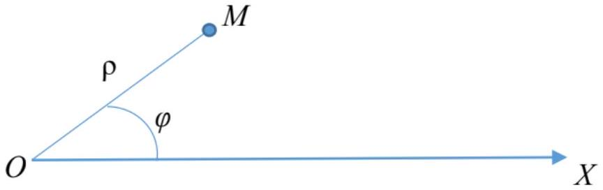
Пусть $M$ - произвольная точка плоскости.
- Полярными координатами точки $M$ называются два числа $\rho, \varphi$, где $\rho$ - длина $O M(\rho=|\overline{O M}|)$, а угол $\varphi$ равен углу, на который необходимо повернуть полярную ось вокруг точки $O$ против часовой стрелки до совмещения ее с отрезком $O M$.
- Число $\rho$ называется полярным радиусом точки. Число $\varphi$ - полярным углом точки.

Заметим, что $\rho \geqslant 0$, а $\varphi$ определён с точностью до $2 \pi k$, где $k \in \mathbb{Z}$. Точка $O$ имеет $\rho=0$, а $\varphi$ для неё не определён (ему можно приписать любое направление).

Значение $\varphi$, принадлежащее $[0 ; 2 \pi)$, называется главным значением $\varphi$.
Полярной осью называют точку и выходящий из неё луч.
Покажем связь между декартовой и полярной системами координат.
Расположим ДПСК и ПСК следующим образом: полюс поместим в начало координат, а полярную ось совместим с положительной полуосью $O x$. Расположенные таким образом ДПСК и ПСК называют соответствующими друг другу.
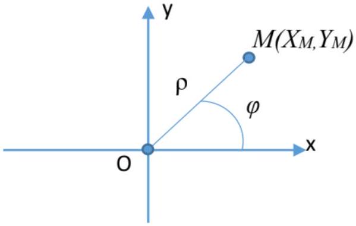
Пусть $M$ произвольная точка плоскости. Тогда полярные координаты точки $M$ равны:
$X_{M}=O M_{x}=|O M| \cdot \cos \varphi=\rho \cdot \cos \varphi$,
$Y_{M}=O M_{y}=|O M| \cdot \sin \varphi=\rho \cdot \sin \varphi$, где $\rho=\sqrt{X_{M}^{2}+Y_{M}^{2}}$, а угол $\varphi$ можно найти, решив следующую систему: $\left\{\begin{array}{l}\cos \varphi=\frac{X_{M}}{\rho}=\frac{X_{M}}{\sqrt{X_{M}^{2}+Y_{M}^{2}}}, \\ \sin \varphi=\frac{Y_{M}}{\rho}=\frac{Y_{M}}{\sqrt{X_{M}^{2}+Y_{M}^{2}}} ;\end{array}\right.$

Цилиндрическая и сферическая системы координат в пространстве вводятся следующим образом: в пространстве зафиксируем некоторую плоскость П. Построим на ней полярную систему координат, а так же координатную ось $O z$ с началом в точке $O$ и перпендикулярную плоскости П.
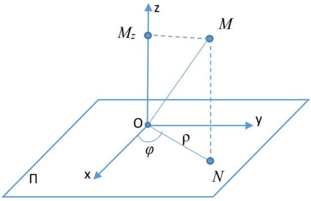
И пусть точка $M$ - произвольная точка пространства, а точка $N$ - её проекция на плоскость П.

- Цилиндрическими координатами точки $M$ называются числа $\rho, \varphi, z$, где $\rho$ и $\varphi$ - полярные координаты точки $N$ относительно построенной полярной системы координат, а $z$ - величина направленного отрезка $\overline{O M_{z}}\left(z=O M_{z}\right)$.
- Сферическими координатами точки $M$ называются три числа $\rho, \varphi, \Theta$, где $\rho$ - длина отрезка $|\overline{O M}|, \varphi$ - полярный радиус точки $N$ относительно построенной полярной системы координат, $a \Theta$ - угол между направленным отрезком $\overline{O M}$ и осъю $O z$.

Из определений следует, что $\rho \geqslant 0$ и для цилиндрических, и для сферических координат, $\Theta \in[0 ; \pi]$, а $\varphi$ определён с точностью до $2 \pi n, n \in \mathbb{Z}$.

Построим в пространстве ДПСК следующим образом: начало координат совпадает с точкой $O$, ось $O z$ совместим с построенной ранее осью $O z$, а положительное направление оси $O x$ - с полярной осью.
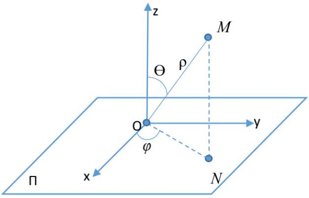
Тогда точка $M$ имеет следующие координаты в системах:

$$
\text { цилиндрическая: }\left\{\begin{array} { l } 
{ X _ { M } = \rho \cdot \operatorname { c o s } \varphi , } \\
{ Y _ { M } = \rho \cdot \operatorname { s i n } \varphi , } \\
{ Z _ { M } = z ; }
\end{array} \quad \text { сферическая: } \left\{\begin{array}{l}
X_{M}=\rho \cdot \cos \varphi \cdot \sin \Theta, \\
Y_{M}=\rho \cdot \sin \varphi \cdot \sin \Theta, \\
Z_{M}=\rho \cdot \cos \Theta .
\end{array}\right.\right.
$$

- Общую декартову систему координат (абфинную систему координат) на плоскости образуют две пересекающие координатные оси с общим началом координат.

Пусть точка $M$ - произвольная точка плоскости. Построим через точку $M$ прямые, параллельные координатным осям.
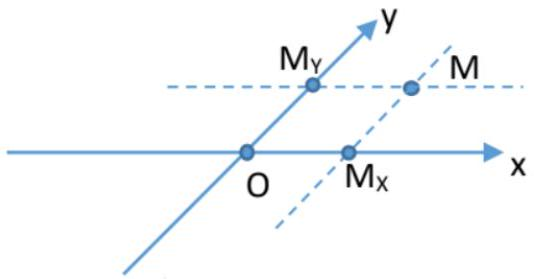

- Общими декартовыми координатами точки $M$ называются величины направленных отрезков $\overline{O M_{x}}$ и $\overline{O M_{y}}$.

## Глава 2

## Векторы

## 2.1 Понятие вектора. Линейные операции над векторами.

- Вектором называется множество всех одинаково направленных отрезков равной длины. Обозначение: $a, b, c$ или $\vec{a}, \vec{b}, \vec{c}$.

Пусть $\overline{A B}$ - направленный отрезок. Тогда существует единственный вектор, которому принадлежит этот отрезок. То есть любой направленный отрезок $\overline{A B}$ однозначно определяет вектор, который обозначается как $\overrightarrow{A B}$.

Пусть заданы вектор $\vec{a}$ и некоторая точка $A$. Тогда существует единственная точка $B$, такая, что $a=\overrightarrow{A B}$.

- Операция построения такой точки $B$ называется откладыванием вектора $\vec{a}$ от точки $A$.
- Длиной вектора $\vec{a}$ называется длина любого из направленных отрезков среди его образующих. Обозначение: $|\vec{a}|$.
- Вектор длины 0 называется нулевым. Обозначение: $\overrightarrow{0}$. Вектор длины 1 называется единичным или ортом.
- Векторы называются коллинеарными, если образующие их отрезки параллельны некоторой прямой.
- Векторы называются компланарными, если образующие их отрезки параллельны некоторой плоскости.

Заметим, что нулевой вектор и коллинеарен любому вектору, и компланарен любым двум другим векторам.

Пусть $a$ и $b-2$ ненулевых вектора, отложенных от некоторой точки $O$. То есть найдём такие точки $A$, и $B$, что $a=\overrightarrow{O A}, b=\overrightarrow{O B}$.

- Углом между векторами $a$ и $b$ называертся угол между направленными отрезками $\overline{O A}$ и $\overline{O B}$.
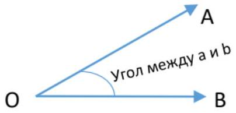
Из определения следует, что угол между двумя векторами $\in[0 ; \pi]$.
Линейные операции над векторами:

- сложение;
- умножение на число.

Пусть $a$ и $b$ - два вектора. Возьмем некоторую точку $O$ и отложим от нее вектор $a=\overrightarrow{O A}$. Затем от точки $A$ отложим вектор $b=\overrightarrow{A B}$.
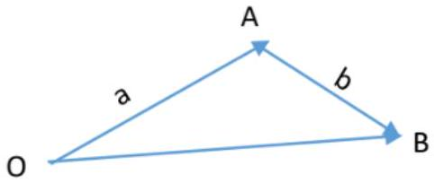

- Суммой векторов $a$ и $b$ будет называться вектор $\overrightarrow{O B}$. Обозначение: $a+b$.
- Произведением вектора а на действительное число $A$ называется вектор, длина которого равна $|A| \cdot|a|$, а направление совпадает с направлением вектора $a$, если $A>0$, и противоположно направлению вектора $a$, если $A<0$. Обозначение: $A \cdot a$.

Свойства линейных операций:

1. $a+b=b+a$.

- Пусть $a=\overrightarrow{O A}, b=\overrightarrow{A B}$. На направленных отрезках $\overline{O A}$ и $\overline{A B}$ построим параллелограмм $O A B C$.
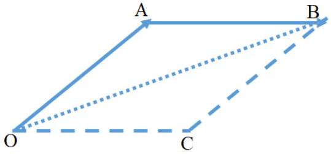
Заметим, что векторы $\overrightarrow{C B}$ и $\overrightarrow{O A}$ сонаправлены и $|\overrightarrow{C B}|=|\overrightarrow{O A}|$. Следовательно, $\overrightarrow{C B}=\overrightarrow{O A}=a$. Путем аналогичных рассуждений получим $\overrightarrow{O C}=\overrightarrow{A B}=b$.
По определению суммы векторов, вектор $\overrightarrow{O B}$ можно, с одной стороны, рассматривать как сумму векторов $\overrightarrow{O A}+\overrightarrow{A B}$, а с другой стороны, как сумму $\overrightarrow{O C}+\overrightarrow{C B}$. Следовательно, $\overrightarrow{O B}=\left\{\begin{array}{l}\overrightarrow{O A}+\overrightarrow{A B}=a+b, \\ \overrightarrow{O C}+\overrightarrow{C B}=\overrightarrow{A B}+\overrightarrow{O A}=b+a ;\end{array} \quad \Rightarrow a+b=b+a\right.$. $\square$

2. $(a+b)+c=a+(b+c)$.
3. $\vec{a}+\overrightarrow{0}=\vec{a}, \quad \forall \vec{a}$.

4. $\alpha(a+b)=\alpha a+\alpha b$,
$(\alpha+\beta) a=\alpha a+\beta a$,
$\alpha(\beta a)=(\alpha \beta) a$, где $a, b$ - векторы, $\alpha, \beta$ - числа.
- Вектор $b$ называется противоположным вектору $a$, если его длина совпадает с длиной вектора $a$, а направление противоположно.

Из определения следует, что

1. $-1 \cdot a=-a$, где вектор $(-a)$ - противоположный вектору $a$;
2. $1 \cdot a=a$.
- Разностью векторов $a$ и $b$ называется вектор, прибавив который $\kappa$ вектору $b$, получим вектор $a$, то есть вектор $c=a-b$, где $c+b=a$.

Правило вычитания: Чтобы из вектора а вычесть вектор $b$, необходимо $\kappa$ вектору а прибавить вектор, противоположный вектору $b$, то есть $a-b=a+(-b)$.

- $(a+(-b))+b=a+(b+(-b))=a+\overrightarrow{0}=a$.

## 2.2 Координаты вектора.

Пусть $a_{1}, \ldots, a_{k}$ - произвольная система векторов. $\alpha_{1}, \ldots, \alpha_{k}$ - некоторые действительные числа.

- Вектор $\alpha_{1} a_{1}+\ldots+\alpha_{k} a_{k}$ называется линейной комбинацией векторов $a_{1}, \ldots, a_{k} c$ коэффициентами $\alpha_{1}, \ldots, \alpha_{k}$.

Если вектор представлен в виде линейной комбинации системы векторов (то есть $b=$ $\alpha_{1} a_{1}+\ldots+\alpha_{k} a_{k}$ ), то говорят, что данный вектор разложим по этим векторам системы.

- Базисом на прямой называется любой ненулевой вектор, параллельный этой прямой.
- Базисом на плоскости называется упорядоченная пара неколлинеарных векторов.
- Базисом в пространстве называется упорядоченная тройка некомпланарных векторов.

Нулевой вектор не может быть элементом базиса.
Теорема.

1. Любой вектор, параллельный прямой, может быть единственным образом разложен по базису этой прямой.
2. Любой вектор, параллельный плоскости, может быть единственным образом разложен по базису на этой плоскости.
3. Любой вектор в пространстве может быть единственным образом по базису в пространстве.
