## Глава 1

## Метод координат

## 1.1 Величина направленного отрезка. Теорема Шаля. Декартова система координат на прямой.

∙ Отрезком называется часть прямой, ограниченная двумя точками. Отрезок назы- вается направленным, если указано, какая из граничных точек является начальной и какая конечной (Обозначения: 𝐴𝐵 – направленный отрезок; $| \overline { { A B } } | ~ - ~ \partial \lambda u \varkappa a$ направленного отрезка).

∙ Отрезок называется нулевым, если его начальная и конечная точки совпадают.

Длина нулевого направленного отрезка равна нулю.

∙ Прямая линия с указанным на ней направлением называется осью.

∙ Пусть дана некоторая ось $\Delta ,$ и на ней расположен направленный отрезок $\overline { { A B } }$ , ве- личиной которого на оси $\Delta$ называется число, равное:

$$
A B = \left\{ { \begin{array} { l l } { { \displaystyle | { \overline { { A } } } { \overline { { B } } } | , \ { \overline { { A } } } { \overline { { B } } } \uparrow \uparrow \Delta , } } \\ { { - | { \overline { { A } } } { \overline { { B } } } | , \ { \overline { { A } } } { \overline { { B } } } \uparrow \downarrow \Delta ; } } \end{array} } \right.
$$

Свойства величины направленного отрезка:

1. Величина 𝐴𝐵 противоположна величине 𝐵𝐴.

2. Длина $| { \overline { { A B } } } |$ равна модулю величин 𝐴𝐵.

Теорема Шаля. При любом расположении трех точек $A _ { i }$ , 𝐵 и $C$ на оси справедливо равенство $A B + B C = A C$

1. Пусть точка 𝐵 лежит между точками 𝐴 и $C ,$ тогда направленные отрезки ${ \overline { { A B } } } , { \overline { { B C } } }$ и $\overline { { A C } }$ сонаправлены. При этом $| { \overline { { A B } } } | + | { \overline { { B C } } } | = | { \overline { { A C } } } |$

(a) Если направляющие оси совпадают с направлениями отрезков, то $| { \overline { { A B } } } | = A B , | { \overline { { B C } } } | =$ $B C , \ | { \overline { { A C } } } | = A C$ . Следовательно, $A B + B C = A C$

(b) Если направляющие оси не совпадают с направлениями отрезков, то $| { \overline { { A B } } } | =$ $- A B , \ | \overline { { B C } } | = - B C , \ | \overline { { A C } } | = - A C$ . Следовательно, $- A B + - B C = - A C \Rightarrow$ $A B + B C = A C$

2. Если точка $C$ лежит между точками 𝐴 и $B ,$ то, по доказанному выше, $A C + C B =$ $A B \Rightarrow A C = A B - C B = A B + B C .$

3. Если точка 𝐴 лежит между точками 𝐵 и 𝐶, то $B A + A C = B C \Rightarrow A C = - B A + B C =$ $A B + B C$

Теорема остается справедливой, даже если некоторые точки совпадают.

Пусть на прямой $\Delta$ дана точка 𝑂, заданы единица масштаба и определенное направление.

∙ Говорят, что на прямой $\Delta$ задана декартовая система координат. При этом ось $\Delta$ называется координатной осью, а точка 𝑂 – началом координат.

Пусть точка 𝐴 — некоторая фиксированная точка на прямой $\Delta$

∙ Координатой точки 𝐴 называется число, равное величине 𝑂𝐴 направленного от- резка 𝑂𝐴. Обозначение: $X _ { A }$

Точки, расположенные по одну сторону от начала координат, имеют одинаковые по знаку координаты. Полуось, на которой все точки имеют положительные координаты, называют положительной полуосью. Аналогично с отрицательной полуосью.

Теорема. Для любых двух точек 𝐴 и 𝐵 на ∆ выполняется: $A B = X _ { B } - X _ { A } , | { \overline { { A B } } } | =$ $| X _ { B } - X _ { A } |$

♦ Рассмотрим величину направленного отрезка 𝐴𝐵. Тогда, по теореме Шаля, $A B =$ $A O + O B = O B - O A = X _ { B } - X _ { A }$ ⊠

Пусть на оси $\Delta$ заданы 2 различные точки: $A \mathrm { ~ c ~ }$ координатой $X _ { A }$ и 𝐵 с координатой $X _ { B }$

∙ Говорят, что точка 𝐶 делит направленный отрезок 𝐴𝐵 в отношении λ, если $\lambda = { \frac { A C } { C B } }$ При этом число λ называется простым отношением трех точек $A , C , B$

1. Если точка 𝐶 лежит между точками 𝐴 и 𝐵, то направляющие отрезки 𝐴𝐶 и 𝐶𝐵 сонаправлены. Следовательно, знак у них одинаковый и $\lambda > 0$ . При этом говорят, что точка $C$ делит направленный отрезок 𝐴𝐵 внутренним образом.

2. Если точка 𝐶 лежит вне отрезка 𝐴𝐵, то говорят, что она делит отрезок 𝐴𝐵 внешним образом. При этом отрезки 𝐴𝐶 и 𝐶𝐵 противоположно направлены (не сонаправлены) и, следовательно, $\lambda < 0$

3. Если $\lambda = 0 .$ , то $A C = 0$ , следовательно, $| { \overline { { A C } } } | = 0$ и точки 𝐴 и 𝐶 совпадают.

4. Если точка 𝐶 лежит за концом отрезка 𝐴𝐵, $\mathrm { \mathop { T o } } \left| { \frac { A C } { C B } } \right| = { \frac { | A C | } { | C B | } } = { \frac { | { \overline { { A C } } } | } { | { \overline { { C B } } } | } } < 1 \Rightarrow \lambda <$ $- 1 \ ( | \overline { { A C } } | > | \overline { { B C } } | )$

5. Если точка 𝐶 лежит перед началом отрезка 𝐴𝐵, то $| { \overline { { A C } } } | < | { \overline { { B C } } } |$ , тогда $- 1 < \lambda < 0$ Заметим, что $\lambda \neq - 1$ , так как в этом случае $\textstyle - 1 = { \frac { A C } { C B } }$ . Следовательно, $A C = - C B \Rightarrow$ $A C = C B \Rightarrow A$ и 𝐵 совпадают, что противоречит выбору 𝐴 и 𝐵.

Теорема. Координата точки $C _ { i }$ делящей направленный отрезок 𝐴𝐵 в отношении λ рав- на

$$
X _ { C } = \frac { X _ { A } + \lambda X _ { B } } { 1 + \lambda }
$$

♦ Из определения деления отрезка в данном отношении следует:

$$
\begin{array} { r l r } {  { \lambda = \frac { A C } { C B } = \frac { X _ { C } - X _ { A } } { X _ { B } - X _ { C } } \Rightarrow \big ( X _ { B } - X _ { C } \big ) \cdot \lambda = X _ { C } - X _ { A } \Rightarrow \lambda X _ { B } + X _ { A } = X _ { C } + \lambda X _ { C } = X _ { C } ( 1 + \lambda ) \Rightarrow } } \\ & { X _ { C } = \frac { X _ { A } + \lambda X _ { B } } { 1 + \lambda } } & { \infty } \end{array}
$$

## 1.2 Декартова прямоугольная система координат на плос- кости, в пространстве (ДПСК).

∙ Декартовой прямоугольной системой координат на плоскости называются две взаимно перпендикулярные координатные оси с общим началом координат. Ось 𝑂𝑥 называется осью абсцисс, 𝑂𝑦 — осью ординат.

∙ Система координат называется правой, если кратчайший поворот от оси 𝑋 к оси 𝑌 против часовой стрелки, иначе левой.

  
Правая ДПСК

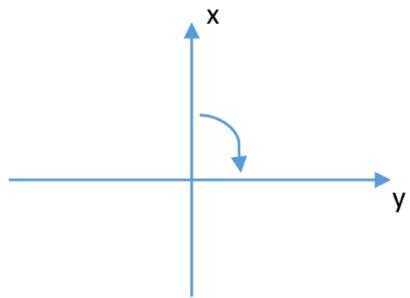  
Левая ДПСК

Пусть 𝑀 — некоторая точка плоскости, $M _ { x }$ и $M _ { y }$ — проекции на оси 𝑂𝑥 и $O y$ соответ- ственно.

∙ Декартовыми прямоугольными координатами точки $M ( X _ { M } , Y _ { M } )$ называются величины направленных отрезков $\overline { { O M _ { x } } } \ u \overline { { O M _ { y } } }$ на координатных осях, то есть $X _ { M } =$ $O M _ { x } , \ Y _ { M } = O M _ { y }$

Пусть $A ( X _ { A } , Y _ { A } )$ и $B ( X _ { B } , Y _ { B } )$ — две различные точки на плоскости.

Теорема. Длина направленного отрезка $\overline { { A B } }$ равна:

$$
| \overline { { { A B } } } | = \sqrt { ( X _ { A } - X _ { B } ) ^ { 2 } + ( Y _ { A } - Y _ { B } ) ^ { 2 } }
$$

♦ Построим проекции точек 𝐴 и 𝐵 на координатные оси. Обозначим через 𝐶 точку пере- сечения проекций.

По теореме Пифагора $| A B | ^ { 2 } = | A C | ^ { 2 } + | B C | ^ { 2 }$ . Тогда $| \overline { { A B } } | = \sqrt { | \overline { { A _ { x } B _ { x } } } | ^ { 2 } + | \overline { { A _ { y } B _ { y } } } | ^ { 2 } } =$ $= { \sqrt { ( X _ { A } - X _ { B } ) ^ { 2 } + ( Y _ { A } - Y _ { B } ) ^ { 2 } } } .$

Рассмотрим случай, когда отрезок $A B$ параллелен 𝑂𝑥 (или 𝐴𝐵 параллелен $O y )$ . Тогда $Y _ { A } = Y _ { B } \textrm { n } \sqrt { ( X _ { A } - X _ { B } ) ^ { 2 } + \underbrace { ( Y _ { A } - Y _ { B } ) ^ { 2 } } _ { = 0 } } = | X _ { A } - X _ { B } | = | \overline { { A B } } | = | \overline { { A _ { x } B _ { x } } } | .$ ⊠

Проведем через точки 𝐴 и 𝐵 некоторую ось. Тогда имеет смысл понятие «деление от- резка в данном отношении».

Теорема. Координаты точки $C _ { i }$ , делящей $\overline { { A B } }$ в отношении λ, равны:

$$
X _ { C } = \frac { X _ { A } + \lambda X _ { B } } { 1 + \lambda } , ~ Y _ { C } = \frac { Y _ { A } + \lambda Y _ { B } } { 1 + \lambda }
$$

♦ Построим проекции точек 𝐴, 𝐵 и $C$ на ось $O x$ . Заметим, что при любом расположении точки $C$ точка $C _ { x }$ будет иметь такой же характер расположения, как и точка 𝐶 (если 𝐶 лежит между 𝐴 и $B _ { ; }$ , то и $C _ { x }$ будет лежать между $A _ { x }$ и $B _ { x } )$ . Следовательно, $\frac { | \overline { { A C } } | } { | \overline { { C B } } | } \sp { \frac { 1 } { A _ { x } C _ { x } } } \frac { \overline { { A _ { x } C _ { x } } } } { \overline { { C _ { x } B _ { x } } } }$ имеют один знак.

По теореме Фалеса длина ${ \frac { | { \overline { { A _ { x } C _ { x } } } } | } { | { \overline { { C _ { x } B _ { x } } } } | } } = { \frac { | { \overline { { A C } } } | } { | { \overline { { C B } } } | } } \Rightarrow \left| { \frac { A _ { x } C _ { x } } { C _ { x } B _ { x } } } \right| = \left| { \frac { A C } { C B } } \right|$ . Следовательно, $\frac { A _ { x } C _ { x } } { C _ { x } B _ { x } } =$ ${ \frac { A C } { C B } } = \lambda$ и точка $C _ { x }$ делит направленный отрезок $\overline { { A _ { x } B _ { x } } }$ также в отношении λ. Следова- тельно, $X _ { C } = \frac { X _ { A } + \lambda X _ { B } } { 1 + \lambda }$

Для ординаты точки 𝐶 равенство доказывается аналогично при рассмотрении случая, $C$ когда прямая 𝐴𝐵 параллельна одной из осей. ⊠

∙ ДПСК в пространстве образуют три взаимно перпендикулярные координатные оси с общим началом координат. Треться ось $O z$ называется осью аппликатой.

∙ Система координат называется правой, если, глядя со стороны направления $O z$ , крат- чайший поворот от оси 𝑂𝑥 к оси 𝑂𝑦 осуществляется против часовой стрелки, иначе — левой.

Пусть $A ( X _ { A } , Y _ { A } , Z _ { A } )$ и $B ( X _ { B } , Y _ { B } , Z _ { B } )$ — две различные точки пространства. Тогда

$$
1 . \ | { \overline { { A B } } } | = { \sqrt { ( X _ { A } - X _ { B } ) ^ { 2 } + ( Y _ { A } - Y _ { B } ) ^ { 2 } + ( Z _ { A } - Z _ { B } ) ^ { 2 } } }
$$

2. Если 𝐶 делит 𝐴𝐵 в отношении $\lambda _ { i }$ то

$$
X _ { C } = \frac { X _ { A } + \lambda X _ { B } } { 1 + \lambda } , Y _ { C } = \frac { Y _ { A } + \lambda Y _ { B } } { 1 + \lambda } , Z _ { C } = \frac { Z _ { A } + \lambda Z _ { B } } { 1 + \lambda } .
$$

## 1.3 Полярные, цилиндрические и сферические коорди- наты. Общая декартова система координат.

∙ Полярную систему координат образуют точка, выходящий из неё луч и единичный отрезок. При этом точка 𝑂 называется полюсом, а луч $O x \mathrm { ~ - ~ }$ полярной осью.

Пусть 𝑀 — произвольная точка плоскости.

∙ Полярными координатами точки 𝑀 называются два числа $\rho , \varphi ,$ где $\rho \mathrm { ~ - ~ } \partial \mathscr { n } u \cdot$ на 𝑂𝑀 $( \rho = | \overline { { O M } } | )$ , а угол φ равен углу, на который необходимо повернуть полярную ось вокруг точки 𝑂 против часовой стрелки до совмещения ее с отрезком 𝑂𝑀.

∙ Число ρ называется полярным радиусом точки. Число φ — полярным углом точ- ки.

Заметим, что $\rho \geqslant 0$ , а φ определён с точностью до $2 \pi k .$ , где $k \in \mathbb { Z }$ . Точка $O$ имеет $\rho = 0 .$ , а φ для неё не определён (ему можно приписать любое направление).

Значение $\varphi ,$ принадлежащее $[ 0 ; 2 \pi )$ , называется главным значением $\boldsymbol { \varphi }$ Полярной осью называют точку и выходящий из неё луч.

Покажем связь между декартовой и полярной системами координат.

Расположим ДПСК и ПСК следующим образом: полюс поместим в начало координат, а полярную ось совместим с положительной полуосью $O x$ . Расположенные таким образом ДПСК и ПСК называют соответствующими друг другу.

Пусть 𝑀 произвольная точка плоскости. Тогда полярные координаты точки 𝑀 равны: $X _ { M } = O M _ { x } = \left| O M \right| \cdot \cos \varphi = \rho \cdot \cos \varphi .$

$Y _ { M } = O M _ { y } = | O M | \cdot \sin \varphi = \rho \cdot \sin \varphi$ , где $\rho = \sqrt { X _ { M } ^ { 2 } + Y _ { M } ^ { 2 } }$ , а угол φ можно найти, решив $\Bigg ( \cos { \varphi } = \frac { X _ { M } } { \rho } = \frac { X _ { M } } { \sqrt { X _ { M } ^ { 2 } + Y _ { M } ^ { 2 } } } ,$   
следующую систему:⎨ $\sin \varphi = \frac { Y _ { M } } { \rho } = \frac { Y _ { M } } { \sqrt { X _ { M } ^ { 2 } + Y _ { M } ^ { 2 } } } ;$

Цилиндрическая и сферическая системы координат в пространстве вводятся следующим образом: в пространстве зафиксируем некоторую плоскость П. Построим на ней полярную систему координат, а так же координатную ось $O z { \mathrm { ~ c ~ } }$ началом в точке $O$ и перпендикуляр- ную плоскости П.

И пусть точка $M$ — произвольная точка пространства, а точка $N - \mathrm { e } \ddot { \mathrm { e } }$ проекция на плос- кость П.

∙ Цилиндрическими координатами точки 𝑀 называются числа $\boldsymbol \rho , \boldsymbol \varphi , z ,$ где ρ и φ — полярные координаты точки 𝑁 относительно построенной полярной системы коор- динат, а 𝑧 — величина направленного отрезка 𝑂𝑀𝑧 $( z = O M _ { z } )$

∙ Сферическими координатами точки 𝑀 называются три числа $\rho , \varphi , \Theta$ , где $\rho \textrm { -- }$ длина отрезка |𝑂𝑀|, φ — полярный радиус точки 𝑁 относительно построенной поляр- ной системы координат, а Θ — угол между направленным отрезком $\overline { { O M } }$ и осью $O z$

Из определений следует, что $\rho \geqslant \mathrm { ~ 0 ~ }$ и для цилиндрических, и для сферических коорди- нат, $\Theta \in [ 0 ; \pi ]$ , а φ определён с точностью до 2𝜋𝑛, $n \in \mathbb { Z }$

Построим в пространстве ДПСК следующим образом: начало координат совпадает с точ- кой $O ,$ ось $O z$ совместим с построенной ранее осью $O z$ , а положительное направление оси $O x - \mathrm { c }$ полярной осью.

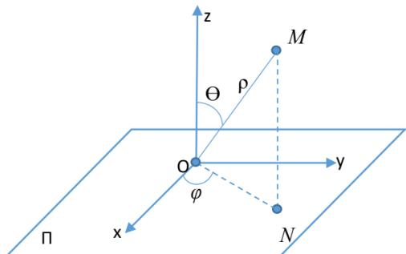

Тогда точка 𝑀 имеет следующие координаты в системах:

цилиндрическая: $\left\{ \begin{array} { l l } { X _ { M } = \rho \cdot \\cos { \varphi } . } \\ { Y _ { M } = \rho \cdot \sin { \varphi } , } \\ { Z _ { M } = z ; } \end{array} \right.$ сферическая: $\left\{ \begin{array} { l l } { X _ { M } = \rho \cdot \cos \varphi \cdot \sin \theta , } \\ { Y _ { M } = \rho \cdot \sin \varphi \cdot \sin \theta , } \\ { Z _ { M } = \rho \cdot \cos \theta . } \end{array} \right.$

∙ Общую декартову систему координат (аффинную систему координат) на плоскости образуют две пересекающие координатные оси с общим началом координат.

Пусть точка 𝑀 — произвольная точка плоскости. Построим через точку 𝑀 прямые, па- раллельные координатным осям.

∙ Общими декартовыми координатами точки 𝑀 называются величины направ- ленных отрезков $\overline { { O M _ { x } } }$ и $\overline { { O M _ { y } } }$

## Глава 2

## Векторы

## 2.1 Понятие вектора. Линейные операции $\mathbf { H a } \mathbf { \varDelta }$ вектора- ми.

∙ Вектором называется множество всех одинаково направленных отрезков равной дли- ны. Обозначение: $a , b , c \ u a u \ a , \vec { b } , \vec { c } .$

Пусть $\overline { { A B } }$ — направленный отрезок. Тогда существует единственный вектор, которому принадлежит этот отрезок. То есть любой направленный отрезок $\overline { { A B } }$ однозначно опреде- ляет вектор, который обозначается как $\overrightarrow { A B }$

Пусть заданы вектор $\vec { a }$ и некоторая точка 𝐴. Тогда существует единственная точка $B _ { : }$ такая, что $a = { \overrightarrow { A B } }$

∙ Операция построения такой точки 𝐵 называется откладыванием вектора $\vec { a }$ от точки 𝐴.

∙ Длиной вектора ⃗𝑎 называется длина любого из направленных отрезков среди его образующих. Обозначение: |⃗𝑎|.

∙ Вектор длины 0 называется нулевым. Обозначение: ${ \vec { 0 } } .$ Вектор длины 1 называет- ся единичным или ортом.

∙ Векторы называются коллинеарными, если образующие их отрезки параллельны неко- торой прямой.

∙ Векторы называются компланарными, если образующие их отрезки параллельны некоторой плоскости.

Заметим, что нулевой вектор и коллинеарен любому вектору, и компланарен любым двум другим векторам.

Пусть 𝑎 и $b - 2$ ненулевых вектора, отложенных от некоторой точки 𝑂. То есть най- дём такие точки 𝐴, и 𝐵, что $a = \overrightarrow { O A } , b = \overrightarrow { O B }$

∙ Углом между векторами 𝑎 и 𝑏 называертся угол между направленными отрез- ками $\overline { { O A } } \ u \overline { { O B } }$

Из определения следует, что угол между двумя векторами $\in [ 0 ; \pi ]$

Линейные операции над векторами:

• сложение;

• умножение на число.

Пусть 𝑎 и $b - \mathbb { \pi } \mathrm { { B a } }$ вектора. Возьмем некоторую точку $O$ и отложим от нее вектор $a = { \overrightarrow { O A } }$ Затем от точки 𝐴 отложим вектор $b = \overrightarrow { A B }$

∙ Суммой векторов 𝑎 и 𝑏 будет называться вектор $\overrightarrow { O B }$ . Обозначение: $a + b$

∙ Произведением вектора 𝑎 на действительное число 𝐴 называется вектор, длина которого равна $| A | \cdot | a |$ , а направление совпадает с направлением вектора $a _ { i }$ , если $A > 0$ и противоположно направлению вектора $^ { a , }$ если $A < 0$ . Обозначение: $A \cdot a$

Свойства линейных операций:

1. $a + b = b + a .$

♦ Пусть $a = { \overrightarrow { O A } } , \ b = { \overrightarrow { A B } }$ . На направленных отрезках $\overline { { O A } }$ и $\overline { { A B } }$ построим паралле- лограмм $O A B C$

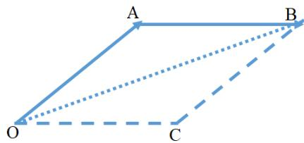

Заметим, что векторы $\overrightarrow { C B }$ и $\overrightarrow { O A }$ сонаправлены и $| { \overline { { C B } } } | = { \underline { { | } } } { \overline { { O A } } } |$ . Следовательно, ${ \overrightarrow { C B } } = { \overrightarrow { O A } } = a$ . Путем аналогичных рассуждений получим $\overrightarrow { O C } = \overrightarrow { A B } = b$

По определению суммы векторов, вектор $\overrightarrow { O B }$ можно, с одной стороны, рассматривать как сумму векторов ${ \overrightarrow { O A } } + { \overrightarrow { A B } }$ , а с другой стороны, как сумму ${ \overrightarrow { O C } } + { \overrightarrow { C B } }$ . Следова-

тельно, $\overrightarrow { O B } = \left\{ \overrightarrow { O A } + \overrightarrow { A B } = a + b , \right.  \\  \overrightarrow { O C } + \overrightarrow { C B } = \overrightarrow { A B } + \overrightarrow { O A } = b + a ;$ $\Rightarrow a + b = b + a .$

2. $( a + b ) + c = a + ( b + c )$

3. $\vec { a } + \vec { 0 } = \vec { a } , \quad \forall \vec { a } .$

4. $\alpha ( a + b ) = \alpha a + \alpha b ,$

$$
( \alpha + \beta ) a = \alpha a + \beta a ,
$$

$$
\alpha ( \beta a ) = ( \alpha \beta ) a , \mathrm { { r } \mathrm { { J } \mathrm { { r } \it { ~ a } , \ b - \delta \mathrm { { e } \mathrm { { K } \mathrm { { r } \mathrm { { o p } \mathrm { { b } \mathrm { { I } , \ \ \alpha \alpha \beta } \alpha \beta - \mathrm { { q \mathrm { _ { H C } \mathrm { { J } \mathrm { { a } . } } } } } } } } } } } } }
$$

∙ Вектор 𝑏 называется противоположным вектору 𝑎, если его длина совпадает с дли- ной вектора 𝑎, а направление противоположно.

Из определения следует, что

1. −1 · 𝑎 = −𝑎, где вектор (−𝑎) — противоположный вектору 𝑎;

2. $1 \cdot a = a .$

∙ Разностью векторов 𝑎 и 𝑏 называется вектор, прибавив который к вектору 𝑏, по- лучим вектор 𝑎, то есть вектор $c = a - b $ , где $c + b = a$

Правило вычитания: Чтобы из вектора 𝑎 вычесть вектор 𝑏, необходимо к вектору 𝑎 прибавить вектор, противоположный вектору 𝑏, то есть $a - b = a + ( - b )$

$$
\bullet \ ( a + ( - b ) ) + b = a + ( b + ( - b ) ) = a + { \vec { 0 } } = a .
$$

## 2.2 Координаты вектора.

Пусть $a _ { 1 } , \ldots , a _ { k }$ — произвольная система векторов. $\alpha _ { 1 } , \ldots , \alpha _ { k } \mathrm { ~ - ~ }$ некоторые действитель- ные числа.

∙ Вектор $\alpha _ { 1 } a _ { 1 } + \ldots + \alpha _ { k } a _ { k }$ называется линейной комбинацией векторов $a _ { 1 } , \ldots , a _ { k } \ c \ \kappa o { \scriptscriptstyle \partial } \phi -$ фициентами $\alpha _ { 1 } , \ldots , \alpha _ { k }$

Если вектор представлен в виде линейной комбинации системы векторов (то есть 𝑏 = $\alpha _ { 1 } a _ { 1 } + \ldots + \alpha _ { k } a _ { k } )$ , то говорят, что данный вектор разложим по этим векторам системы.

∙ Базисом на прямой называется любой ненулевой вектор, параллельный этой пря- мой.

∙ Базисом на плоскости называется упорядоченная пара неколлинеарных векторов.

∙ Базисом в пространстве называется упорядоченная тройка некомпланарных век- торов.

Нулевой вектор не может быть элементом базиса.

## Теорема.

1. Любой вектор, параллельный прямой, может быть единственным образом разло- жен по базису этой прямой.

2. Любой вектор, параллельный плоскости, может быть единственным образом раз- ложен по базису на этой плоскости.

3. Любой вектор в пространстве может быть единственным образом по базису в пространстве.

♦ Покажем существование разложения для каждого из пунктов.

1. Пусть $\Delta -$ некоторая прямая, 𝑎 — базис на ней, 𝑏 — вектор, параллельный $\Delta$ . Тогда $a \parallel b \Rightarrow a$ и 𝑏 коллинеарны.

Пусть $e _ { a } , e _ { b } \mathrm { ~ - ~ } , \mathrm { e } _ { , \mathrm { I } \mathrm { H H } \mathrm { H } \mathrm { H } \mathrm { b I e } }$ векторы, параллельные векторам 𝑎 и $b$ соответственно.   
Так как $e _ { a } = { \frac { 1 } { | a | } } a , \ e _ { b } = { \frac { 1 } { | b | } } b$ и 𝑎 и 𝑏 коллинеарны, то и $e _ { a }$ и $e _ { b }$ также коллинеарны.   
Следовательно, они либо противоположные, либо равные.

Если они равные, то $e _ { a } = e _ { b } \Rightarrow { \frac { 1 } { \left| a \right| } } a = { \frac { 1 } { \left| b \right| } } b \Rightarrow b = { \frac { \left| b \right| } { \left| a \right| } } a = [ { \mathrm { 3 a M e H a ~ } } { \frac { \left| b \right| } { \left| a \right| } } { \mathrm { ~ H a ~ } } l ] = l a$ Если они противоположные, то $e _ { a } = - e _ { b } \Rightarrow { \frac { 1 } { \left| a \right| } } a = - { \frac { 1 } { \left| b \right| } } b \Rightarrow b = - { \frac { \left| b \right| } { \left| a \right| } } a = \left[ \mathrm { 3 a M e H a } \right.$ $- { \frac { \left| b \right| } { \left| a \right| } } { \mathrm { ~ H a ~ } } l ] = l a \Rightarrow$ вектор 𝑏 разложим по базису 𝑎.

2. Пусть П — некоторая плоскость, $a _ { 1 }$ и $a _ { 2 } \mathrm { ~ - ~ } 6 \mathrm { a 3 u c }$ на плоскости, $b \parallel \Pi \Rightarrow a _ { 1 } , \ a _ { 2 } , \ b -$ компланарны. Отложим векторы базиса от некоторой точки О на плоскости П, то есть $a _ { 1 } = \overrightarrow { O A _ { 1 } } , a _ { 2 } = \overrightarrow { O A _ { 2 } } , b = \overrightarrow { O B }$

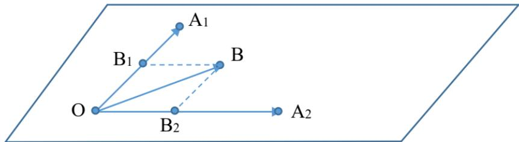

Построим прямую, проходящую через точку $B .$ , параллельную $O A _ { 2 }$ . Пусть $B _ { 1 } - \mathrm { T O } \mathrm { q } -$ ка пересечения построенной прямой и прямой $O A _ { 1 }$ . Аналогично на $O A _ { 2 }$ построим точку $B _ { 2 }$

По определению суммы векторов $b = \overrightarrow { O B } = \overrightarrow { O B _ { 1 } } + \overrightarrow { O B _ { 2 } }$ . Тогда $O B _ { 1 } \parallel O A _ { 1 }$ , а ненуле- вой вектор $\overrightarrow { O A _ { 1 } }$ является на этой прямой базисом. Следовательно, по доказанному выше в пункте 1, $\overrightarrow { O B _ { 1 } } = l _ { 1 } \cdot \overrightarrow { O A _ { 1 } } = l _ { 1 } \cdot a _ { 1 }$ . По аналогичным рассуждениям получим $\overrightarrow { O B _ { 2 } ^ { ' } } = l _ { 2 } \cdot a _ { 2 } \Rightarrow b = l _ { 1 } \cdot a _ { 1 } + l _ { 2 } \cdot a _ { 2 }$

3. Доказательство данного пункта проводится по аналогичной схеме с пунктом 2. Пока- жем единственность: рассмотрим самый сложный вариант, в пространстве. На плос- кости и прямой доказательства будут аналогичными.

Пусть $a _ { 1 } , ~ a _ { 2 } , ~ a _ { 3 } ~ -$ базис в пространстве, а $b -$ некоторый вектор пространства. И пусть существуют 2 различных разложения: $\left\{ \begin{array} { l l } { b = l _ { 1 } a _ { 1 } = l _ { 2 } a _ { 2 } + l _ { 3 } a _ { 3 } , } \\ { b = \beta _ { 1 } a _ { 1 } + \beta _ { 2 } a _ { 2 } + \beta _ { 3 } a _ { 3 } ; } \end{array} \right. \Rightarrow \left[ \mathrm { B b I U T e M } \right.$ из первого второе] $\Rightarrow 0 = ( l _ { 1 } - \beta _ { 1 } ) a _ { 1 } + ( l _ { 2 } - \beta _ { 2 } ) a _ { 2 } + ( l _ { 3 } - \beta _ { 3 } ) a _ { 3 }$

Пусть $l _ { i } - \beta _ { i } \neq 0 \Rightarrow a _ { 1 } = - \frac { l _ { 2 } - \beta _ { 2 } } { l _ { 1 } - \beta _ { 1 } } a _ { 2 } - \frac { l _ { 3 } - \beta _ { 3 } } { l _ { 1 } - \beta _ { 1 } } a _ { 3 } \Rightarrow a _ { 1 } , \ a _ { 2 }$ , 𝑎3 компланарные, что является противоречием с тем, что базис в пространстве — это 3 некомпланарных вектора $\Rightarrow l _ { i } - \beta _ { i } = 0 \Rightarrow$ два разложения совпадают.

Пусть 𝑎 — некоторый вектор в пространстве. $e _ { 1 } , e _ { 2 } , e _ { 3 } -$ некоторый базис в пространстве. По теореме выше вектор 𝑎 единственным образом представим в виде $\displaystyle l _ { 1 } e _ { 1 } + l _ { 2 } e _ { 2 } + l _ { 3 } e _ { 3 }$

∙ Коэффициенты разложения вектора 𝑎 по базису $e _ { 1 } , e _ { 2 } , e _ { 3 }$ называются координата- ми вектора 𝑎 в базисе $e _ { 1 } , e _ { 2 } , e _ { 3 }$ . Обозначение: $a ( l _ { 1 } , l _ { 2 } , l _ { 3 } )$

Теорема. При умножении вектора на число все его координаты умножаются на это число. При сложении векторов их соответствующие координаты складываются.

♦ Пусть $a , b -$ произвольные векторы, $e _ { 1 } , e _ { 2 } , e _ { 3 } - 6 \mathrm { a } _ { 3 \mathrm { H C } }$ $\left( l _ { 1 } , l _ { 2 } , l _ { 3 } \right) \scriptscriptstyle \mathrm { ~ H ~ } \left( \beta _ { 1 } , \beta _ { 2 } , \beta _ { 3 } \right) -$ коорди- наты векторов 𝑎 и 𝑏 в базисе $e _ { 1 } , e _ { 2 } , e _ { 3 }$ соответственно. Тогда

$$
l \cdot a = l \cdot ( l _ { 1 } e _ { 1 } + l _ { 2 } e _ { 2 } + l _ { 3 } e _ { 3 } ) = l \cdot l _ { 1 } e _ { 1 } + l \cdot l _ { 2 } e _ { 2 } + l \cdot l _ { 3 } e _ { 3 } ;
$$

$$
a + b = ( l _ { 1 } e _ { 1 } + l _ { 2 } e _ { 2 } + l _ { 3 } e _ { 3 } ) + ( \beta _ { 1 } e _ { 1 } + \beta _ { 2 } e _ { 2 } + \beta _ { 3 } e _ { 3 } ) = ( l _ { 1 } + \beta _ { 1 } ) e _ { 1 } + ( l _ { 2 } + \beta _ { 2 } ) e _ { 2 } + ( l _ { 3 } + \beta _ { 3 } ) e _ { 3 } .
$$

Получили векторы с координатами $l a ( l \cdot l _ { 1 } , l \cdot l _ { 2 } , l \cdot l _ { 3 } ) , a + b ( l _ { 1 } + \beta _ { 1 } , l _ { 2 } + \beta _ { 2 } , l _ { 3 } + \beta _ { 3 } )$

Следствие (критерий коллинеарности векторов). Два ненулевых вектора 𝑎 и $b$ кол- линеарны ⇐⇒ их координаты пропорциональны.

$\bullet \Rightarrow )$ Пусть $a ( l _ { 1 } , l _ { 2 } , l _ { 3 } ) , b ( \beta _ { 1 } , \beta _ { 2 } , \beta _ { 3 } ) \textrm { - 2 }$ ненулевых коллинеарных вектора ⇒ вектор 𝑎 является базисом на прямой $\Rightarrow b$ представим в виде: $b \ = \ l a \ \Rightarrow \ b$ имеет координаты $( l \cdot l _ { 1 } , l \cdot l _ { 2 } , l \cdot l _ { 3 } ) \Rightarrow$ координаты пропорциональны.

$\left. \right)$ Пусть координаты пропорциональны: $l \cdot l _ { i } = \beta _ { i } \Rightarrow b = \beta _ { 1 } e _ { 1 } + \beta _ { 2 } e _ { 2 } + \beta _ { 3 } e _ { 3 } = l \cdot l _ { 1 } e _ { 1 } + l$ $l _ { 2 } e _ { 2 } + l \cdot l _ { 3 } e _ { 3 } = l \cdot ( l _ { 1 } e _ { 1 } + l _ { 2 } e _ { 2 } + l _ { 3 } e _ { 3 } ) = l a \Rightarrow$ вектор 𝑎 либо ${ \uparrow } \uparrow \ b ,$ либо ↑↓ $b \Rightarrow a$ коллинеарен $b .$ ⊠

## 2.3 Декартовы координаты вектора.

∙ Рассмотрим ДПСК 𝑂𝑥𝑦𝑧, и пусть 𝑖, 𝑗, 𝑘 — единичные векторы, сонаправленные с ося- ми $O x , O y , O z$ . Такие векторы называют направляющими ортами осей координат.

∙ Векторы $i , j ,$ 𝑘 некомпланарны, следовательно, они образуют базис в пространстве.   
Данный базис является ортонормированным базисом.

Пусть 𝑎 — произвольный вектор пространства. Тогда по первой теореме из предыдущего параграфа $a = x \cdot i + y \cdot j + z \cdot k$ , где $( x , y , z )$ — декартовы координаты вектора 𝑎. То есть декартовы координаты вектора — это коэффициенты при разложении этого вектора по ортонормированному базису.

Рассмотрим некоторый вектор 𝑎 и некоторую ось ∆. Отложим вектор 𝑎 от точки 𝐴 и пусть $a = { \overrightarrow { A B } }$ . Построим проекции 𝐴 и 𝐵 на ось $\Delta$ и пусть это будут точки $A _ { 1 }$ и $B _ { 1 }$

∙ Полученный в результате направленный отрезок $\overline { { A _ { 1 } B _ { 1 } } }$ определяет вектор $\overrightarrow { A _ { 1 } B _ { 1 } }$ , ко- торый называется проекцией вектора 𝑎 на ось $\Delta$

∙ Величина направленного отрезка $\overline { { A _ { 1 } B _ { 1 } } }$ называется величиной проекции вектора 𝑎 на ось $\Delta$ . Обозначение: $I I P _ { \Delta } a$

Свойства величин проекции вектора на ось:

1. ПРΔ𝑎 = |𝑎| · cos φ, где φ — угод между вектором 𝑎 и осью $\Delta .$

♦ Отложим от некоторой точки 𝑂 на оси $\Delta$ вектор 𝑎 (то есть $a = { \overrightarrow { O A } } )$ . 𝐴1 — проекция точки 𝐴. Тогда $\Pi \mathrm { P } _ { \Delta } a = O A _ { 1 }$

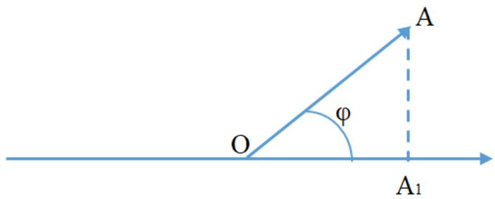

Если угол φ острый, то $\Pi \mathrm { P } _ { \Delta } a = | \overline { { O A _ { 1 } } } | \Rightarrow \Pi \mathrm { P } _ { \Delta } a = | \overline { { O A } } | \cdot \cos ( \varphi ) = | a | \cdot \cos ( \varphi )$

Если угол φ тупой, то $\Pi \mathrm { \mathrm { P } } _ { \Delta } a = - | \overline { { O A _ { 1 } } } | = - | \overline { { O A } } | \cdot \mathrm { c o s } ( \pi - \varphi ) = | \overline { { O A } } | \cdot \mathrm { c o s } ( \varphi ) = | a | \cdot \mathrm { c o s } ( \varphi )$ ⊠

2. $\Pi \mathrm { P } _ { \Delta } ( l a ) = l \cdot \Pi \mathrm { P } _ { \Delta } a .$

♦ По первому свойству, $\Pi \mathrm { P } _ { \Delta } ( l a ) = | l a | \cdot \cos ( \varphi _ { 1 } ) = | l | \cdot | a | \cdot \cos ( \varphi _ { 1 } )$ , где $\varphi _ { 1 } \mathrm { ~ - ~ } \mathrm { y r o } \mathrm { . }$ между ∆ и 𝑙𝑎.

Если $l > 0$ , то $| l | = l _ { \mathrm { ~ \bf ~ H ~ } } \varphi _ { 1 }$ является углом между $\Delta$ и 𝑎 (равен углу φ). Следо- вательно, $\Pi \mathrm { P } _ { \Delta } ( l a ) = l \cdot \Pi \mathrm { P } _ { \Delta } a$

Если 𝑙 < 0, то |𝑙| = −𝑙 и φ1 равен углу $\pi - \varphi . \cos ( \pi - \varphi ) = - \cos ( \varphi )$ . Следова- тельно, $\Pi \mathrm { P } _ { \Delta } ( l a ) = l \cdot \Pi \mathrm { P } _ { \Delta } a$ ⊠

3. $\Pi \mathrm { P } _ { \Delta } ( a + b ) = \Pi \mathrm { P } _ { \Delta } a + \Pi \mathrm { P } _ { \Delta } b .$

♦ Пусть $a = \overrightarrow { A B } , b = \overrightarrow { B C } \mathrm { ~ n ~ } a + b = \overrightarrow { A C } .$ . Построим на ось $\Delta$ проекции точек 𝐴, 𝐵 и 𝐶 (обозначим как 𝐴1, 𝐵1 и $C _ { 1 }$ соответственно).

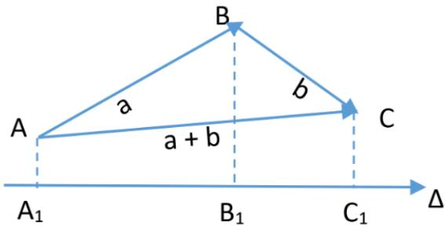

Заметим, что

(a) $\Pi \mathrm { P } _ { \Delta } ( a + b ) = A _ { 1 } C _ { 1 }$

(b) $\Pi \mathrm { P } _ { \Delta } a = A _ { 1 } B _ { 1 }$

(c) $\Pi \mathrm { P } _ { \Delta } b = B _ { 1 } C _ { 1 }$

По теореме Шаля, $\begin{array} { r } { A _ { 1 } C _ { 1 } = A _ { 1 } B _ { 1 } + B _ { 1 } C _ { 1 } \Rightarrow \Pi \mathrm { P } _ { \Delta } ( a + b ) = \Pi \mathrm { P } _ { \Delta } a + \Pi \mathrm { P } _ { \Delta } b . } \end{array}$

Теорема. Декартовы координаты вектора равны величинам проекции этого вектора на координатные оси.

♦ Пусть 𝑎 — некоторый вектор пространства с координатами 𝑥, 𝑦, 𝑧. Отложим 𝑎 от начала координат, то есть $\ d _ { \cdot } = { \cal O M } ,$ а затем построим проекции точки $M$ на оси $O x , O y , O z$ . Тогда $\overrightarrow { O M } = \overrightarrow { O M _ { x } } + \overrightarrow { O M _ { y } } + \overrightarrow { O M _ { z } }$ . Так как $O M _ { x } \parallel i \parallel$ 𝑂𝑥 и, при этом, вектор 𝑖 ненулевой, он является базисом и $\overrightarrow { O M _ { x } }$ представим в виде: $\overrightarrow { O M _ { x } } = l \cdot i$

Из определения произведения вектора на число, $| \overrightarrow { O M _ { x } } | = | l | \cdot | i |$ . Следовательно, $| l | =$   
$\frac { | \overrightarrow { O M _ { x } } } { | i | } = [ | i | = 1 ] = | \overrightarrow { O M _ { x } ^ { ' } } | = | \overrightarrow { O M _ { x } } |$ |𝑂𝑀𝑥|, 𝑂𝑀𝑥 ↑↑ 𝑂𝑥, , а по знаку 𝑙 = ⇒ по опреде- −|𝑂𝑀𝑥|, 𝑂𝑀𝑥 ↑↓ 𝑂𝑥.   
лению проекции, $l = O M _ { x } = \Pi \mathrm { P } _ { O x } \cdot O M = \Pi \mathrm { P } _ { O x } \cdot a .$

Аналогично $O M _ { y } = \mathrm { H P } _ { O y } \cdot a , O M _ { z } = \mathrm { H P } _ { O z } \cdot a \Rightarrow a = \mathrm { H P } _ { O x } \cdot i + \mathrm { H P } _ { O y } \cdot j + \mathrm { H P } _ { O z } \cdot k .$ А так как разложение по базису единственно, то $\Pi \mathrm { P } _ { O x } \cdot a = x , \Pi \mathrm { P } _ { O y } \cdot a = y , \Pi \mathrm { P } _ { O z } \cdot a = z$ ⊠

Следствие. Длина вектора 𝑎 с координатами $( x , y , z )$ равна $\sqrt { x ^ { 2 } + y ^ { 2 } + z ^ { 2 } }$

♦ Из параллелепипеда, построенного на отрезках $O M _ { x } , O M _ { y } , O M _ { z }$ , получаем

$$
| a | = | \overline { { O M } } | = \sqrt { | \overline { { O M _ { x } } } | ^ { 2 } + | \overline { { O M _ { y } } } | ^ { 2 } + | \overline { { O M _ { z } } } | ^ { 2 } } = \sqrt { x ^ { 2 } + y ^ { 2 } + z ^ { 2 } } .
$$

⊠ Обозначим через α, β и γ углы между вектор 𝑎 и векторами $i , j$ и 𝑘 соответственно.

∙ Числа cos(α), cos(β) и cos(γ) называются направляющими косинусами вектора 𝑎.

Следствие. $\cos ^ { 2 } ( \alpha ) + \cos ^ { 2 } ( \beta ) + \cos ^ { 2 } ( \gamma ) = 1$

♦ По теореме, $x = \Pi \mathrm { P } _ { O x } \cdot a = | a | \cdot \cos ( a , O x ) = | a | \cdot \cos ( a , i ) = | a | \cdot \cos ( \alpha ) \Rightarrow \cos ( \alpha ) = { \frac { x } { | a | } } .$

Аналогично найдем $\cos ( \beta ) = { \frac { y } { | a | } } , \cos ( \gamma ) = { \frac { z } { | a | } } \Rightarrow$

$$
\cos ^ { 2 } ( \alpha ) + \cos ^ { 2 } ( \beta ) + c o s ^ { 2 } ( \gamma ) = \frac { x ^ { 2 } + y ^ { 2 } + z ^ { 2 } } { | a | ^ { 2 } } = 1 .
$$

⊠ ∙ Единичный вектор, сонаправленный $c \ a _ { \scriptscriptstyle \mathrm { i } }$ , называется ортом вектора 𝑎, и имеет координаты $e _ { a } = ( \cos ( \alpha ) , \cos ( \beta ) , \cos ( \gamma ) )$

∙ Пусть 𝑀 — некоторая точка пространства. Вектор 𝑂𝑀 называется радиус-вектором точки 𝑀. Обозначение: $r _ { m }$

Теорема. Радиус-вектор точки 𝑀 с координатами $\left( x _ { m } , y _ { m } , z _ { m } \right)$ имеет такие же коор- динаты $\left( x _ { m } , y _ { m } , z _ { m } \right)$

♦ Разложим $r _ { m }$ по базису $i , j , k : r _ { m } = x \cdot i + y \cdot j + z \cdot k$ . По первой теореме параграфа, $x _ { m } = O M _ { x } \Rightarrow x = x _ { m }$ . Аналогично $y = y _ { m } , z = z _ { m }$ ⊠

Следствие. Пусть $M _ { 1 } ( x _ { 1 } , y _ { 1 } , z _ { 1 } )$ и $M _ { 2 } ( x _ { 2 } , y _ { 2 } , z _ { 2 } )$ — две различные точки пространства. Тогда вектор $M _ { 1 } M _ { 2 }$ имеет координаты $\left( x _ { 2 } - x _ { 1 } , y _ { 2 } - y _ { 1 } , z _ { 2 } - z _ { 1 } \right)$

♦ $O M _ { 1 } + M _ { 1 } M _ { 2 } = O M _ { 2 } \Rightarrow M _ { 1 } M _ { 2 } = O M _ { 2 } - O M 1 = r _ { m _ { 2 } } - r _ { m _ { 1 } } \Rightarrow$ координаты вектора $M _ { 1 } M _ { 2 }$ равны $( x _ { 2 } - x _ { 1 } , y _ { 2 } - y _ { 1 } , z _ { 2 } - z _ { 1 } )$ ⊠

## 2.4 Скалярное произведение векторов.

∙ Скалярным произведением векторов 𝑎 и 𝑏 называется число, равное произведению длин этих векторов на косинус угла между ними. Обозначение: $( a , b ) = | a | \cdot | b | \cdot \cos ( a , b )$

Свойства скалярного произведения:

1. $a \cdot b = b \cdot a .$

♦ Доказательство следует из определения скалярного произведения.

2. ∀𝑎, $, b \neq 0 \quad a \cdot b = | a | \cdot \Pi \mathrm { P } _ { a } \cdot b = | b | \cdot \Pi \mathrm { P } _ { b } \cdot a .$

$a \cdot b = | a | \cdot | b | \cdot \cos ( a , b ) = [ \operatorname { I }$ по свойствам величины проекции $= \Pi \mathrm { P } _ { a } \cdot b = | b | \cdot \cos ( a , b ) ]$ $= | a | \cdot \Pi \mathrm { P } _ { a } \cdot b$ ⊠

3. $( \lambda \cdot a ) \cdot b = \lambda \cdot ( a \cdot b ) = a \cdot ( \lambda \cdot b )$

♦ (λ · 𝑎) · 𝑏 = |𝑏| · ПР𝑏 · (λ · 𝑎) = |𝑏| · λ · ПР𝑏 · 𝑎 = λ · (𝑎 · 𝑏).

4. $( a + b ) \cdot c = a \cdot c + b \cdot c , a \cdot ( b + c ) = a \cdot b + a \cdot c .$

♦ (𝑎 + 𝑏) · 𝑐 = |𝑐| · ПР𝑐 · (𝑎 + 𝑏) = |𝑐| · (ПР𝑐 · 𝑎 + ПР𝑐 · 𝑏) = |𝑐| · ПР𝑐 · 𝑎 + |𝑐| · ПР𝑐 · 𝑏 = 𝑎 · 𝑐 + 𝑏 · 𝑐. ⊠

5. $a \cdot a \geqslant 0$ , причем 𝑎 · 𝑎 = 0 ⇐⇒ 𝑎 — нулевой вектор.

♦ $a \cdot a = | a | \cdot | a | \cdot \underbrace { \cos ( a , a ) } _ { = 1 } = | a | ^ { 2 } \geqslant 0$ , причем $| a | ^ { 2 } = 0 \Longleftrightarrow | a | = 0$ , то есть вектор $a \textrm { -- }$ нулевой. ⊠

6. Критерий перпендикулярности векторов.

Два ненулевых вектора 𝑎 и 𝑏 перпендикулярны $\Longleftrightarrow u x$ скалярное произведение равно 0.

♦ ⇒) Пусть $a \perp b \Rightarrow \angle ( a , b ) = { \frac { \pi } { 2 } } \Rightarrow a \cdot b = | a | \cdot | b | \cdot \cos { \frac { \pi } { 2 } } = 0 .$

$$
\Leftrightarrow \Pi \operatorname { J y c r e } a \cdot b = 0 \Rightarrow \left| a \right| \cdot \left| b \right| \cdot \cos ( a , b ) = 0 \Rightarrow \cos ( a , b ) = 0 \Rightarrow \angle ( a , b ) = { \frac { \pi } { 2 } } .
$$

Теорема. Скалярное произведение векторов 𝑎 и 𝑏, имеющих декартовы координаты $a ( x _ { 1 } , y _ { 1 } , z _ { 1 } )$ $b ( x _ { 2 } , y _ { 2 } , z _ { 2 } )$ , равно $a \cdot b = x _ { 1 } \cdot x _ { 2 } + y _ { 1 } \cdot y _ { 2 } + z _ { 1 } \cdot z _ { 2 }$

♦ По определению декартовых координат, $a = x _ { 1 } \cdot i + y _ { 1 } \cdot j + z _ { 1 } \cdot k , b = x _ { 2 } \cdot i + y _ { 2 } \cdot j +$ $z _ { 2 } \cdot k$ , где 𝑖, 𝑗, 𝑘 — ортонормированный базис.

$a \cdot b = ( x _ { 1 } \cdot i + y _ { 1 } \cdot j + z _ { 1 } \cdot k ) \cdot ( x _ { 2 } \cdot i + y _ { 2 } \cdot j + z _ { 2 } \cdot k ) = x _ { 1 } \cdot x _ { 2 } \cdot i \cdot i + x _ { 1 } \cdot y _ { 2 } \cdot i \cdot j + x _ { 1 }$ $\cdot \ z _ { 2 } \cdot i \cdot k + \ldots = \left[ \ i \cdot j = j \cdot k = i \cdot k = 0 \right.$ , так как они друг с другом перпендикулярны, а $i \cdot i = j \cdot j = k \cdot k = 1$ , так как орты, а $\cos = 1 \ { \mathrm { J } } = x _ { 1 } \cdot x _ { 2 } + y _ { 1 } \cdot y _ { 2 } + z _ { 1 } \cdot z _ { 2 }$ ⊠

## 2.5 Векторное произведение векторов.

Рассмотрим упорядоченную тройку некомпланарных векторов $e _ { 1 } , e _ { 2 } , e _ { 3 }$ , отложим их от некоторой точки 𝑂 и пусть $e _ { 1 } = \overrightarrow { O E _ { 1 } } , e _ { 2 } = \overrightarrow { O E _ { 2 } } , e _ { 3 } = \overrightarrow { O E _ { 3 } }$

∙ Если при наблюдении с конца направленного отрезка $O E _ { 3 }$ кратчайший поворот от $\overrightarrow { O E _ { 1 } } \kappa \overrightarrow { O E _ { 2 } }$ осуществляется против часовой стрелки, то тройка векторов $e _ { 1 } , e _ { 2 } , e _ { 3 }$ на- зывается правой, в противном случае левой. Данное свойство также называется ори- ентацией векторов.

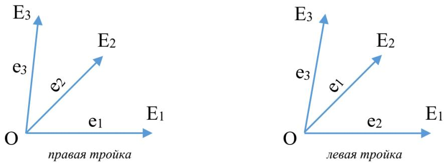

Из векторов 𝑎, 𝑏, 𝑐 можно составить 6 упорядоченных троек:

𝑎, 𝑏, 𝑐 𝑏, 𝑐, 𝑎 𝑐, 𝑎, 𝑏 — правая тройка;   
𝑎, 𝑐, 𝑏 𝑏, 𝑎, 𝑐 𝑐, 𝑏, 𝑎 — левая тройка.

Из определения ориентации тройки векторов следует, что первые три тройки имеют одну ориентацию, а вторые три противоположную им ориентацию.

∙ Векторным произведением вектора 𝑎 на вектор 𝑏 называется вектор, обознача- емый $a \times b$ или $[ a , b ]$ , который удовлетворяет следующим условиям:

1. $| [ a , b ] | = | a | \cdot | b | \cdot \sin ( a , b ) ;$

2. $[ a , b ] \perp a , [ a , b ] \perp b ;$

3. упорядоченная тройка $a , b , [ a , b ]$ является правой.

Свойства векторного произведения векторов:

1. Длина векторного произведения векторов 𝑎 и 𝑏 равна площади параллелограмма, построенного на векторах 𝑎 и $b ,$ отложенных от одной точки.

♦ Следует из первого пункта определения.

2. Два ненулевых вектора 𝑎 и 𝑏 коллинеарны ⇐⇒ их векторное произведение равно нулевому вектору.

♦ ⇒) Пусть векторы 𝑎 и 𝑏 коллинеарны, тогда угол между ними в радианах либо 0, либо $\pi \Rightarrow s i n ( a , b ) = 0 \Rightarrow | [ a , b ] | = | a | \cdot | b | \cdot 0 = 0$ , получили нулевой вектор.

⇐) Пусть векторное произведение $[ a , b ] = { \overrightarrow { 0 } } \ \Rightarrow \ | [ a , b ] | = 0 \ \Rightarrow \ | a | \cdot | b | \cdot \sin ( a , b ) =$ 0 $( | a | , | b | \neq 0 ) \Rightarrow \sin ( a , b ) = 0 \Rightarrow \angle ( a , b ) = 0$ или $\angle ( a , b ) = \pi \Rightarrow a ;$ , 𝑏 коллениарны. ⊠

3. $[ a , b ] = - [ b , a ]$

♦ Если векторы 𝑎 и $b$ коллениарны, то утверждение очевидно. Так как $[ a , b ] = { \overrightarrow { 0 } }$ по второму свойству и, следовательно, $[ b , a ] = { \overrightarrow { 0 } }$

Пусть векторы 𝑎 и 𝑏 неколлениарны, тогда векторы $[ a , b ] \textrm { \textbf { u } } [ b , a ]$ коллениарны, так как каждый из них одновременно перпендикулярен векторам 𝑎 и $b ,$ и, при этом, длины их равны.

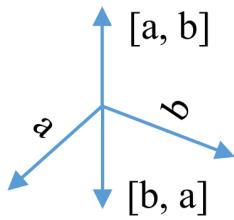

Следовательно, возможны два варианта:

(a) $[ a , b ] = [ b , a ] ;$

(b) $[ a , b ] = - [ b , a ]$

Пусть $[ a , b ] ~ = ~ [ b , a ]$ . По определению векторного произведения, тройка векторов $( a , b , [ a , b ] )$ правая $\Rightarrow ( a , b , [ b , a ] )$ тоже правая, но, по определению векторного произ- ведения, тройка векторов $( b , a , [ b , a ] )$ также правая. Тогда, глядя со стороны направ- ления вектора $b$ на $^ { a , }$ кратчайший поворот против часовой стрелки осуществляется, с одной стороны, от 𝑎 к $b ,$ а с другой — от 𝑏 к 𝑎, что является противоречием $\Rightarrow$ $[ a , b ] = - [ b , a ]$ ⊠

4. $[ \lambda \cdot a , b ] = \lambda \cdot [ a , b ] , \ [ a , \lambda \cdot b ] = \lambda \cdot [ a , b ] \quad \lambda \in \mathbb { R } .$

♦ Если векторы 𝑎 и 𝑏 коллениарны или $\lambda = 0$ , то утверждение очевидно.

Пусть $\lambda \neq 0$ и векторы 𝑎 и 𝑏 неколлениарны. Тогда покажем равенство длин для обоих случаев:

$$
\begin{array} { r l } { | \lambda [ a , b ] | = | \lambda | \cdot | [ a , b ] | = | \lambda | \cdot | a | \cdot | b | \cdot \sin ( a , b ) . } & { } \\ { | [ \lambda a , b ] | = | \lambda a | \cdot | b | \cdot \sin ( \lambda a , b ) = \left\{ | \lambda | \cdot | a | \cdot | b | \cdot \sin ( a , b ) , \lambda > 0 ; \right. } & { \left. = | \lambda | \cdot | a | \cdot | b | \cdot \sin ( a , b ) \cdot \sin ( a , b ) \right\} . } \end{array}
$$

sin(𝑎, 𝑏).

Покажем направления. $[ \lambda a , b ]$ и $\textstyle \lambda [ a , b ]$ перпендикулярны и $^ { a , }$ и $b \Rightarrow [ \lambda a , b ] \parallel \lambda [ a , b ]$ При $\lambda > 0$ векторное произведение $[ a , b ]$ сонаправлено с обоими векторами $a , b .$ При $\lambda < 0$ векторное произведение $[ a , b ]$ имеет противоположное направление с век- торами $a , b \Rightarrow$

$$
[ \lambda a , b ] \uparrow \downarrow \lambda [ a , b ] \Rightarrow [ a , \lambda b ] = - [ \lambda b , a ] = - \lambda [ b , a ] = \lambda [ a , b ] .
$$

5. 𝑎) $[ a + b , c ] = [ a , c ] + [ b , c ] ;$

𝑏) $[ a , b + c ] = [ a , b ] + [ a , c ] .$

(a) Если один из векторов $a , b , c$ нулевой, то утверждение очевидно.

Пусть векторы $a , b , c$ ненулевые. Обозначим через $e _ { c }$ орт вектора ${ \mathit { c } } ,$ тогда $e _ { c }$ $= { \frac { 1 } { | c | } } \cdot c \Rightarrow | e _ { c } | = 1$

Построим векторное произведение вектора 𝑎 на $e _ { c }$ следующим образом:

1) отложим векторы 𝑎 и $e _ { c }$ от некоторой точки 𝑂. Тогда $a = { \overrightarrow { O A } } , e _ { c } = { \overrightarrow { O C } } ;$

2) проведем через точку 𝑂 плоскость перпендикулярно отрезку $O C ;$

3) построим отрезок $O A _ { 1 }$ — проекцию отрезка $O A$ на плоскость П, а затем повернем этот отрезок в плоскости П вокруг точки $O$ по часовой стрелке на угол $\frac { \pi } { 2 }$ и получим отрезок $O A _ { 2 }$

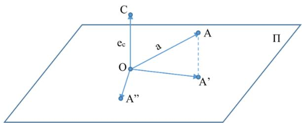

Докажем, что $\overrightarrow { O A _ { 2 } } = [ \overrightarrow { O A } , \overrightarrow { O C } ] = [ a , e _ { c } ]$

1) Длина: $| \overrightarrow { O A _ { 2 } ^ { \prime } } | = | \overrightarrow { O A _ { 2 } } | = | \overrightarrow { O A _ { 1 } } | = | \overrightarrow { O A } | \cdot \cos \angle A O A _ { 1 } = | \overrightarrow { O A } | \cdot \cos ( \pm ( \frac { \pi } { 2 } - 1 . 8 ^ { 2 } )$ $\begin{array} { r } { \angle ( a , e _ { c } ) ) = | a | \cdot | e _ { c } | \cdot \sin ( a , e _ { c } ) = | [ a , e _ { c } ] | . } \end{array}$

2) Направление: $\overline { { O A _ { 2 } } } \perp \overline { { O C } }$ , так как $\overline { { O A _ { 2 } } }$ лежит в плоскости, перпендику- лярной отрезку 𝑂𝐶, $\overline { { O A _ { 2 } } } \perp \overline { { O A } } \Rightarrow \overline { { O A _ { 2 } } } \perp e _ { c } , \overline { { O A _ { 2 } } } \perp$ 𝑎 по теореме о трех перпендикулярах.

3) Тройка векторов $\overrightarrow { O A } , \overrightarrow { O C } , \overrightarrow { O A _ { 2 } }$ правая по построению.

Таким образом мы показали, что $\overrightarrow { O A _ { 2 } } = [ a , e _ { c } ] _ { \backslash }$

Отложим вектор 𝑏 от точки 𝐴. Пусть $b = A B$ . Построим треугольник $O A _ { 1 } B _ { 1 }$ — проекцию треугольника 𝑂𝐴𝐵 на плоскость П, а затем повернем этот тре- угольник по часовой стрелке вокруг точки 𝑂 на угол $\frac { \pi } { 2 }$ и получим треугольник $O A _ { 2 } B _ { 2 }$

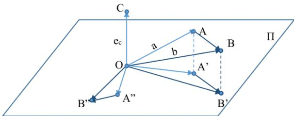

По определению суммы векторов, $\overrightarrow { O B _ { 2 } } = \overrightarrow { O A _ { 2 } } + \overrightarrow { A _ { 2 } B _ { 2 } }$ . По доказанному выше, $\overrightarrow { O B _ { 2 } } = [ \overrightarrow { O B } , \overrightarrow { O C } ] = [ a + b , e _ { c } ] , \overrightarrow { A _ { 2 } B _ { 2 } } = [ \overrightarrow { A B } , \overrightarrow { O C } ] = [ b , e _ { c } ]$

Следовательно, из полученного выше имеем $[ a + b , e _ { c } ] = [ a , e _ { c } ] + [ b , e _ { c } ]$

Домножим полученное равенство на длину вектора 𝑐 и используем четвертое свойство. Получим $[ a + b , c ] = [ a , c ] + [ b , c ]$

$$
( \mathrm { b } ) \ [ a , b + c ] = - [ b + c , a ] = - ( [ b , a ] + [ c , a ] ) = [ a , b ] + [ a , c ] .
$$

∙ Квадратная таблица чисел вида $\left( { \begin{array} { l l } { \alpha _ { 1 } } & { \alpha _ { 2 } } \\ { \beta _ { 1 } } & { \beta _ { 2 } } \end{array} } \right)$ называется матрицей второго порядка.

∙ Определителем матрицы второго порядка называется число вида

$$
\begin{array} { r } { \left| \begin{array} { l l } { \alpha _ { 1 } } & { \alpha _ { 2 } } \\ { \beta _ { 1 } } & { \beta _ { 2 } } \end{array} \right| = \alpha _ { 1 } \beta _ { 2 } - \alpha _ { 2 } \beta _ { 1 } . } \end{array}
$$

Теорема. Пусть векторы 𝑎 и 𝑏 в правой $\mathcal { I } I C K$ имеют координаты $a ( X _ { 1 } , Y _ { 1 } , Z _ { 1 } ) \ u b ( X _ { 2 } , Y _ { 2 } , Z _ { 2 } )$ тогда вектор $[ a , b ]$ имеет координаты

$$
\left[ a , b \right] = \left( \left| Y _ { 1 } \quad Z _ { 1 } \right| , - \left| X _ { 1 } \quad Z _ { 1 } \right| , \left| X _ { 1 } \quad Y _ { 1 } \right| \right) .
$$

♦ Из определения декартовых координат вектора следует, что $a = X _ { 1 } \cdot i + Y _ { 1 } \cdot j + Z _ { 1 } \cdot k$ $b = X _ { 2 } \cdot i + Y _ { 2 } \cdot j + Z _ { 2 } \cdot k$ . Тогда

$$
[ a , b ] = \left[ X _ { 1 } \cdot i + Y _ { 1 } \cdot j + Z _ { 1 } \cdot k , ~ X _ { 2 } \cdot i + Y _ { 2 } \cdot j + Z _ { 2 } \cdot k \right] = X _ { 1 } \cdot X _ { 2 } \cdot \left[ i , i \right] + X _ { 1 } \cdot Y _ { 2 } \cdot \left[ i , j \right] + Y _ { 2 } \cdot \left[ i , i + X _ { 1 } \cdot + i + Y _ { 2 } \cdot + i + Z _ { 2 } \cdot k \right] .
$$

$$
+ X _ { 1 } \cdot Z _ { 2 } \cdot [ i , k ] + Y _ { 1 } \cdot X _ { 2 } \cdot [ i , j ] + Y _ { 1 } \cdot Z _ { 2 } \cdot [ j , k ] + Z _ { 1 } \cdot X _ { 2 } \cdot [ k , i ] + Z _ { 1 } \cdot Y _ { 2 } \cdot [ k , j ] + Z _ { 1 } \cdot Z _ { 2 } \cdot [ k , k ] + Y _ { 1 } \cdot Y _ { 2 } \cdot [ j , j ] .
$$

$[ i , i ] = { \overrightarrow { 0 } } , [ j , j ] = { \overrightarrow { 0 } } , [ k , k ] = { \overrightarrow { 0 } }$ , так как векторы параллельны сами себе, следовательно, применимо второе свойство. $[ i , j ] = k , [ i , k ] = - j , [ j , i ] = - k , [ j , k ] = i , [ k , i ] = j , [ k , j ] = - i$

Подставим и получим $X _ { 1 } \cdot Y _ { 2 } \cdot k + X _ { 1 } \cdot Z _ { 2 } \cdot ( - j ) + Y _ { 1 } \cdot X _ { 2 } \cdot ( - k ) + Y _ { 1 } \cdot Z _ { 2 } \cdot i + Z _ { 1 } \cdot X _ { 2 } \cdot j + Z _ { 1 } \cdot Y _ { 2 } \cdot ( - i )$ = $\left( Y _ { 1 } \cdot Z _ { 2 } - Z _ { 1 } \cdot Y _ { 2 } \right) \cdot i - \left( X _ { 1 } \cdot Z _ { 2 } - Z _ { 1 } \cdot X _ { 2 } \right) \cdot j + \left( X _ { 1 } \cdot Y _ { 2 } - Y _ { 1 } \cdot X _ { 2 } \right) \cdot k$ = $= { \frac { | Y _ { 1 }  \quad Z _ { 1 } | } { | Y _ { 2 }  \quad Z _ { 2 } | } } \cdot i - { | X _ { 1 }  \quad Z _ { 1 } | } \cdot j + { | X _ { 1 }  \quad Y _ { 1 } | } \cdot k .$ ⊠

## 2.6 Смешанное произведение векторов.

∙ Смешанным произведением трех векторов $a , b ,$ c называется число $a b c = [ a , b ] \cdot c$   
Теорема. Пусть 𝑉 — объём параллелепипеда, построенного на отложенных от одной $\mathbf { \Phi } = \left\{ \begin{array} { l } { V , \ : { 2 } \partial e \ : a , b , c \mathrm { ~ - ~ } } \\ { - V , \ : { 2 } \partial e \ : a , b , c \mathrm { ~ - ~ } } \end{array} \right.$ правая тройка;   
точки трех некомпланарных векторах 𝑎, 𝑏, 𝑐. Тогда 𝑎𝑏𝑐 левая тройка.   
♦ Пусть векторы $a , b$ и 𝑐 отложены от точки 𝑂. Тогда $a = \overrightarrow { O A } , b = \overrightarrow { O B } \textrm { n } c = \overrightarrow { O C }$ . Так как   
векторы $a , b ,$ 𝑐 некомпланарны, то векторы 𝑎 и 𝑏 неколлениарны.

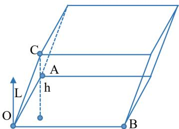

Обозначим через $S$ площадь параллелограмма, построенного на отрезках 𝑂𝐴 и 𝑂𝐵. Тогда $S = | { \overrightarrow { O A } } | \cdot | { \overrightarrow { O B } } | \cdot s i n { \angle } ( B O A ) = | a | \cdot | b | \cdot \sin ( a , b ) = | [ a , b ] |$

Обозначим через 𝑒 орт $[ a , b ]$ . Тогда тройка векторов $a , b , c -$ правая и при этом $[ a , b ] = | [ a , b ] | \cdot e = S \cdot e \Rightarrow a b c = [ a , b ] \cdot c = ( S \cdot e ) \cdot c = S \cdot ( e \cdot c ) = S \cdot | e | \cdot \Pi \mathrm { P } _ { e } c = S \cdot \Pi \mathrm { P } _ { e } c .$

Пусть $h -$ высота рассматриваемого параллелепипеда, опущенная из вершины $C$ на плос- кость $A O B$ , тогда $| \Pi \mathrm { P } _ { e } c | = h$

$\left\{ \Pi \mathrm { P } _ { e } c > 0 \right.$ , если 𝑎, 𝑏, 𝑐 — правая тройка векторов; но при этом ⇒ , если $a , b , c -$ левая тройка векторов.

$\begin{array} { r } { a b c = \left\{ \begin{array} { l l } { a b c = S \cdot h , } \\ { a b c = - S \cdot h } \end{array} \right. } \\ { \mathrm { H J e r c a l } . } \end{array}$ если $a , b , c -$ правая тройка; $\Rightarrow V = \left| a b c \right| \mathbf { \Sigma } _ { \mathbf { H } }$ условие теоремы выпол- , если $a , b , c -$ левая тройка. ⊠

Свойства смешанного произведения:

1. Векторы $a , b , c$ компланарны ⇐⇒ их смешанное произведение $a b c = 0$

♦ ⇒) Пусть векторы $a , b , c$ компланарны.

$$
1 ) \ a \parallel \ b \Rightarrow [ a , b ] = 0 \Rightarrow a b c = [ a , b ] \cdot c = 0 ;
$$

$$
2 ) \ a \not \parallel b \Rightarrow [ a , b ] \perp a , [ a , b ] \perp b \Rightarrow [ a , b ] \perp c \Rightarrow a b c = [ a , b ] \cdot c = 0 .
$$

⇐) Пусть $a b c = 0$ , и предположим, что векторы $a , b , c$ некомпланарны. Тогда, от- ложив их от одной точки, можно построить параллелепипед $\mathrm { ~ c ~ } V = | a b c | \neq 0$ , что противоречит тому, что $a b c = 0$ . Значит $a , b , c$ компланарны. ⊠

2. 𝑎𝑏𝑐 $: = b c a = c a b = - a c b = - b a c = - c b a .$

♦ Если векторы $a , b , c$ компланарны, то все произведения равны 0.

Если векторы $a , b , c$ некомпланарны, то модули рассматриваемых смешанных про- изведений будут равны, а знак зависит от ориентации соответствующих троек.

Первые три смешанных произведений имеют одну ориентацию, а последние три про- тивоположную ориентацию. ⊠

$$
3 . \ ( \alpha a ) b c = a ( \alpha b ) c = a b ( \alpha c ) = \alpha ( a b c ) .
$$

$$
\bullet a b ( \alpha c ) = [ a , b ] ( \alpha c ) = \alpha ( [ a , b ] c ) = \alpha ( a b c ) .\tag{⊠}
$$

$$
\begin{array} { r } { 4 . \ ( a + b ) \cdot c \cdot d = a c d + b c d ; } \\ { a \cdot ( b + c ) \cdot d = a b d + a c d ; } \\ { a \cdot b \cdot ( c + d ) = a b c + a b d . } \end{array}
$$

$$
\bullet \ ( a + b ) \cdot c \cdot d = [ a + b , c ] \cdot d = ( [ a , c ] + [ b , c ] ) \cdot d = [ a , c ] \cdot d + [ b , c ] \cdot d = a c d + b c d .
$$

∙ Квадратная таблица чисел вида $\left( \begin{array} { l l l } { \alpha _ { 1 } } & { \alpha _ { 2 } } & { \alpha _ { 3 } } \\ { \beta _ { 1 } } & { \beta _ { 2 } } & { \beta _ { 3 } } \\ { \gamma _ { 1 } } & { \gamma _ { 2 } } & { \gamma _ { 3 } } \end{array} \right)$ называется матрицей третьего порядка.

∙ Определителем матрицы третьего порядка является число вида

$$
\left| { \begin{array} { l l l } { \alpha _ { 1 } } & { \alpha _ { 2 } } & { \alpha _ { 3 } } \\ { \beta _ { 1 } } & { \beta _ { 2 } } & { \beta _ { 3 } } \\ { \gamma _ { 1 } } & { \gamma _ { 2 } } & { \gamma _ { 3 } } \end{array} } \right| = \alpha _ { 1 } \left| { \beta _ { 1 } }  & { \beta _ { 3 } \right| - \alpha _ { 2 } \left| { \beta _ { 1 } } } & { \beta _ { 3 } \right| + \alpha _ { 3 } \left| { \beta _ { 1 } } \right|} &  \beta _ { 2 }  .
$$

Теорема. Пусть векторы $a , b , c \ u$ правой ДПСК имеют координаты $a ( x _ { 1 } , y _ { 1 } , z _ { 1 } ) , b ( x _ { 2 } , y _ { 2 } , z _ { 2 } )$ 2 $c ( x _ { 3 } , y _ { 3 } , z _ { 3 } )$ , тогда 𝑎𝑏𝑐 $= { \begin{array} { r r r } { \left| x _ { 1 } \right|} & { y _ { 1 } } & { z _ { 1 } } \\ { x _ { 2 } } & { y _ { 2 } } & { z _ { 2 } } \\ { x _ { 3 } } & { y _ { 3 } } & { z _ { 3 } } \end{array}  }$

$$
\bullet a b c = b c a = [ b , c ] \cdot a = \left( { \left| Y _ { 2 } \right. } Z _ { 2 } { \Big | } , - { \left| \begin{array} { l l } { X _ { 2 } } & { Z _ { 2 } } \\ { X _ { 3 } } & { Z _ { 3 } } \end{array} \right| } , { \left| \begin{array} { l l } { X _ { 2 } } & { Y _ { 2 } } \\ { X _ { 3 } } & { Y _ { 3 } } \end{array} \right| } \right) \cdot ( x _ { 1 } , y _ { 1 } , z _ { 1 } ) =
$$

$$
= x _ { 1 } \left| Y _ { 2 } \quad Z _ { 2 } \right| - y _ { 1 } \left| X _ { 2 } \quad Z _ { 2 } \right| + z _ { 1 } \left| X _ { 2 } \quad Y _ { 2 } \right| = { \overset { { \vartriangle } } { \left| X _ { 2 } \quad Y _ { 2 } \quad Z _ { 2 } \right| } } .
$$

## 2.7 Преобразование декартовых прямоугольных коор- динат на плоскости и в пространстве.

Пусть на плоскости заданы две ДПСК: $O x y , O ^ { \prime } x ^ { \prime } y ^ { \prime }$ и пусть некоторая точка 𝑀 плоскости в первой ДПСК имеет координаты $( x , y )$ , а во второй $( x ^ { \prime } , y ^ { \prime } )$ . Выразим координаты $( x , y )$

через $( x ^ { \prime } , y ^ { \prime } )$

Пусть $i , j , i ^ { \prime } , j ^ { \prime } \stackrel { } { - }$ направляющие орты осей координат $O x , O y , O ^ { \prime } x ^ { \prime } , O ^ { \prime } y ^ { \prime }$ соответственно. Так как точка 𝑀 в ДПСК $O x y$ имеет координаты $( x , y )$ , то вектор $\overrightarrow { O M }$ представим в виде ${ \overrightarrow { O M } } = x \cdot i + y \cdot j$ . Аналогично $\overrightarrow { O ^ { \prime } M } = x ^ { \prime } \cdot i ^ { \prime } + y ^ { \prime } \cdot j ^ { \prime }$

Пусть точка $O ^ { \prime }$ в исходной ДПСК имеет координаты $( a , b )$ , тогда $\overrightarrow { O O ^ { \prime } } = a \cdot i + b \cdot j$

Так как любой вектор можно разложить по базису на плоскости, то векторы $i ^ { \prime } , j ^ { \prime }$ можно разложить по базисам $i , j$ на плоскости, то есть представить в виде $i ^ { \prime } = \alpha _ { 1 } \cdot i + \alpha _ { 2 } \cdot j$ $j ^ { \prime } = \beta _ { 1 } \cdot i + \beta _ { 2 } \cdot j$

Определим коэффициенты этих разложений. Для этого умножим каждое равенство на векторы $i , j ;$

$$
i ^ { \prime } \cdot i = \alpha _ { 1 } \cdot i \cdot i + \alpha _ { 2 } \cdot j \cdot i = \alpha _ { 1 } \Rightarrow \alpha _ { 1 } = i ^ { \prime } \cdot i = | i ^ { \prime } | \cdot | i | \cdot \cos ( i , i ^ { \prime } ) = \cos ( i , i ^ { \prime } )
$$

$$
i ^ { \prime } \cdot j = \alpha _ { 1 } \cdot i \cdot j + \alpha _ { 2 } \cdot j \cdot j \Rightarrow \alpha _ { 2 } = i ^ { \prime } \cdot j = | i ^ { \prime } | \cdot | j | \cdot \cos ( j , i ^ { \prime } )
$$

$$
j ^ { \prime } \cdot i = \beta _ { 1 } \cdot i \cdot i + \beta _ { 2 } \cdot j \cdot i = \beta _ { 1 } \Rightarrow \beta _ { 1 } = j ^ { \prime } \cdot i = \cos ( i , j ^ { \prime } )
$$

$$
j ^ { \prime } \cdot j = \beta _ { 1 } \cdot i \cdot j + \beta _ { 2 } \cdot j \cdot j = \beta _ { 2 } \Rightarrow \beta _ { 2 } = j ^ { \prime } \cdot j = \cos ( j , j ^ { \prime } )
$$

Из определения суммы векторов следует, что $\overrightarrow { O M } = \overrightarrow { O O ^ { \prime } } + \overrightarrow { O ^ { \prime } M }$ . Тогда из разложения по базису этих векторов получим

$$
x \cdot i + y \cdot j = a \cdot i + b \cdot j + x ^ { \prime } \cdot ( \alpha _ { 1 } \cdot i + \alpha _ { 2 } \cdot j ) + y ^ { \prime } \cdot ( \beta _ { 1 } \cdot i + \beta _ { 2 } \cdot j ) ;
$$

$$
x \cdot i + y \cdot j = ( a + x ^ { \prime } \cdot \alpha _ { 1 } + y ^ { \prime } \cdot \beta _ { 1 } ) \cdot i + ( b + x ^ { \prime } \cdot \alpha _ { 2 } + y ^ { \prime } \cdot \beta _ { 2 } ) \cdot j .
$$

Так как разложение любого вектора по базису единственно, то $\left\{ \begin{array} { l l } { x = a + x ^ { \prime } \cdot \alpha _ { 1 } + y ^ { \prime } \cdot \beta _ { 1 } } \\ { y = b + x ^ { \prime } \cdot \alpha _ { 2 } + y ^ { \prime } \cdot \beta _ { 2 } . } \end{array} \right.$ ⇒

$$
\begin{array} { r } { \left\{ x = a + x ^ { \prime } \cdot \cos ( i , i ^ { \prime } ) + y ^ { \prime } \cdot \cos ( i , j ^ { \prime } ) , \right. } \\ { \left. y = b + x ^ { \prime } \cdot \cos ( j , i ^ { \prime } ) + y ^ { \prime } \cdot \cos ( j , j ^ { \prime } ) . \right. } \end{array}\tag{2.7.1}
$$

∙ Полученная формула (2.7.1) называется формулой преобразования декартовых координат точки.

Рассмотрим некоторые частные случаи.

1. Преобразование симметрии относительно прямой $( y = x )$

Пусть точки $O ( x , y )$ и $O ^ { \prime } ( x ^ { \prime } , y ^ { \prime } )$ — начала двух ДПСК разной ориентации. И пусть они совпадают $( O = O ^ { \prime } )$

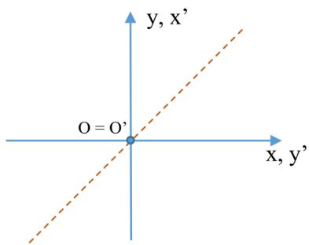

Тогда получаем $\angle ( i , i ^ { \prime } ) = \angle ( i , j ) = { \frac { \pi } { 2 } } , \angle ( j , j ^ { \prime } ) = \angle ( j , i ) = { \frac { \pi } { 2 } } , \angle ( i , j ^ { \prime } ) = \angle ( j , i ^ { \prime } ) = 0 .$ Отсюда имеем

$$
\left\{ { x = y ^ { \prime } , } \right.\tag{2.7.2}
$$

∙ Полученная формула (2.7.2) называется формулой преобразования симмет- рии относительно прямой $y = x$

## 2. Параллельный перенос координатных осей.

Пусть начало новой ДПСК располагается в точке $O ^ { \prime } ( a , b )$ исходной ДПСК.

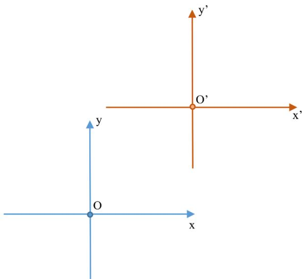

При параллельном переносе координатных осей их орты совпадают, то есть $i = i ^ { \prime } .$ $j = j ^ { \prime }$ . Тогда

$$
\left\{ \begin{array} { l l } { x = a + x ^ { \prime } \cdot \cos 0 + y ^ { \prime } \cdot \cos \displaystyle \frac { \pi } { 2 } , } \\ { y = b + x ^ { \prime } \cdot \cos \displaystyle \frac { \pi } { 2 } + y ^ { \prime } \cdot \sin \displaystyle \frac { \pi } { 2 } . } \end{array} \right. \quad \Rightarrow \left\{ x = a + x ^ { \prime } , \frac { \pi } { 2 } , \right.\tag{2.7.3}
$$

∙ Полученная формула (2.7.3) называется формулой параллельного переноса.

## 3. Преобразование поворота.

Пусть ДПСК $O ^ { \prime } x ^ { \prime } y ^ { \prime }$ получена из правой ДПСК 𝑂𝑥𝑦 путем поворота вокрут точки 𝑂 против часовой стрелки на угол φ.

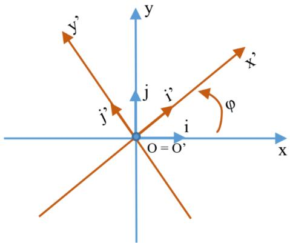

И пусть начала координат равны $( O ^ { \prime } = O )$ . Тогда

$$
\cos ( i , i ^ { \prime } ) = \cos \varphi ,
$$

$$
\cos ( i , j ^ { \prime } ) = \cos ( \varphi + \frac \pi 2 ) ,
$$

$$
\cos ( j , i ^ { \prime } ) = \cos ( \frac { \pi } { 2 } - \varphi ) ,
$$

$$
\cos ( j , j ^ { \prime } ) = \cos \bar { \varphi } .
$$

Из уравнений выше следует система

$$
\left\{ { \begin{array} { l } { x = x ^ { \prime } \cos \varphi - y ^ { \prime } \sin \varphi , } \\ { y = x ^ { \prime } \sin \varphi + y ^ { \prime } \cos \varphi . } \end{array} } \right.\tag{2.7.4}
$$

∙ Полученная формула (2.7.4) называется формулой преобразования поворота.

Пусть точка 𝑀 в ДПСК 𝑂𝑥𝑦𝑧 имеет координаты $( x , y , z )$ , а в ДПСК $\begin{array} { r l } {  } & { { } O ^ { \prime } x ^ { \prime } y ^ { \prime } z ^ { \prime } - ( x ^ { \prime } , y ^ { \prime } , z ^ { \prime } ) } \end{array}$ и пусть точка 𝑂 имеет координаты $O ( a , b , c )$ в ДПСК 𝑂𝑥𝑦𝑧. Тогда справедлива система

$$
\left\{ \begin{array} { l l } { x = a + x ^ { \prime } \cos ( i , i ^ { \prime } ) + y ^ { \prime } \cos ( i , j ^ { \prime } ) + z ^ { \prime } \cos ( i , k ^ { \prime } ) , } \\ { y = b + x ^ { \prime } \cos ( j , i ^ { \prime } ) + y ^ { \prime } \cos ( j , j ^ { \prime } ) + z ^ { \prime } \cos ( j , k ^ { \prime } ) , } \\ { z = c + x ^ { \prime } \cos ( k , i ^ { \prime } ) + y ^ { \prime } \cos ( k , j ^ { \prime } ) + z ^ { \prime } \cos ( k , k ^ { \prime } ) . } \end{array} \right.\tag{2.7.5}
$$

∙ Полученная формула (2.7.5) называется формулой преобразования декартовых координат в пространстве.

## Глава 3

## Уравнения прямой на плоскости

## 3.1 Общее уравнение прямой. Уравнение прямой в от- резках.

∙ Нормальным вектором прямой на плоскости называется ненулевой вектор, пер- пендикулярный данной прямой.

Рассмотрим некоторую прямую $\Delta$ . Пусть она проходит через некоторую точку $M _ { 0 } ( x _ { 0 } , y _ { 0 } )$ и она перпендикулярна ненулевому вектору $n ( A , B )$ .

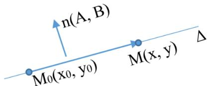

Так как вектор 𝑛 ненулевой, то $A ^ { 2 } + B ^ { 2 } \ne 0$ . Если некоторая точка $M ( x , y )$ лежит на прямой $\Delta .$ , то $\overrightarrow { M _ { 0 } M } \perp n$ и наоборот, если точка 𝑀 не лежит на прямой $\Delta .$ , то $\overrightarrow { M _ { 0 } M } \downarrow n$ Таким образом, точка $M \in \Delta \Longleftrightarrow { \overrightarrow { M _ { 0 } M } } \bot n$

∙ Уравнение ${ \overrightarrow { M _ { 0 } M } } \cdot n = 0$ называется уравнением в векторной форме прямой на плоскости, проходящей через точку $M _ { 0 }$ перпендикулярно вектору 𝑛.

Вектор $\overrightarrow { M _ { 0 } M }$ в ДПСК имеет координаты $\left( x - x _ { 0 } , y - y _ { 0 } \right)$ . Тогда

$$
A ( x - x _ { 0 } ) + B ( y - y _ { 0 } ) = 0 .\tag{3.1.1}
$$

∙ Уравнение (3.1.1) называется уравнением в координатной форме прямой на плоскости, проходящей через точку с координатами $( x _ { 0 } , y _ { 0 } )$ перпендикулярно векто- ру 𝑛 с координатами $( A , B )$

Теорема. Любая прямая на плоскости в $\mathcal { I } I T C K$ может быть задана уравнением вида

$$
A x + B y + C = 0 , \quad A ^ { 2 } + B ^ { 2 } \neq 0 .\tag{3.1.2}
$$

В ДПСК любое уравнение вида (3.1.2) определяет прямую и только.

1. Пусть произвольная прямая ∆ проходит через точку $M _ { 0 } ( x _ { 0 } , y _ { 0 } )$ перпендикулярно вектору $n ( A , B )$ . Преобразуем уравнение (3.1.1) следующим образом: $A x + B y \ +$ $\underbrace { \left( - A x _ { 0 } - B y _ { 0 } \right) } _ { C } = 0$ . Тогда уравнение прямой примет вид (3.1.2), причем 𝐴 и $B -$ координаты нормального вектора. Следовательно, $A ^ { 2 } + B ^ { 2 } \ne 0$

2. Так как коэффициенты 𝐴 и 𝐵 не обращаются в 0 одновременно, то уравнение (3.1.2) всегда имеет решение. Пусть $( x _ { 0 } , y _ { 0 } )$ — решение уравнения (3.1.2). Тогда $A x _ { 0 } + B y _ { 0 } +$ $C = 0$

Вычтем полученное равенство из уравнения (3.1.2) и получим $A ( x - x _ { 0 } ) + B ( y - y _ { 0 } ) = 0$ — уравнение прямой, проходящей через точку $M _ { 0 }$ . Значит уравнение (3.1.2) является уравнением прямой.

∙ Уравнение (3.1.2) называется общим уравнением прямой на плоскости. Причем коэффициенты 𝐴 и 𝐵 являются координатами нормального вектора 𝑛.

$A _ { 1 } x + B _ { 1 } y + C _ { 1 } = 0 .$ Теорема. Если два общих уравнения определяют одну прямую, то $A _ { 2 } x + B _ { 2 } y + C _ { 2 } = 0$ существует действительное число λ такое, что $A _ { 1 } = \lambda \cdot A _ { 2 } , B _ { 1 } = \lambda \cdot B _ { 2 } , C _ { 1 } = \lambda \cdot C _ { 2 }$

♦ Так как оба уравнения описывают одну прямую, то векторы $n _ { 1 } ( A _ { 1 } , B _ { 1 } )$ и $n _ { 2 } ( A _ { 2 } , B _ { 2 } )$ являются нормальными векторами одной прямой ⇒ они коллениарны и существует λ такое, что $A _ { 1 } = \lambda \cdot A _ { 2 } , \mathrm { ~ a ~ } B _ { 1 } = \lambda \cdot B _ { 2 }$ . Пусть прямая проходит через точку $M _ { 0 } ( x _ { 0 } , y _ { 0 } )$ , тогда подставим и получим следующие уравнения:

$$
\begin{array} { r } { A _ { 1 } x _ { 0 } + B _ { 2 } y _ { 0 } + C _ { 1 } = 0 , } \\ { A _ { 2 } x _ { 0 } + B _ { 2 } y _ { 0 } + C _ { 2 } = 0 . } \end{array}
$$

Отнимем от первого уравнения второе домноженное на λ и получим $( A _ { 1 } - \lambda A _ { 2 } ) \cdot x _ { 0 } + ( B _ { 1 } - \lambda B _ { 2 } ) \cdot y _ { 0 } + ( C _ { 1 } - \lambda \cdot C _ { 2 } ) = 0 \ \Rightarrow C _ { 1 } - \lambda C _ { 2 } = 0 \Rightarrow C _ { 1 } = \lambda C _ { 2 } .$

Рассмотрим взаимное расположение двух прямых. Пусть $A _ { 1 } x + B _ { 1 } y + C _ { 1 } = 0$ и $A _ { 2 } x +$ $B _ { 2 } y + C _ { 2 } = 0$ — уравнения этих двух прямых.

1. Прямые совпадают, если $\exists \lambda \in \mathbb { R } : A _ { 1 } = \lambda { \cdot } A _ { 2 } , B _ { 1 } = \lambda { \cdot } B _ { 2 } , C _ { 1 } = \lambda { \cdot } C _ { 2 } ;$

2. Прямые параллельны, если $\exists \lambda \in \mathbb { R } : A _ { 1 } = \lambda { \cdot } A _ { 2 } , B _ { 1 } = \lambda { \cdot } B _ { 2 } , C _ { 1 } \neq \lambda { \cdot } C _ { 2 }$

3. Прямые пересекаются, если $\# \lambda \in \mathbb { R } : A _ { 1 } = \lambda { \cdot } A _ { 2 } , B _ { 1 } = \lambda { \cdot } B _ { 2 }$ . Угол пересечения равен углу между нормальными векторами этих прямых, то есть

$$
\cos ( \Delta _ { 1 } , \Delta _ { 2 } ) = \frac { \left| n _ { 1 } \cdot n _ { 2 } \right| } { \left| n _ { 1 } \right| \cdot \left| n _ { 2 } \right| } = \frac { \left| A _ { 1 } A _ { 2 } + B _ { 1 } B _ { 2 } \right| } { \sqrt { A _ { 1 } ^ { 2 } + B _ { 1 } ^ { 2 } } \cdot \sqrt { A _ { 2 } ^ { 2 } + B _ { 2 } ^ { 2 } } } .
$$

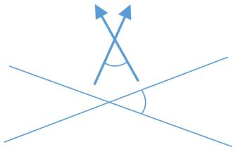

∙ Общее уравнение прямой называется полным, если все его коэффициенты 𝐴, 𝐵 и $C \neq$ 0. В противном случае уравнение называется неполным.

Рассмотрим виды неполных уравнений. Пусть $\Delta - \mathrm { \Pi { I p } { \cdot } \Pi { M a } \it { A } }$

1. $C = 0 \Rightarrow O ( 0 , 0 ) \in \Delta$ , прямая проходит через начало координат;

2. $B = 0 \Rightarrow \Delta \parallel O y ;$

3. $A = 0 \Rightarrow \Delta \parallel O x ;$

4. $B = 0 , C = 0 \Rightarrow \Delta = O y ;$

5. $A = 0 , C = 0 \Rightarrow \Delta = O x .$

Рассмотрим полное уравнение $A x + B y + C = 0$ . Прямая, описанная этим уравнением, не проходит через начало координат и не параллельна ни одной из координатных осей. Преобразуем уравнение следующим образом:

$$
A x + B y = - C \Rightarrow \frac { A x } { - C } + \frac { B y } { - C } = 1 \Rightarrow \frac { x } { - C } + \frac { y } { - C } = 1 \Rightarrow \left[ \frac { - C } { A } = a , ~ \frac { - C } { B } = b \right] \Rightarrow \frac { A x } { - C } = - \frac { A y } { - C } = - \frac { A y } { - C } = 0
$$

$$
{ \frac { x } { a } } + { \frac { y } { b } } = 1 .\tag{3.1.3}
$$

∙ Уравнение (3.1.3) называется уравнением прямой в отрезках.

Так как точки пересечения этой прямой с координатными осями имеют координаты $( a , 0 )$ и $( 0 , b )$ , то 𝑎 и 𝑏 — величины направленных отрезков, отсекаемых прямой по координатным осям от начала координат.

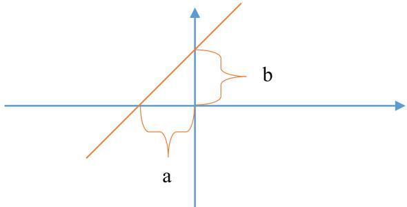

## 3.2 Нормальное уравнение прямой.

Рассмотрим некоторую прямую $\Delta .$ Построим прямую $\Delta _ { 2 }$ , проходящую через начало ко- ординат и перпендикулярную прямой $\Delta$ . Пусть $P \mathrm { ~ - ~ } \mathrm { { \Delta T O } q K a }$ пересечения прямых $\Delta \mathrm { ~ u ~ } \Delta _ { 2 }$ Обозначим через 𝑛 единичный вектор, перпендикулярный прямой $\Delta$ и сонаправленный с вектором $\overrightarrow { O P }$

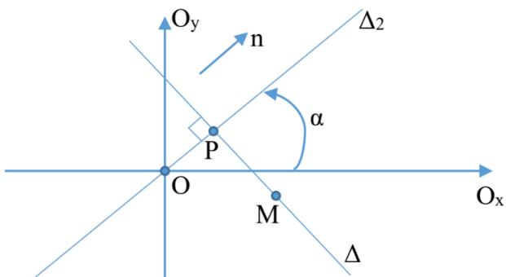

Если точки 𝑂 и $P$ совпадают, то 𝑛 — произвольный единичный вектор, перпендикулярный прямой $\Delta$ . Обозначим через 𝑝 расстояние между точками 𝑂 и $P _ { \mathrm { : } }$ то есть $p = | \overline { { O P } } |$ . Через α обозначим угол, на который надо повернуть ось 𝑂𝑥 против часовой стрелки, чтобы ее направление совпало с направлением нормального вектора 𝑛. Тогда вектор 𝑛 имеет коор- динаты 𝑛(cos α, cos β).

Пусть $M ( x , y )$ — произвольная точка плоскости. $M \in \Delta \Longleftrightarrow \overrightarrow { P M } \perp n \Longleftrightarrow \overrightarrow { P M } \cdot n = 0 .$

По определению суммы векторов $\overrightarrow { P M } = \overrightarrow { P \dot { O } } + \overrightarrow { O M } = \overrightarrow { O M } - \overrightarrow { O P }$ , тогда подставим и получим $( \overrightarrow { O M } - \overrightarrow { O P } ) \cdot n = 0 \Rightarrow \overrightarrow { O M } \cdot n - \overrightarrow { O P } \cdot n = 0$ . Распишем уменьшаемое и вычитаемое: $\overrightarrow { O M } \cdot n = ( x , y ) \cdot ( \cos \alpha , \sin \alpha ) = x \cos \alpha + y \sin \alpha .$

$$
\overrightarrow { O P } \cdot n = | \overrightarrow { O P } | \cdot | n | \cdot \cos { ( \overrightarrow { O P } , n ) } = p \cdot 1 \cdot 1 = p \Rightarrow \mathrm { I m . } \mathrm { { n o m } . \ y p a b a H e H M e }
$$

$$
x \cos \alpha + y \sin \alpha - p = 0 .\tag{3.2.1}
$$

∙Уравнение (3.2.1) называется нормальным нормальным уравнением прямой.

Пусть $M _ { 0 } ( x _ { 0 } , y _ { 0 } )$ — произвольная точка плоскости, а точка $M _ { 1 } ( x _ { 1 } , y _ { 1 } ) \mathrm { ~ - ~ e e ~ }$ проекция на прямую $\Delta$ . Обозначим через $\rho ( M _ { 0 } , \Delta )$ — расстояние от точки $M _ { 0 }$ до прямой $\Delta$ . Тогда $\mathsf { \Omega } _ { \mathsf { P } } ( M _ { 0 } , \Delta ) = \mathsf { | } \overline { { M _ { 1 } M _ { 0 } } } \mathsf { | }$

∙ Отклонением точки $M _ { 0 }$ от прямой $\Delta$ называется число

$$
\delta ( M _ { 0 } , \Delta ) = \left\{ \begin{array} { l l } { \mathsf { \boldsymbol { \rho } } ( M _ { 0 } , \Delta ) , \overrightarrow { M _ { 1 } M _ { 0 } } \uparrow \uparrow n , } \\ { - \mathsf { \boldsymbol { \rho } } ( M _ { 0 } , \Delta ) , \overrightarrow { M _ { 1 } M _ { 0 } } \uparrow \downarrow n . } \end{array} \right.
$$

Из определения отклонения следует, что $\mathsf { p } ( M _ { 0 } , \Delta ) = | \delta ( M _ { 0 } , \Delta ) | \mathrm { ~ \textmu ~ } \delta ( M _ { 0 } , \Delta ) = \Pi \mathrm { P } _ { n } \overrightarrow { M _ { 1 } M _ { 0 } }$

Теорема. Если 𝑥 cos $\alpha + y$ sin $\alpha - p = 0 \mathrm { ~ - ~ }$ нормальное уравнение прямой, то отклонение точки $M _ { 0 } ( x _ { 0 } , y _ { 0 } )$ от прямой $\Delta$ следующее: $\delta ( M _ { 0 } , \Delta ) = x _ { 0 } \cos \alpha + y _ { 0 }$ sin $\alpha - p$

$$
\begin{array} { r l } & { \bullet \left( M _ { 0 , } \Delta \right) = \Pi \mathrm { P } _ { n } \overrightarrow { M _ { 1 } M _ { 0 } } = \ \big [ \ \overrightarrow { M _ { 1 } M _ { 0 } ^ { \prime } } = \ \overrightarrow { M _ { 1 } \partial _ { + } } + \overrightarrow { O M _ { 0 } ^ { \prime } } = \ \overrightarrow { O M _ { 0 } ^ { \prime } } - \overrightarrow { O M _ { 1 } ^ { \prime } } \ \big ] \ \Rightarrow \ \Pi \mathrm { P } _ { n } ( \overrightarrow { O M _ { 0 } ^ { \prime } } - \overrightarrow { O M _ { 1 } ^ { \prime } } ) = } \\ & { = \Pi \mathrm { P } _ { n } \overrightarrow { O M _ { 0 } ^ { \prime } } - \Pi \mathrm { P } _ { n } \overrightarrow { O M _ { 1 } ^ { \prime } } \mathrm { . ~ P a c c u r a n t { m e x } } \ \mathrm { o f e } \ \mathrm { m p o e c u r a t i n t } \ \mathrm { I m ~ o r } \mathrm { . } n \mathrm { e . r } \mathrm { q e r m b e o c r u r } . } \end{array}
$$

$$
\Pi { \mathrm { P } _ { n } } \overrightarrow { O M _ { 0 } ^ { \prime } } = \vert \overrightarrow { O M _ { 0 } ^ { \prime } } \vert \cdot \cos ( n , \overrightarrow { O M _ { 0 } ^ { \prime } } ) \cdot 1 = \overrightarrow { O M _ { 0 } ^ { \prime } } \cdot n = ( x _ { 0 } , y _ { 0 } ) ( \cos \alpha , \sin \alpha ) = x _ { 0 } \cos \alpha + y _ { 0 } \sin \alpha .
$$

$\Pi \mathrm { P } _ { n } \overrightarrow { O M _ { 1 } } = p$ (по определению величины проекции). Тогда, подставив вместо проекций полученные выражения, имеем $\delta ( M _ { 0 } , \Delta ) = \Pi \mathrm { P } _ { n } \overrightarrow { O M _ { 0 } } - \Pi \mathrm { P } _ { n } \overrightarrow { O M _ { 1 } ^ { ' } } = x _ { 0 } c o s \alpha + y _ { 0 } s i n \alpha - p .$ . ⊠

Построим нормальное уравнение прямой с помощью общего уравнения.

Пусть прямая $\Delta$ удовлетворяет общему уравнению

$$
A x + B y + C = 0 .\tag{3.2.2}
$$

И пусть уравнение (3.2.1) — нормальное уравнение прямой $\Delta$ . Так как уравнения эти урав- нения определяют одну прямую, то их коэффициенты пропорциональны, то есть $\exists \lambda \in \mathbb { R }$ 2 cos $\alpha = \lambda \cdot A$ , sin $\alpha = \lambda \cdot B , \frac { \ d H } { \ d t } p = \lambda \cdot C$ . Из первых двух равенств имеем $1 = \cos ^ { 2 } \alpha + \sin ^ { 2 } \alpha =$ $\lambda ^ { 2 } ( A ^ { 2 } + B ^ { 2 } ) \Rightarrow \lambda = \pm \ \frac { \bf { \sigma } ^ { \bf { 1 } } } { \sqrt { A ^ { 2 } + B ^ { 2 } } }$ , причем из полученного соотношения следует, что знак λ противоположен знаку 𝐶.

∙ Полученное таким образом число λ называется нормирующим множителем для общего уравнения (3.2.2), так как, домножив это уравнение на λ, получим нормальное уравнение.

## 3.3 Параметрическое и каноническое уравнения прямой. Уравнение прямой с угловым коэффициентом.

До этого мы задавали прямую с помощью нормального вектора. Теперь зададим её дру- гим способом.

∙ Ненулевой вектор, параллельный прямой, называется направляющим вектором прямой.

Рассмотрим некоторую прямую $\Delta$ и пусть $a ( a _ { 1 } , a _ { 2 } )$ — ее направляющий вектор, $M _ { 0 } ( x _ { 0 } , y _ { 0 } )$ — точка на прямой. Тогда точка $M ( x , y ) \in \Delta \Longleftrightarrow \overrightarrow { M _ { 0 } M } \parallel a$

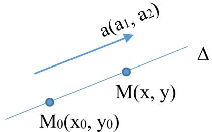

Следовательно, $\exists t \in R$ такое, что $\overrightarrow { M _ { 0 } M } = t a . \overrightarrow { M _ { 0 } M } = \overrightarrow { M _ { 0 } O } + \overrightarrow { O M } = \overrightarrow { O M } - \overrightarrow { O M _ { 0 } } = r _ { m } - r _ { m _ { 0 } }$ Получаем $r _ { m } - r _ { m _ { 0 } } = t a$ . Тогда

$$
r _ { m } = r _ { m _ { 0 } } + t a\tag{3.3.1}
$$

∙ Уравнение (3.3.1) называется параметрическим уравнением в векторной форме.

Запишем это уравнение через координаты:

$$
\left\{ { \begin{array} { l } { x = x _ { 0 } + t \cdot a _ { 1 } , } \\ { y = y _ { 0 } + t \cdot a _ { 2 } . } \end{array} } \right.\tag{3.3.2}
$$

∙ Уравнение (3.3.2) называется параметрическим уравнением прямой в коорди- натной форме.

Если прямая не параллельна ни одной из координатных осей, то $a _ { 1 } \neq 0 \mathrm { ~ n ~ } a _ { 2 } \neq 0$ Тогда $\overline { { t } } = \frac { x - x _ { 0 } } { a _ { 1 } } , \overline { { t } } = \frac { y - y _ { 0 } } { a _ { 2 } } \Rightarrow$

$$
{ \frac { x - x _ { 0 } } { a _ { 1 } } } = { \frac { y - y _ { 0 } } { a _ { 2 } } } .\tag{3.3.3}
$$

∙ Уравнение (3.3.3) называется каноническим уравнением прямой.

Если прямая параллельна одной из координатных осей, то уравнение прямой также может быть записано в каноническом виде. При этом равенство нулю в знаменателе означает не деление на нуль, а равенство нулю числителя для всех точек прямой. Рассмотрим прямую, изображенную на графике:

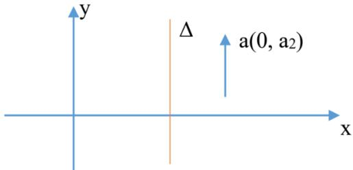

Ее параметрическое уравнение имеет вид: $\left\{ { \begin{array} { l } { x = x _ { 0 } , } \\ { y = y _ { 0 } + a _ { 2 } \cdot t . } \end{array} } \right.$

Тогда каноническое уравнение этой прямой имеет вид: ${ \frac { x - x _ { 0 } } { 0 } } = { \frac { y - y _ { 0 } } { a _ { 2 } } } .$

Если прямая $\Delta$ проходит через две различные точки $M _ { 0 } ( x _ { 0 } , y _ { 0 } )$ и $M _ { 1 } ( x _ { 1 } , y _ { 1 } )$ , то в каче- стве направляющего вектора прямой можно взять вектор $\overline { { M _ { 0 } M _ { 1 } ^ { ' } } } \left( x _ { 1 } - x _ { 0 } , y _ { 1 } - y _ { 0 } \right)$ . Тогда уравнение прямой примет вид:

$$
{ \frac { x - x _ { 0 } } { x _ { 1 } - x _ { 0 } } } = { \frac { y - y _ { 0 } } { y _ { 1 } - y _ { 0 } } } .\tag{3.3.4}
$$

∙ Уравнение (3.3.4) называется уравнением прямой, проходящей через $\mathcal { Q }$ точки.

Пусть прямая $\Delta$ не параллельна оси $O y$ , и пусть $a ( a _ { 1 } , a _ { 2 } ) \textrm { -- } \mathrm { e e }$ направляющий вектор $( a _ { 1 } \neq 0 )$ и точка $M _ { 0 } ( x _ { 0 } , y _ { 0 } ) \in \Delta$

∙ Углом наклона прямой $\Delta$ к оси 𝑂𝑥 называется угол, на который необходимо повер- нуть ось 𝑂𝑥 против часовой стрелки, чтобы она стала параллельна прямой $\Delta$

∙ Тангенс угла наклона прямой к оси $O x$ называется угловым коэффициентом пря- мой.

То есть если φ — угол наклона, а 𝑘 — угловой коэффициент, то $k = \mathrm { t g } \varphi$

Теорема. Если вектор $a ( a _ { 1 } , a _ { 2 } )$ — направляющий вектор прямой $\Delta _ { i }$ , то $k = \frac { a _ { 2 } } { a _ { 1 } }$

1. Пусть направляющий вектор 𝑎 прямой $\Delta$ направлен так, что $\angle ( a , i ) = \varphi$ . Тогда $a _ { 1 } = \Pi { \mathrm P } _ { O x } a = \Pi { \mathrm P } _ { i } a = | a | \cdot \cos ( a , i ) = | a | \cdot \cos \varphi .$

$$
a _ { 2 } = \Pi { \mathrm P } _ { O y } a = \Pi { \mathrm P } _ { j } a = | a | \cdot \cos ( a , j ) = | a | \cdot \cos ( \pm ( \frac { \pi } { 2 } - \varphi ) ) = | a | \cdot \sin \varphi .
$$

$$
{ \mathrm { T o r } } \pi { \mathrm { a } } { \frac { a _ { 2 } } { a _ { 1 } } } = { \frac { \left| a \right| \cdot \sin \varphi } { \left| a \right| \cdot \cos \varphi } } = { \mathrm { t g } } \varphi = k .
$$

2. Пусть вектор 𝑎 направлен так, что $\angle ( a , i ) \neq \varphi$ . Тогда вектор $b = - a$ также является направляющим вектором и $\angle ( b , i ) = \varphi$ . По доказанному выше, $k = { \frac { b _ { 2 } } { b _ { 1 } } } = { \frac { - a _ { 2 } } { - a _ { 1 } } } = { \frac { a _ { 2 } } { a _ { 1 } } }$

Пусть ${ \frac { x - x _ { 0 } } { a _ { 1 } } } = { \frac { y - y _ { 0 } } { a _ { 2 } } }$ — каноническое уравнение прямой $\Delta .$ . Тогда, домножим все на $a _ { 2 }$ и получим $y - y _ { 0 } = { \overset { - } { \frac { a _ { 2 } } { a _ { 1 } } } } ( x - x _ { 0 } ) = k ( x - x _ { 0 } ) \Rightarrow$

$$
y - y _ { 0 } = k ( x - x _ { 0 } ) .\tag{3.3.5}
$$

∙ Уравнение (3.3.5) называется уравнением с угловым коэффициентом прямой, проходящей через точку с координатами $( x _ { 0 } , y _ { 0 } )$

Обозначим $b = y _ { 0 } - k x _ { 0 }$ . Тогда уравнение прямой имеет вид

$$
y = k x + b .\tag{3.3.6}
$$

∙ Уравнение (3.3.6) называется уравнением прямой с угловым коэффициентом.

## Глава 4

# Уравнения плоскости и прямой в пространстве

## 4.1 Уравнение плоскости.

∙ Нормальным вектором плоскости называется ненулевой вектор, перпендикуляр- ный плоскости.

Рассмотрим некоторую плоскость П, проходящую через точку $M _ { 0 } ( x _ { 0 } , y _ { 0 } , z _ { 0 } )$ перпендику- лярно вектору $n ( A , B , C )$

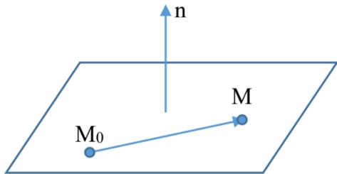

Точка $M ( x , y , z ) \in \Pi \Longleftrightarrow \overrightarrow { M _ { 0 } M } \perp n \Longleftrightarrow \overrightarrow { M _ { 0 } M } \cdot n = 0$ . Таким образом получаем уравнение

$$
A ( x - x _ { 0 } ) + B ( y - y _ { 0 } ) + C ( z - z _ { 0 } ) = 0 .\tag{4.1.1}
$$

∙ Уравнение (4.1.1) называется уравнением плоскости, проходящей через точку $M _ { 0 } ( x _ { 0 } , y _ { 0 } , z _ { 0 } )$ перпендикулярно вектору $n ( A , B , C )$

Обозначим $D = - A x _ { 0 } - B y _ { 0 } - C z _ { 0 }$ , тогда уравнение (4.1.1) примет вид

$$
A x + B y + C z + D = 0 \quad A ^ { 2 } + B ^ { 2 } + C ^ { 2 } \neq 0 .\tag{4.1.2}
$$

∙ Уравнение (4.1.2) называется общим уравнением плоскости.

Теорема. Любая плоскость в пространстве может быть задана уравнением вида (4.1.2).   
Любое уравнение вида (4.1.2) определяет плоскость.

♦ Доказательство аналогично подобной теореме для случая с прямой.

$A _ { 1 } x + B _ { 1 } y + C _ { 1 } z + D _ { 1 } = 0 \nonumber$ Теорема. Если два общих уравнения определяют одну плос- $A _ { 2 } x + B _ { 2 } y + C _ { 2 } z + D _ { 2 } = 0$ кость, то существует действительное число λ такое, что

$$
A _ { 1 } = \lambda A _ { 2 } , B _ { 1 } = \lambda B _ { 2 } , C _ { 1 } = \lambda C _ { 2 } , D _ { 1 } = \lambda D _ { 2 } .
$$

♦ Доказательство аналогично подобной теореме для случая с прямой.

Пусть даны два нормальных вектора $n _ { 1 } ( A _ { 1 } , B _ { 1 } , C _ { 1 } )$ и $n _ { 2 } ( A _ { 2 } , B _ { 2 } , C _ { 2 } )$ . Тогда косинус угла между плоскостями равен косинусу угла между нормальными векторами к плоскостям:

$$
\cos ( n _ { 1 } , n _ { 2 } ) = { \frac { n _ { 1 } \cdot n _ { 2 } } { | n _ { 1 } | \cdot | n _ { 2 } | } } .
$$

∙ Общее уравнение плоскости называется полным, если все его коэффициенты отличны от нуля, в противном случае называется неполным.

Неполные уравнения описывают плоскости, параллельные координатным осям и $\left( \mathrm { { \cal H J I H } } \right)$ проходящие через начало координат.

Пусть $A x + B y + C z + D = 0$ — полное общее уравнение плоскости. Перенесем 𝐷 с проти- воположным знаком в правую часть уравнения и разделим на него же. Тогда получим

$$
\begin{array} { c c } { { \displaystyle { \frac { A x } { - D } } + \frac { B y } { - D } + \frac { C z } { - D } = 1 \Rightarrow \displaystyle { \frac { x } { - D } } + \frac { y } { \frac { - D } { B } } + \frac { z } { \frac { - D } { C } } = 1 \Rightarrow \displaystyle { \left[ \frac { - D } { A } = a , \frac { - D } { B } = b , \frac { - D } { C } = c \right] } \Rightarrow } } \\ { { } } & { { } } \\ { { \displaystyle { \frac { x } { a } + \frac { y } { b } + \frac { z } { c } = 1 . } } } \end{array}\tag{3}
$$

∙ Уравнение (4.1.3) называется уравнением плоскости в отрезках.

Числа $a , b , c$ являются величинами направленных отрезков, отсекаемых плоскостью по координатным осям от начала координат.

Пусть П — произвольная плоскость. Построим прямую $\Delta .$ , проходящую через начало ко- ординат перпендикулярно плоскости П. Обозначим через $P$ точку пересечения прямой $\Delta$ и плоскости П. Через $p$ обозначим $| \overline { { O P } } |$ , а через $n -$ единичный вектор, перпендикуляр- ный плоскости П и сонаправленный с вектором $\overrightarrow { O P }$ . Если точки $O$ и $P$ совпадают, то направление единичного нормального вектора 𝑛 выбираем произвольно.

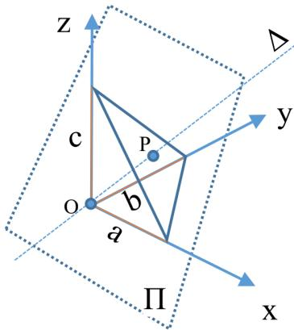

Так как 𝑛 — единичный вектор, то его координаты $n ( c o s \alpha , c o s \beta , c o s \gamma )$ , где α, $\beta , \gamma - \mathrm { y r J I b I }$ между 𝑛 и осями координат $O x , O y , O z$ соответственно.

Точка $M ( x , y , z ) \in \Pi \Longleftrightarrow x \cdot \cos \alpha + y \cdot \cos \beta + z \cdot \cos \gamma = p .$ . Перенесем 𝑝 в левую сто- рону и получим

$$
x \cdot \cos \alpha + y \cdot \cos \beta + z \cdot \cos \gamma - p = 0 .\tag{4.1.4}
$$

∙ Уравнение (4.1.4) называется нормальным уравнением плоскости.

Нормальное уравнение можно построить из общего уравнения, домножив его на норми- рующий множитель $\lambda = \pm { \frac { 1 } { \sqrt { A ^ { 2 } + B ^ { 2 } + C ^ { 2 } } } }$ , где знак λ противоположен знаку 𝐷.

Пусть $M ( x , y , z )$ — некоторая произвольная точка пространства, $M _ { 1 } \mathrm { ~ - ~ } \mathrm { e e }$ проекция на плоскость П, тогда $\rho ( M , \Pi ) = | \overline { { M _ { 1 } M } } |$ — расстояние от точки 𝑀 до плоскости П.

∙ Отклонением $\delta ( M , \varPi )$ называется число, равное

$$
\delta ( M , \Pi ) = \left\{ { \Theta ( M , \Pi ) , \overrightarrow { M _ { 1 } M } \uparrow \uparrow n , } \atop { - \rho ( M , \Pi ) , \overrightarrow { M _ { 1 } M } \uparrow \downarrow n . }  \right.
$$

Теорема. Если 𝑥 · cos α + 𝑦 · cos $\beta + z \cdot$ cos $\gamma - p = 0 \textrm { -- }$ нормальное уравнение плоскости $\varPi ,$ то отклонение точки $M _ { 0 } ( x _ { 0 } , y _ { 0 } , z _ { 0 } )$ от плоскости П равняется:

$$
\delta ( M _ { 0 } , \varPi ) = x _ { 0 } \cdot \cos \alpha + y _ { 0 } \cdot \cos \beta + z _ { 0 } \cdot \cos \gamma - p .
$$

♦ Доказательство аналогично подобной теореме для случая с прямой.

Заметим, что $\rho ( M _ { 0 } , \Pi ) = | x _ { 0 } \cdot \cos \alpha + y _ { 0 } \cdot \cos \beta + z _ { 0 } \cdot \cos \gamma - p |$

Пусть плоскость П проходит через точку $M _ { 0 } ( x _ { 0 } , y _ { 0 } , z _ { 0 } )$ параллельно двум неколлинеар- ным векторам $a ( a _ { 1 } , a _ { 2 } , a _ { 3 } )$ и $b ( b _ { 1 } , b _ { 2 } , b _ { 3 } )$ .

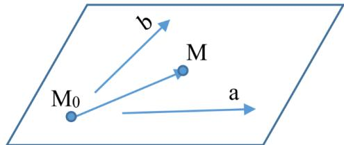

Тогда $M ( x , y , z ) \in \Pi \Longleftrightarrow \overrightarrow { M _ { 0 } M } , a , b -$ компланарные $\iff \overrightarrow { M _ { 0 } M } \cdot a \cdot b = 0 \Longleftrightarrow$

$$
( r _ { m } - r _ { m _ { 0 } } ) \cdot a \cdot b = 0 .\tag{4.1.5}
$$

∙ Уранвнение (4.1.5) называется уравнением плоскости, проходящей через точку $M _ { 0 }$ , параллельно неколлениарным векторам 𝑎 и 𝑏 в векторной форме.

Так же это уравнение можно записать через определитель:

$$
\begin{array} { r l } { x - x _ { 0 } \quad } & { { } y - y _ { 0 } \quad \quad z - z _ { 0 } } \\ { a _ { 1 } \quad } & { { } a _ { 2 } \quad } & { { } a _ { 3 } } \\ { b _ { 1 } \quad } & { { } b _ { 2 } \quad } & { { } b _ { 3 } } \end{array}\tag{4.1.6}
$$

∙ Уравнение (4.1.6) называется уравнением плоскости, проходящей через точку $M _ { 0 }$ , параллельно неколлениарным векторам 𝑎 и 𝑏.

Если плоскость П проходит через три точки, не лежащие на одной прямой $M _ { 0 } ( x _ { 0 } , y _ { 0 } , z _ { 0 } )$ $M _ { 1 } ( x _ { 1 } , y _ { 1 } , z _ { 1 } ) , M _ { 2 } ( x _ { 2 } , y _ { 2 } , z _ { 2 } )$ , то в качестве неколлинеарных векторов, параллельных плос- кости, можно взять $\overline { { M _ { 0 } M } }$ и $\overrightarrow { M _ { 0 } M _ { 2 } }$ и тогда уравнение примет вид:

$$
\left| { \begin{array} { r l r l } { x - x _ { 0 } } & { } & { y - y _ { 0 } } & { } & { z - z _ { 0 } } \\ { x _ { 1 } - x _ { 0 } } & { } & { y _ { 1 } - y _ { 0 } } & { } & { z _ { 1 } - z _ { 0 } } \\ { x _ { 2 } - x _ { 0 } } & { } & { y _ { 2 } - y _ { 0 } } & { } & { z _ { 2 } - z _ { 0 } } \end{array} } \right| = 0 .\tag{4.1.7}
$$

∙ Уравнение (4.1.7) называется уравнением плоскости, проходящей через три точки.

Так как векторы 𝑎 и $b$ неколлинеарны, то они на плоскости П образуют базис. Следо- вательно, любой вектор, параллельный плоскости, в том числе и $\overrightarrow { M _ { 0 } M }$ , если точка 𝑀 принадлежит плоскости П, может быть разложен по этому базису, то есть представим в виде $\overrightarrow { M _ { 0 } M } = t \cdot a + s \cdot b ,$ где $t , s \in \mathbb { R }$ . Тогда

$$
\boldsymbol { r _ { m } } = \boldsymbol { r _ { m _ { 0 } } } + \boldsymbol { t } \cdot \boldsymbol { a } + \boldsymbol { s } \cdot \boldsymbol { b } .\tag{4.1.8}
$$

∙ Уравнение (4.1.8) называется параметрическим уравнением плоскости в век- торной форме.

Распишем векторы по координатам и получим

$$
\left\{ \begin{array} { l l } { x = x _ { 0 } + t \cdot a _ { 1 } + s \cdot b _ { 1 } , } \\ { y = y _ { 0 } + t \cdot a _ { 2 } + s \cdot b _ { 2 } , } \\ { z = z _ { 0 } + t \cdot a _ { 3 } + s \cdot b _ { 3 } . } \end{array} \right.\tag{4.1.9}
$$

∙ Уравнение (4.1.9) называется параметрическим уравнением плоскости в коор- динатной форме.

## 4.2 Уравнение прямой в пространстве.

∙ Ненулевой вектор, параллельный прямой, называется направляющим вектором прямой.

Рассмотрим некоторую прямую $\Delta$ и пусть $a ( a _ { 1 } , a _ { 2 } , a _ { 3 } ) \textrm { -- }$ ее направляющий вектор, $M _ { 0 } ( x _ { 0 } , y _ { 0 } , z _ { 0 } ) \tiny \frac { \ } { \ }$ точка на прямой $\Delta .$ . Тогда точка $M ( x , y , z ) \in \Delta \Longleftrightarrow \overrightarrow { M _ { 0 } M } \parallel a \Longleftrightarrow$ $\exists t \in \mathbb { R } : M _ { 0 } { \tilde { M } } = t \cdot a$ . Отсюда получаем

$$
\begin{array} { r } { r _ { m } = r _ { m _ { 0 } } + t \cdot a . } \end{array}\tag{4.2.1}
$$

∙ Уравнение (4.2.1) называется параметрическим уравнением прямой в вектор- ной форме.

Распишем это уравнения через координаты векторов и получим

$$
\left\{ \begin{array} { l l } { x = x _ { 0 } + t \cdot a _ { 1 } , } \\ { y = y _ { 0 } + t \cdot a _ { 2 } , } \\ { z = z _ { 0 } + t \cdot a _ { 3 } . } \end{array} \right.\tag{4.2.2}
$$

∙ Уравнение (4.2.2) называется параметрическим уравнением прямой в коорди- натной форме.

Выразив параметр 𝑡 из каждого параметрического уравнения получим

$$
{ \frac { x - x _ { 0 } } { a _ { 1 } } } = { \frac { y - y _ { 0 } } { a _ { 2 } } } = { \frac { z - z _ { 0 } } { a _ { 3 } } } .\tag{4.2.3}
$$

∙ Уравнение (4.2.3) называется каноническим уравнением прямой.

Если прямая ∆ проходит через две различные точки $M _ { 0 } ( x _ { 0 } , y _ { 0 } , z _ { 0 } )$ и $M _ { 1 } ( x _ { 1 } , y _ { 1 } , z _ { 1 } )$ , то в качестве направляющего вектора можно взять вектор $\overrightarrow { M _ { 0 } M _ { 1 } }$ . Подставляем координаты в каноническое уравнение и получаем

$$
{ \frac { x - x _ { 0 } } { x _ { 1 } - x _ { 0 } } } = { \frac { y - y _ { 0 } } { y _ { 1 } - y _ { 0 } } } = { \frac { z - z _ { 0 } } { z _ { 1 } - z _ { 0 } } } .\tag{4.2.4}
$$

∙ Уравнение (4.2.4) называется уравнением прямой по двум точкам.

Пусть $A _ { 1 } x + B _ { 1 } y + C _ { 1 } z + D _ { 1 } = 0 \textrm { n } A _ { 2 } x + B _ { 2 } y + C _ { 2 } z + D _ { 2 } = 0 -$ две различные плоскости, про- ходящие через прямую $\Delta$ , тогда точка $M ( x , y , z ) \in \Delta \Longleftrightarrow$ ее координаты удовлетворяют каждому уравнению плоскости. Следовательно,

$$
\left\{ \begin{array} { l l } { A _ { 1 } x + B _ { 1 } y + C _ { 1 } z + D _ { 1 } = 0 , } \\ { A _ { 2 } x + B _ { 2 } y + C _ { 2 } z + D _ { 2 } = 0 . } \end{array} \right.\tag{4.2.5}
$$

∙ Уравнение (4.2.5) называется уравнением прямой, заданной как линия пересе- чения двух плоскостей (общим уравнением прямой).

Рассмотрим взаимное расположение прямых в пространстве. Возьмём две прямые $\Delta _ { 1 }$ и $\Delta _ { 2 }$ , проходящие через точки $M _ { 0 }$ и $M _ { 1 }$ , описанные каноническими уравненениями

$$
\frac { x - x _ { 0 } } { a _ { 1 } } = \frac { y - y _ { 0 } } { a _ { 2 } } = \frac { z - z _ { 0 } } { a _ { 3 } } \textrm { H } \frac { x - x _ { 1 } } { b _ { 1 } } = \frac { y - y _ { 1 } } { b _ { 2 } } = \frac { z - z _ { 1 } } { b _ { 3 } }
$$

соответственно. При этом $a ( a _ { 1 } , a _ { 2 } , a _ { 3 } ) \textrm { \ -- } b ( b _ { 1 } , b _ { 2 } , b _ { 3 } ) \textrm { -- }$ два направляющих вектора соответ- ственно.

1. прямые совпадают, если $a \parallel b \parallel \overrightarrow { M _ { 0 } M _ { 1 } } \Rightarrow \frac { a _ { 1 } } { b _ { 1 } } = \frac { a _ { 2 } } { b _ { 2 } } = \frac { a _ { 3 } } { b _ { 3 } } ;$

2. прямые параллельны, если $a \parallel b , \overrightarrow { M _ { 0 } M _ { 1 } } \nparallel a , b ;$

3. прямые пересекаются, если 𝑎 ∦ $b \nparallel \overrightarrow { M _ { 0 } M _ { 1 } }$ , но при этом $\overrightarrow { M _ { 0 } M _ { 1 } } \cdot a \cdot b = 0$ (то есть векторы $a , b , \overrightarrow { M _ { 0 } M _ { 1 } }$ компланарны);

4. прямые скрещивающиеся, если 𝑎 ∦ 𝑏 ∦ $\overrightarrow { M _ { 0 } M _ { 1 } }$ , но при этом $\overrightarrow { M _ { 0 } M _ { 1 } } \cdot a \cdot b \neq 0$ (то есть $a , b , \overrightarrow { M _ { 0 } M _ { 1 } }$ не компланарны).

1)  
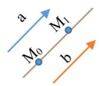

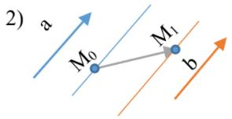

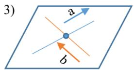

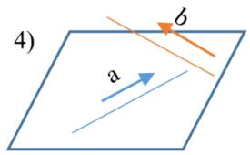

Заметим, что угол между двумя прямыми равен углу между их направляющими векто- рами, то есть

$$
\cos ( \Delta _ { 1 } , \Delta _ { 2 } ) = \frac { | a \cdot b | } { | a | \cdot | b | } .
$$

Рассмотрим взаимное расположение прямой и плоскости. Пусть прямая задана канони- ческим уравнением $\frac { x \dot { - } x _ { 0 } } { a _ { 1 } } = \frac { y - y _ { 0 } } { a _ { 2 } } \dot { = } \frac { z - z _ { 0 } } { a _ { 3 } }$ , а плоскость задана общим уравнением $A x + B y + C z + D = 0$

1. Если прямая лежит на плоскости, то $a \perp n \Longleftrightarrow a \cdot n = 0$ , а сами прямая и плоскость имеют одну общую точку.

2. Прямая параллельна плоскости, если $a \cdot n = 0$ , а общих точек у них нет.

3. Прямая и плоскость пересекаются, если $a \cdot n \neq 0$

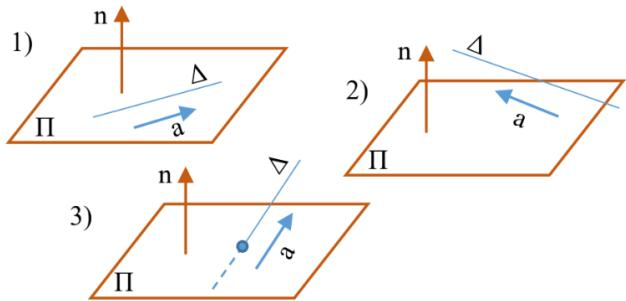

При этом угол между прямой и плоскостью равен углу между нормальным вектором плоскости и направляющим вектором прямой.

$$
\sin ( \Delta , \Pi ) = \frac { | a \cdot n | } { | a | \cdot | n | } .
$$

# Линии и поверхности второго порядка

## 5.1 Эллипс.

∙ Эллипсом называется множество всех точек плоскости, cумма расстояний от ко- торых до данных двух точек $F _ { 1 }$ и $F _ { 2 }$ есть величина постоянная. При этом точки $F _ { 1 }$ и $F _ { 2 }$ называются фокусами эллипса.

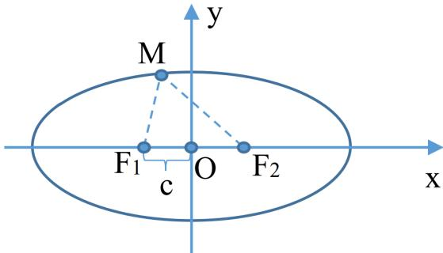

Выведем формулу: пусть $F _ { 1 }$ и 𝐹2 – фокусы, $| \overline { { F _ { 1 } F _ { 2 } } } | = 2 c$

Построим ДПСК, чтобы $O x$ проходила через фокусы так, чтобы направление вектора $\overrightarrow { F _ { 1 } F _ { 2 } }$ совпадало с направлением оси 𝑥, а начало координат располагалось в центе $\overline { { F _ { 1 } F _ { 2 } } }$ Тогда фокусы $F _ { 1 }$ и $F _ { 2 }$ имеют координаты $( - c , 0 ) \texttt { u } ( c , 0 )$ соответственно. И пусть $2 a \mathrm { ~ -- ~ }$ сумма расстояний от точки эллипса $M ( x , y ) \ \mathcal { \mu } ( x , y )$ фокусов. Заметим, что $2 a > 2 c \Rightarrow a > c$ Отрезки $M F _ { 1 }$ и $M F _ { 2 }$ назовём фокальными радиусами точки 𝑀.

По определению $| \overline { { { M F _ { 1 } } } } | + | \overline { { { M F _ { 2 } } } } | = 2 a \Rightarrow$

$$
{ \sqrt { ( x + c ) ^ { 2 } + y ^ { 2 } } } + { \sqrt { ( x - c ) ^ { 2 } + y ^ { 2 } } } = 2 a .\tag{5.1.1}
$$

Преобразуем уравнение $( 5 . 1 . 1 ) \colon { \sqrt { ( x + c ) ^ { 2 } + y ^ { 2 } } } = 2 a - { \sqrt { ( x - c ) ^ { 2 } + y ^ { 2 } } } \Leftrightarrow$ (возведём в квад- рат) $( x + c ) ^ { 2 } + y ^ { 2 } = 4 a ^ { 2 } - 4 a { \sqrt { ( x - c ) ^ { 2 } + y ^ { 2 } } } + ( x - c ) ^ { 2 } + y ^ { 2 } \Leftrightarrow$ (перенесём выражение с корнем в левую часть, всё остальное в правую и раскроем квадраты) 4𝑎 ${ \sqrt { ( x - c ) ^ { 2 } + y ^ { 2 } } } =$ $4 a ^ { 2 } + x ^ { 2 } + c ^ { 2 } - 2 x c - x ^ { 2 } - c ^ { 2 } - 2 x c + y ^ { 2 } - y ^ { 2 } \Leftrightarrow$ (уберём подобные)   
4𝑎 $\sqrt { ( x - c ) ^ { 2 } + y ^ { 2 } = 4 a ^ { 2 } - }$ 4𝑥𝑐 ⇔ (сократим на 4) $a { \sqrt { ( x - c ) ^ { 2 } + y ^ { 2 } = a 2 - x c } } \Leftrightarrow$ (снова воз- ведём в квадрат) $a ^ { 2 } ( ( x - c ) ^ { 2 } + y ^ { 2 } ) = ( a ^ { 2 } - x c ) ^ { 2 } \Leftrightarrow$ (раскроем скобки) $a ^ { 2 } x ^ { 2 } - 2 a ^ { 2 } x c + a ^ { 2 } c ^ { 2 } +$ $a ^ { 2 } y ^ { 2 } = a ^ { 4 } - 2 a ^ { 2 } x c + x ^ { 2 } c ^ { 2 } \Leftrightarrow$ (сгруппируем 𝑥 и 𝑦 слева, 𝑎 и 𝑐 справа и уберём подобные) $( a ^ { 2 } - c ^ { 2 } ) c ^ { 2 } + a ^ { 2 } y ^ { 2 } = a ^ { 2 } ( a ^ { 2 } - c ^ { 2 } )$

Обозначим $b = { \sqrt { a ^ { 2 } - c ^ { 2 } } }$ (так как $a > c )$ . Заметим, что $b < a$ . Тогда $b ^ { 2 } x ^ { 2 } + a ^ { 2 } y ^ { 2 } = a ^ { 2 } b ^ { 2 }$ Разделим обе части уравнения на $a ^ { 2 } b ^ { 2 } ;$

$$
{ \frac { x ^ { 2 } } { a ^ { 2 } } } + { \frac { y ^ { 2 } } { b ^ { 2 } } } = 1 .\tag{5.1.2}
$$

∙ Уравнение (5.1.2) называется каноническим уравнением эллипса.

Любая точка, удовлетворяющая уравнению (5.1.1) (то есть принадлежащая эллипсу), удо- влетворяет уравнению (5.1.2). Покажем, что любая точка, удовлетворяющая уравнению (5.1.2), будет принадлежать эллипсу.

Пусть $M _ { 1 } ( x _ { 1 } , y _ { 1 } )$ удовлетворяет (5.1.2) ⇒

$$
{ \frac { x _ { 1 } ^ { 2 } } { a ^ { 2 } } } + { \frac { y _ { 1 } ^ { 2 } } { b ^ { 2 } } } = 1 .\tag{5.1.3}
$$

$\begin{array} { r } { | \overline { { M _ { 1 } F _ { 1 } } } | = \sqrt { ( x _ { 1 } + c ) ^ { 2 } + y ^ { 2 } } = [ \mathtt { u s } \ ( 5 . 1 . 3 ) \ y ^ { 2 } = b ^ { 2 } ( 1 - \frac { x _ { 1 } ^ { 2 } } { a ^ { 2 } } ) ] = \sqrt { ( x _ { 1 } + c ) ^ { 2 } + b ^ { 2 } ( 1 - \frac { x _ { 1 } ^ { 2 } } { a ^ { 2 } } ) } = [ b ^ { 2 } = a ^ { 2 } - 1 . 3 ] . } \end{array}$ $\begin{array} { r } { c ^ { 2 } ] = \sqrt { ( x _ { 1 } + c ) ^ { 2 } + ( a ^ { 2 } - c ^ { 2 } ) ( 1 - \frac { x _ { 1 } ^ { 2 } } { a ^ { 2 } } ) } = \sqrt { x _ { 1 } ^ { 2 } + 2 x _ { 1 } c + c ^ { 2 } + a ^ { 2 } } = c ^ { 2 } - x _ { 1 } ^ { 2 } + \frac { c ^ { 2 } x _ { 1 } ^ { 2 } } { a ^ { 2 } } = \sqrt { a ^ { 2 } + 2 x _ { 1 } c + \frac { c ^ { 2 } x _ { 1 } ^ { 2 } } { a ^ { 2 } } } = c ^ { 2 } - 1 . } \end{array}$ $\begin{array} { r } { \sqrt { ( a + \frac { c } { a } x _ { 1 } ) ^ { 2 } } = | a + \frac { c } { a } x _ { 1 } | } \end{array}$ . Аналогично $\begin{array} { r } { | \overline { { M _ { 1 } F _ { 2 } } } | = | a - \frac { c } { a } x _ { 1 } | . } \end{array}$

Раскроем модули, оценив подмодульные выражения. Из (5.1.3) следует, что $\frac { x _ { 1 } ^ { 2 } } { a ^ { 2 } } \leqslant 1 \Rightarrow$ $- 1 \leqslant \frac { x _ { 1 } } { a } \leqslant 1 \Rightarrow - a < - c < \frac { c x _ { 1 } } { a } < c < a \Rightarrow | a + \frac { c } { a } x _ { 1 } | = a + \frac { c } { a } x _ { 1 } , | a - \frac { c } { a } x _ { 1 } | = a - \frac { c } { a } x _ { 1 } \Rightarrow $ $| \overline { { { M _ { 1 } F _ { 1 } } } } | + | \overline { { { M _ { 1 } F _ { 2 } } } } | = a + \frac { c } { a } x _ { 1 } + a - \frac { c } { a } x _ { 1 } = 2 a \Rightarrow$ точка $M _ { 1 }$ удовлетворяет уравнению $( 5 . 1 . 1 ) \Rightarrow M _ { 1 }$ — точка, принадлежащая эллипсу ⇒ уравнение (5.1.2) является каноническим уравнени- ем эллипса, где $b < a$

В случае, если $b > a$ , каноническое уравнение имеет вид ${ \frac { x _ { 1 } ^ { 2 } } { b ^ { 2 } } } + { \frac { y _ { 1 } ^ { 2 } } { a ^ { 2 } } } = 1$ , а фокусы будут лежать не на 𝑂𝑥, а на $O y$

Исследование формы эллипса по его каноническому уравнению:

$\frac { x _ { 1 } ^ { 2 } } { a ^ { 2 } } \mathrm { ~  ~ u ~ } \frac { y _ { 1 } ^ { 2 } } { b ^ { 2 } } \leqslant 1 \Rightarrow \left| x _ { 1 } \right| \leqslant \left| a \right| \mathrm { ~  ~ u ~ } \left| y _ { 1 } \right| \leqslant \left| b \right|$ , то есть эллипс — линия ограниченная и распо- ложенная внутри прямоугольника, которая ограничена прямыми $x = \pm a , y = \pm b$

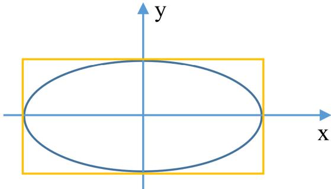

В уравнении эллипса обе координаты имеют чётные степени, следовательно, если точка $M _ { 1 } ( x , y )$ принадлежит эллипсу, то и точки $M _ { 2 } ( - x , y ) , M _ { 3 } ( x , - y ) , M _ { 4 } ( - x , - y )$ также будут принадлежать эллипсу.

Эллипс симметричен относительно начала координат и осей.

∙ Центр симметрии называется центром эллипса.

∙ Прямая, проходящая через фокусы, называется большой осью эллипса, перпенди- кулярная ей и проходящая через центр – малая ось. Точки пересечения осей эллипса с эллипсом (𝑂𝑥 в точках $A _ { 1 } ( a , 0 )$ и $A _ { 2 } ( - a , 0 ) , O y$ в точках $B _ { 1 } ( 0 , b )$ и $B _ { 2 } ( 0 , - b ) )$ называ- ются вершинами эллипса. Отрезки $O A _ { 1 } , O A _ { 2 } , O B _ { 1 } , O B _ { 2 } \mathrm { ~ - ~ } n o . n y o c u$ (большой и малой соответственно) эллипса с длинами 𝑎 и 𝑏.

Рассмотрим поведение эллипса в первой четверти ДПСК: $\left\{ 0 < x \leqslant a \right.$ $y \ = \ b { \sqrt { 1 - { \frac { x ^ { 2 } } { a ^ { 2 } } } } }$ (из канонического уравнения) $\Rightarrow \ y \ = \ { \frac { b } { a } } ( a ^ { 2 } - x ^ { 2 } ) ^ { \frac { 1 } { 2 } } \ \Rightarrow \ y ^ { \prime } \ = \ { \frac { b } { a } } \cdot { \frac { 1 } { 2 } } ( a ^ { 2 } -$ $x ^ { 2 } ) ^ { - { \frac { 1 } { 2 } } } ( - 2 x ) = - { \frac { b } { a } } x ( a ^ { 2 } - x ^ { 2 } ) ^ { - { \frac { 1 } { 2 } } } < 0$ , то есть функция убывает. $y ^ { \prime \prime } = - { \frac { b } { a } } \cdot \left( ( a ^ { 2 } - x ^ { 2 } ) ^ { - { \frac { 1 } { 2 } } } x + \right.$ $\frac { x ( 2 x ) ( a ^ { 2 } - x ^ { 2 } ) ^ { - \frac { 3 } { 2 } } } { 2 } \biggr ) = - \frac { a b } { ( a ^ { 2 } - x ^ { 2 } ) ^ { \frac { 3 } { 2 } } } < 0$ , то есть график функции вогнут.

## 5.2 Гипербола.

∙ Гиперболой называется множество точек плоскости, модуль разности расстояний от которых до заранее заданных точек $F _ { 1 } ~ u ~ F _ { 2 }$ , называемых фокусами гиперболы, есть величина постоянная и меньшая, чем расстояние между фокусами..

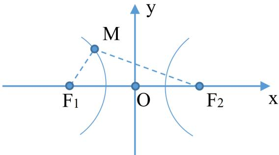

Выведем формулу. Пусть $F _ { 1 }$ и $F _ { 2 } - \mathrm { { d o t y c b I } , } | \overline { { F _ { 1 } F _ { 2 } } } | = 2 c$

Построим ДПСК. Ось 𝑂𝑥 проходит через фокусы и соноправлена с $\overrightarrow { F _ { 1 } F _ { 2 } }$ , а центр между фокусами — начало координат. Обозначим модуль разности точек гиперболы до фокусов за $2 a \Rightarrow 2 a < 2 c \Rightarrow a < c$

Пусть $M ( x , y )$ — произвольная точка гиперболы. Как и в эллипсе, отрезки $M F _ { 1 } ~ \mathrm { { u } } M F _ { 2 }$ будем называть фокальными радиусами.

По определению $| | \overline { { { M F _ { 1 } } } } | - | \overline { { { M F _ { 2 } } } } | | = 2 a \Rightarrow$

$$
| { \sqrt { ( x + c ) ^ { 2 } + y ^ { 2 } } } - { \sqrt { ( x - c ) ^ { 2 } + y ^ { 2 } } } | = 2 a .\tag{5.2.1}
$$

∙ Уравнение (5.2.1) называется уравнением гиперболы.

Преобразуем это уравнение. Раскроем модуль и получим: ${ \sqrt { ( x + c ) ^ { 2 } + y ^ { 2 } } } - { \sqrt { ( x - c ) ^ { 2 } + y ^ { 2 } } } =$ $\pm 2 a \Leftrightarrow { \sqrt { ( x + c ) ^ { 2 } + y ^ { 2 } } } = \pm 2 a + { \sqrt { ( x - c ) ^ { 2 } + y ^ { 2 } } } \Leftrightarrow$ (возведём в квадрат и раскроем квадра- ты сумм и разности) $x ^ { 2 } + c ^ { 2 } + 2 x c + y ^ { 2 } = 4 a ^ { 2 } + x ^ { 2 } + c ^ { 2 } - 2 x c + y ^ { 2 } \pm 4 a { \sqrt { ( x - c ) ^ { 2 } + y ^ { 2 } } } \Leftrightarrow$ (приведём подобные) $\pm a { \sqrt { ( x - c ) ^ { 2 } + y ^ { 2 } } } = - a ^ { 2 } + x c \Leftrightarrow$ (снова возведём в квадрат и рас- кроем квадраты сумм и разности) $a ^ { 2 } ( x ^ { 2 } + c ^ { 2 } - 2 x c + y ^ { 2 } ) = a ^ { 4 } + x ^ { 2 } c ^ { 2 } - 2 a ^ { 2 } x c \Leftrightarrow$ (снова приводим подобные, раскрыв скобку слева, после чего группируем по 𝑥 и 𝑦 справа, а без них слева) $a ^ { 2 } ( c ^ { 2 } - a ^ { 2 } ) = x ^ { 2 } ( c ^ { 2 } - a ^ { 2 } ) - a ^ { 2 } y ^ { 2 }$ . Так как $c > a \Rightarrow c ^ { 2 } - a ^ { 2 } > 0 \Rightarrow$ обозначим $b = { \sqrt { c ^ { 2 } - a ^ { 2 } } } \Rightarrow x ^ { 2 } b ^ { 2 } - y ^ { 2 } a ^ { 2 } = a ^ { 2 } b ^ { 2 }$ . 𝑎 и $b \neq 0 \Rightarrow$ делим на $a ^ { 2 } b ^ { 2 }$ и получаем

$$
{ \frac { x ^ { 2 } } { a ^ { 2 } } } - { \frac { y ^ { 2 } } { b ^ { 2 } } } = 1 .\tag{5.2.2}
$$

Любая точка, удовлетворяющая уравнению (5.2.1), то есть принадлежащая гиперболе, удовлетворяет и уравнению (5.2.2). Покажем, что любая точка, удовлетворяющая уравне- нию (5.2.2), будет принадлежать гиперболе.

Пусть точка $M _ { 1 } ( x _ { 1 } , y _ { 1 } )$ удовлетворяет уравнению (5.2.2)⇒

$$
{ \frac { x _ { 1 } ^ { 2 } } { a ^ { 2 } } } - { \frac { y _ { 1 } ^ { 2 } } { b ^ { 2 } } } = 1 .\tag{5.2.3}
$$

$$
\begin{array} { r l } & { | \overline { { M _ { 1 } F _ { 1 } } } | = \sqrt { ( x _ { 1 } + c ) ^ { 2 } + y ^ { 2 } } = \left[ \mathtt { m } _ { 3 } \left( 5 . 2 . 3 \right) y ^ { 2 } = b ^ { 2 } ( \frac { x _ { 1 } ^ { 2 } } { a ^ { 2 } } - 1 ) \right] = \sqrt { ( x _ { 1 } + c ) ^ { 2 } + b ^ { 2 } ( \frac { x _ { 1 } ^ { 2 } } { a ^ { 2 } } - 1 ) } = } \\ & { \sqrt { ( x _ { 1 } + c ) ^ { 2 } + ( c ^ { 2 } - a ^ { 2 } ) ( \frac { x _ { 1 } ^ { 2 } } { a ^ { 2 } } - 1 ) } = \sqrt { x _ { 1 } ^ { 2 } + 2 x _ { 1 } c + c ^ { 2 } + a ^ { 2 } - c ^ { 2 } - x _ { 1 } ^ { 2 } + \frac { c ^ { 2 } x _ { 1 } ^ { 2 } } { a ^ { 2 } } } = \sqrt { ( a + \frac { c } { a } x _ { 1 } ) ^ { 2 } } = } \\ & { | a + \frac { c } { a } x _ { 1 } | . \mathrm { ~ A n a m o r n u m } \ | \overline { { M _ { 1 } F _ { 2 } } } | = | a - \frac { c } { a } x _ { 1 } | . } \\ & { \mathrm { ~ H 3 ~ } ( 5 . 2 . 3 ) \mathrm { ~ c h e r w e r , ~ q r o ~ } \frac { x _ { 1 } ^ { 2 } } { a ^ { 2 } } \geqslant 1 \Rightarrow x _ { 1 } \geqslant a \mathrm { ~ u r m ~ } x _ { 1 } \leqslant - a . } \end{array}
$$

$$
\begin{array} { r l } & { 1 . \mathrm { ~ } \Pi _ { \mathrm { y C T b ~ } } x _ { 1 } \geqslant a \Rightarrow \frac { c x _ { 1 } } { a } > c > a \Rightarrow | \overline { { M _ { 1 } F _ { 1 } } } | = a + \frac { c } { a } x _ { 1 } , | \overline { { M _ { 1 } F _ { 2 } } } | = - a + \frac { c } { a } x _ { 1 } \Rightarrow | \overline { { M _ { 1 } F _ { 1 } } } | - } \\ & { | \overline { { M _ { 1 } F _ { 2 } } } | = 2 a . } \end{array}
$$

2. Пусть 𝑥1 ⩽ −𝑎 ⇒ 𝑐𝑥1 < −𝑐 < −𝑎 < 0 ⇒ |𝑀1𝐹1| = −𝑎 − 𝑐 𝑥1, |𝑀1𝐹2| = 𝑎 − 𝑐 𝑥1 ⇒ 𝑎 𝑎 𝑎 |𝑀1𝐹1| − |𝑀1𝐹2| = −2𝑎 ⇒ ||𝑀1𝐹1| − |𝑀1𝐹2|| = 2𝑎.

Следовательно, точка $M _ { 1 }$ принадлежит гиперболе. Тогда

∙ Уравнение (5.2.2) называется каноническим уравнением гиперболы.

Исследование формы гиперболы по её каноническому уравнению:

Из (5.2.2) следует, что ${ \frac { x _ { 1 } ^ { 2 } } { a ^ { 2 } } } \geqslant 1 \Rightarrow | x | \geqslant a \Rightarrow \mathrm { B }$ полосе между прямыми −𝑎 и 𝑎 точек гиперболы нет.

Гиперболы пересекается с осью 𝑂𝑥 в точках $A _ { 1 } ( a , 0 ) \textrm { \ -- } A _ { 2 } ( - a , 0 )$

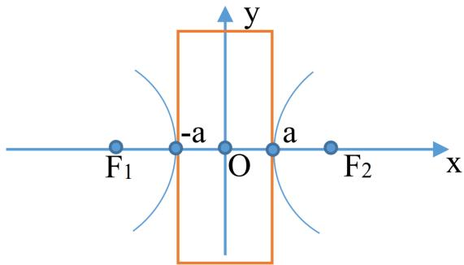

Так как все степени четные, то гипербола симметрична относительно осей $O x , O y$ и точки $O ( 0 , 0 )$

∙ Центр симметрии гиперболы (центр между $F _ { 1 }$ и $F _ { 2 } )$ называется центром гипер- болы. Ось симметрии, проходящая через фокусы, называется действительной (фо- кальной) осью, а перпендикулярная ей ось, проходящая через центр гиперболы — мни- мой осью. Точки пересечения гиперболы с действительной осью являются её верши- нами. Величины $a , b$ называются соответственно действительными и мнимыми полуосями. Если $a = b$ , то гиперболу называют равносторонней.

Исследуем формулу гиперболы в первой четверти, выразив 𝑦 из канонического уравне- ния:

$$
y = { \frac { b } { a } } ( x ^ { 2 } - a ^ { 2 } ) ^ { \frac { 1 } { 2 } } .
$$

$y ^ { \prime } = { \frac { 1 } { a } } \cdot x ( x ^ { 2 } - a ^ { 2 } ) ^ { \frac { 1 } { 2 } } > 0 .$ , то есть функция возрастает;

$y ^ { \prime \prime } = { \frac { 1 } { a } } ( x ^ { 2 } - a ^ { 2 } ) ^ { - { \frac { 3 } { 2 } } } ( - a ^ { 2 } ) < 0$ , то есть график функции вогнут.

Асимптота гиперболы в 1-й четверти: $y = k x + l$

$$
k = \operatorname* { l i m } _ { x \to \infty } { \frac { y } { x } } = \operatorname* { l i m } _ { x \to \infty } { \frac { b } { a } } \cdot { \frac { \sqrt { x ^ { 2 } - a ^ { 2 } } } { , x } } = { \frac { b } { a } } ;
$$

$$
l = \operatorname* { l i m } _ { x \to \infty } x \frac { b } { a } y = 0 \Rightarrow y = \frac { b } { a } x .
$$

## 5.3 Эксцентриситет и директрисы эллипса и гиперболы.

Рассмотрим эллипс, у которого фокусное расстояние равно $2 c .$ , а сумма расстояний от то- чек эллипса до фокусов $2 a$ . Тогда каноническое уравнение эллипса имеет вид ${ \frac { x _ { 1 } ^ { 2 } } { a ^ { 2 } } } + { \frac { y _ { 1 } ^ { 2 } } { b ^ { 2 } } } = 1$ где $b ^ { 2 } = a ^ { 2 } - c ^ { 2 }$

Рассмотрим гиперболу, у которой фокусное расстояние равно $2 c ,$ а модуль разности рас- стояний от точек гиперболы до фокусов $2 a$ . Тогда каноническое уравнение гиперболы имеет вид ${ \frac { x _ { 1 } ^ { 2 } } { a ^ { 2 } } } - { \frac { y _ { 1 } ^ { 2 } } { b ^ { 2 } } } = 1$ , где $b ^ { 2 } = c ^ { 2 } - a ^ { 2 }$

∙ Эксцентриситетом эллипса (гиперболы) называется величина, равная $\varepsilon = { \frac { c } { a } }$

Заметим, что для эллипса 𝑎 $> c \Rightarrow 0 < \varepsilon < 1$ , для гиперболы $a < c \Rightarrow \varepsilon > 1$

∙ Прямые $\Delta _ { 1 } \ u \ \Delta _ { 2 }$ , проходящие перпендикулярно фокальной оси эллипса (гиперболы) на расстоянии равном $\frac { a } { c }$ от центра эллипса (гиперболы), называются директрисами эл- липса (гиперболы).

Если эллипс и гипербола заданы каноническим уравнением, то уравнение директрисы имеет вид $\textstyle x = \pm { \frac { a } { \varepsilon } }$

Директрисы расположены по разные стороны от $O y$ . Фокус и директриса, расположенные по одну сторону от $O y$ , называются соответствующими друг другу.

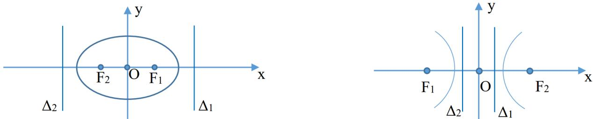

Теорема (основное свойство директрисы). Отношение расстояния от произвольной точки эллипса (гиперболы) до фокуса $F _ { i }$ к расстоянию этой точки до соответствующей этому фокусу директрисы равна эксцентриситету эллипса (гиперболы). То есть

$$
\frac { p ( M _ { 0 } , F _ { i } ) } { p ( M _ { 0 } , \Delta _ { i } ) } = \varepsilon .
$$

♦ Пусть точка $M _ { 0 } ( x _ { 0 } , y _ { 0 } )$ принадлежит эллипсу ${ \frac { x _ { 1 } ^ { 2 } } { a ^ { 2 } } } + { \frac { y _ { 1 } ^ { 2 } } { b ^ { 2 } } } = 1$ . Тогда $\vert \overline { { M _ { 0 } F _ { 1 } } } \vert = \vert a - \frac { c } { a } x _ { 0 } \vert =$ $\left| a - \varepsilon x _ { 0 } \right| \ x \ \left| \overline { { M _ { 0 } F _ { 2 } } } \right| \ = \ \left| a + \varepsilon x _ { 0 } \right|$ . Следовательно, так как $\Delta _ { 1 } = x + \frac { a } { \varepsilon } , \Delta _ { 2 } = - x - \frac { a } { \varepsilon } $ , то $\rho ( M _ { 0 } , \Delta _ { 1 } ) = | x _ { 0 } - \frac { a } { \varepsilon } | , \ \rho ( M _ { 0 } , \Delta _ { 2 } ) = | x _ { 0 } + \frac { a } { \varepsilon } |$ . Получаем $\frac { \rho ( M _ { 0 } , F _ { i } ) } { \rho ( M _ { 0 } , \Delta _ { i } ) } = \frac { | \grave { a _ { - } } \varepsilon x _ { 0 } | } { | x _ { 0 } - \frac { a } { \varepsilon } | } = \frac { | a - \varepsilon \bar { x _ { 0 } } | } { | \frac { a - \varepsilon x _ { 0 } } { \varepsilon } | } =$ $| \varepsilon | = \varepsilon$ . Аналогично и во втором случае и для гиперболы. ⊠

Теорема. Пусть в плоскости задана некоторая прямая $\Delta$ и точка $F _ { ; }$ , не лежащая на ней. Множество точек плоскости, для которых отношение 𝜇 равняется отношению расстояния до 𝐹 к расстоянию до $\Delta$ и отлично от 1, является эллипсом, если $\mu < 1$ , и гиперболой, если $\mu > 1$ . При этом точка 𝐹 будет являться фокусом, ∆ — директрисой, а 𝜇 — эксцентриситетом.

♦ Построим ДПСК так, чтобы 𝑂𝑦 совпадала с $\Delta$ , а 𝑂𝑥 проходила через $F .$

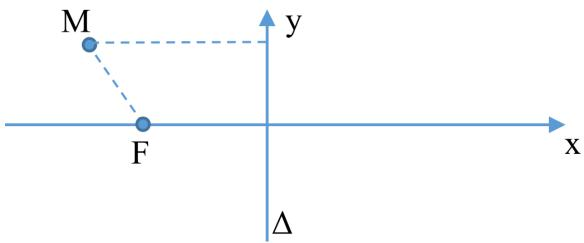

Точка 𝐹 будет иметь координаты (𝑘, 0), а $\mathbf { \nabla } _ { p } ( F , \Delta ) = | k |$

Пусть $M ( x , y )$ — некоторая точка, удовлетворяющая отношению: $\mu = \frac { p ( M , F ) } { p ( M , \Delta ) }$ . Преоб- разуем данное неравенство: ${ \frac { { \sqrt { ( x - k ) ^ { 2 } + y ^ { 2 } } } } { | x | } } = \mu \Rightarrow { \sqrt { ( x - k ) ^ { 2 } + y ^ { 2 } } } = \mu | x | \Rightarrow$ (возведём в квадрат и раскроем скобки) $x ^ { 2 } + k ^ { \stackrel { . } { 2 } } - 2 k x + y ^ { 2 } = \mu ^ { 2 } x ^ { 2 } \Rightarrow x ^ { 2 } ( 1 - \mu ^ { 2 } ) + k ^ { 2 } - 2 k x + y ^ { 2 } = 0 \Rightarrow$ $x ^ { 2 } ( 1 - \mu ^ { 2 } ) - 2 k x + y ^ { 2 } = - k ^ { 2 } \Rightarrow$ (добавим в обе части неравенства выражение $\frac { k ^ { 2 } } { 1 - \mu ^ { 2 } } \biggr )$ $x ^ { 2 } ( 1 - \mu ^ { 2 } ) - 2 k x + { \frac { k ^ { 2 } } { 1 - \mu ^ { 2 } } } + y ^ { 2 } = { \frac { k ^ { 2 } } { 1 - u ^ { 2 } } } - k ^ { 2 } \Rightarrow ( 1$ в левой части во всех слагаемых, за ис- ключением $y ^ { 2 }$ , выносим за скобки $( 1 - \mu ^ { 2 } ) )$   
$( 1 - \mu ^ { 2 } ) ( x ^ { 2 } - \frac { 2 k x } { 1 - \mu ^ { 2 } } + \frac { k ^ { 2 } } { ( 1 - \mu ^ { 2 } ) ^ { 2 } } ) + y ^ { 2 } = \frac { k ^ { 2 } } { 1 - \mu ^ { 2 } } - k ^ { 2 } \Rightarrow$ (слева получился квадрат разности, а справа приведём к общему знаменателю)

$$
\begin{array} { l } { ( 1 - \mu ^ { 2 } ) ( x ^ { 2 } - \displaystyle \frac { k } { 1 - \mu ^ { 2 } } ) ^ { 2 } + y ^ { 2 } = \displaystyle \frac { k ^ { 2 } \mu ^ { 2 } } { 1 - \mu ^ { 2 } } \Rightarrow ( \mathrm { \small ~ \ m o \ n e a r t u n ~ o 6 e ~ \ u a c r { \scriptstyle { H } } ~ \mu { \scriptstyle a } ~ } 1 - \mu ^ { 2 } ) } \\ { ( x ^ { 2 } - \displaystyle \frac { k } { 1 - \mu ^ { 2 } } ) ^ { 2 } + \displaystyle \frac { y ^ { 2 } } { 1 - \mu ^ { 2 } } = \displaystyle \frac { k ^ { 2 } \mu ^ { 2 } } { ( 1 - \mu ^ { 2 } ) ^ { 2 } } . } \end{array}
$$

Выполним замену $a = | \frac { k \mu } { 1 - \mu ^ { 2 } } |$ и выполним преобразование параллельного переноса ДПСК:

$$
\left\{ { x } ^ { \prime } = { x } - \frac { k } { 1 - \mu ^ { 2 } } , \right.
$$

Тогда, поделив на правую часть, получим

$$
\frac { ( x ^ { \prime } ) ^ { 2 } } { a ^ { 2 } } + \frac { ( y ^ { \prime } ) ^ { 2 } } { a ^ { 2 } ( 1 - \mu ^ { 2 } ) } = 1 .\tag{5.3.1}
$$

Если $\mu < 1$ , то уравнение (5.3.1) является каноническим уравнением эллипса, а если $\mu > 1$ — гиперболы.

Покажем, что 𝜇 — эксцентриситет. Если уравнение (5.3.1) задает эллипс, то $\varepsilon = { \frac { c } { a } } =$ $\lfloor b ^ { 2 } = a ^ { 2 } - c ^ { 2 } \Rightarrow c ^ { 2 } = a ^ { 2 } - b ^ { 2 } \rfloor = { \frac { \sqrt { a ^ { 2 } - b ^ { 2 } } } { a } } = \lfloor b ^ { 2 } = a ^ { 2 } ( 1 - \mu ^ { 2 } ) \rfloor \mathtt { m } ( 1 ) \rfloor = { \frac { \sqrt { a ^ { 2 } - a ^ { 2 } ( 1 - \mu ^ { 2 } ) } } { a } } = \mu .$ Если гипербола, то $b ^ { 2 } = c ^ { 2 } - a ^ { 2 } \Rightarrow { \overset { \mathbf { u } } { c } } ^ { 2 } = a ^ { 2 } + b ^ { 2 }$ и аналогично.

$x ^ { \prime } = \pm { \frac { a } { \varepsilon } } \Rightarrow x = \pm { \frac { a } { \varepsilon } } + { \frac { k } { 1 - \mu ^ { 2 } } } = \pm { \frac { | { \frac { k \mu } { 1 - \mu ^ { 2 } } } | } { \varepsilon } } + { \frac { k } { 1 - \mu ^ { 2 } } } \Rightarrow$ одно из уравнений имеет вид $x = 0$ . В ДПСК $O ^ { \prime } x ^ { \prime } y ^ { \prime }$ точка $F$ будет иметь координаты $( \pm c , 0 )$ , директрисы будут иметь уравнение $\pm { \frac { a } { \varepsilon } } \Rightarrow$ выполнив обратный перенос ДПСК получим, что одна из директрис совпадает с прямой $\Delta$ и один из фокусов совпадает с точкой 𝐹. ⊠

После доказательства теоремы определения эллипса и гиперболы можно дать по-новому.

∙ Эллипсом (гиперболой) называется множество точек на плоскости, для которых отношения расстояния до заданной точки, называемой фокусом, к расстоянию до за- данной прямой, называемой директрисой, постоянно меньше единицы (больше едини- цы).

## 5.4 Парабола.

∙ Параболой называется множество точек плоскости, каждая из которых равноуда- лена от точки называемой фокусом и от прямой называемой директрисой.

Выведем уравнение параболы. Построим ДПСК так, чтобы ось 𝑂𝑥 проходила через фо- кус 𝐹 перпендикулярно прямой $\Delta .$ И пусть 𝐷 — точка пересечения прямой $\Delta \underset { \cdot } { \pi }$ оси 𝑂𝑥. Направление 𝑂𝑥 выберем так, чтобы оно совпадало с направлением вектора $\overrightarrow { D F }$ . Начало координат будет располагаться в центре между точками 𝐷 и 𝐹.

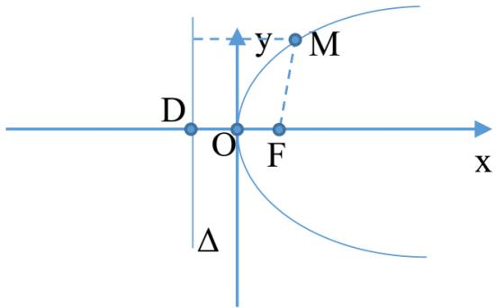

Обозначим за $p$ расстояние $\rho ( F , \Delta )$ . Тогда точка 𝐹 будет иметь координаты $\left( { \frac { p } { 2 } } , 0 \right)$ и коор- дината 𝑥 точки $D$ равна $- { \frac { p } { 2 } }$ . Следовательно, получим

$$
x + { \frac { p } { 2 } } = 0 \quad ( x - { \frac { p } { 2 } } = 0 ) .\tag{5.4.1}
$$

∙ Уравнение (5.4.1) называется нормальным уравнением параболы.

Пусть $M ( x , y )$ — произвольная точка параболы. Тогда $\begin{array} { r } { \mathsf { \rho } \mathsf { \rho } \bigl ( M , F \bigr ) = \mathsf { \rho } \mathsf { \rho } \bigl ( M , \Delta \bigr ) \Rightarrow \sqrt { ( x - \frac { p } { 2 } ) ^ { 2 } + y ^ { 2 } } = } \end{array}$ $\begin{array} { r } { | - x - \frac { p } { 2 } | } \end{array}$ . Возведем в квадрат, раскроем скобки и получим $\begin{array} { r } { x ^ { 2 } + \frac { p ^ { 2 } } { 2 } - p x + y ^ { 2 } = x ^ { 2 } \frac { p ^ { 2 } } { 2 } + p x \Rightarrow } \end{array}$

$$
y ^ { 2 } = 2 p x .\tag{5.4.2}
$$

∙ Уравнение (5.4.2) называется каноническим уравнением параболы. При этом па- раметр 𝑝 называется фокальным параметром.

Исследование формы параболы по её каноническому уравнению:

Пусть $x \geqslant 0$ . Тогда парабола находится в I и IV четвертях. Так как уравнение содер- жит 𝑦 в чётной степени, то парабола симметрична относительно оси $O x$

∙ Ось симметрии называется осью параболы. Точка $O ( 0 , 0 )$ пересечения оси параболы и самой параболы называется вершиной параболы.

Рассмотрим поведение параболы в I четверти, то есть при $x > 0 , y > 0 ;$ $y = { \sqrt { 2 p x } }$ . Тогда $y ^ { \prime } = { \frac { \sqrt { 2 p } } { 2 } } x ^ { - { \frac { 1 } { 2 } } } > 0$ , то есть функция возрастает. И $y ^ { \prime \prime } = - { \frac { \sqrt { 2 p } } { 4 } } x ^ { - { \frac { 3 } { 2 } } } < 0$ , то есть функция выпукла. Асимптот нет, так как $k = \operatorname* { l i m } _ { x \to \infty } { \frac { \sqrt { 2 p x } } { x } } = 0 , { \textrm { a } } b = \infty$

## 5.5 Линии второго порядка.

∙ Алгебраической линией второго порядка называется множество точек плоско- сти, координаты которых удовлетворяют уравнению

$$
A x ^ { 2 } + 2 B x y + C y ^ { 2 } + 2 D x + 2 E y + F = 0 ,\tag{5.5.1}
$$

где коэффициенты 𝐴, 𝐵 и 𝐶 не обращаются в нуль одновременно. В случае, если уравне- нию (5.5.1) не удовлетворяет ни одна из точек, то это уравнение определяет мнимую линию.

Определим, какие линии будут являться линиями второго порядка.

Пусть $B \neq 0$ . Построим ДПСК $O ^ { \prime } x ^ { \prime } y ^ { \prime }$ , которая получена из ДПСК 𝑂𝑥𝑦 поворотом против часовой стрелки вокруг начала координат на угол $\boldsymbol { \varphi }$ . Тогда $\left\{ { \begin{array} { l } { x = x ^ { \prime } c o s \varphi - y ^ { \prime } s i n \varphi } \\ { y = x ^ { \prime } s i n \varphi + y ^ { \prime } c o s \varphi . } \end{array} } \right.$ Заменим и получим $A ( x ^ { \prime } \cos \varphi - y ^ { \prime } \sin \varphi ) ^ { 2 } + 2 B ( x ^ { \prime } \cos \varphi - y ^ { \prime } \sin \varphi ) \cdot ( x ^ { \prime }$ cos $\varphi + y ^ { \prime }$ sin $\varphi ) +$ $C ( x ^ { \prime } \cos \varphi + y ^ { \prime } \sin \varphi ) ^ { 2 } + 2 D ( x ^ { \prime } \cos \varphi - y ^ { \prime } \sin \varphi ) + 2 E ( x ^ { \prime } \cos \varphi + y ^ { \prime } \sin \varphi ) + F = 0$ Ракскрыв скобки и приведя подобные, получим

$$
A ^ { \prime } ( x ^ { \prime } ) ^ { 2 } + 2 B x ^ { \prime } y ^ { \prime } + C ^ { \prime } ( y ^ { \prime } ) ^ { 2 } + 2 D ^ { \prime } x ^ { \prime } + 2 E ^ { \prime } y ^ { \prime } + F = 0 .\tag{5.5.2}
$$

Покажем, что коэффициенты 𝐴′, $B ^ { \prime } \textbf { \em u } C ^ { \prime }$ не обращаются одновременно в нуль: 𝐴′ = 𝐴 · cos2 φ + 2𝐵 · cos φ · sin φ + 𝐶 · sin2 φ;   
𝐵′ = −𝐴 · 𝑐𝑜𝑠φ · sin φ + 𝐵 · (𝑐𝑜𝑠2φ − sin2 φ) + 𝐶 · sin φ · 𝑐𝑜𝑠φ;   
𝐶′ = 𝐴 · sin2 φ − 2𝐵 · cos φ · sin φ + 𝐶 · cos2 φ.

Предположим, что 𝐴′, 𝐵′ и $C ^ { \prime }$ равны нулю. Сложив первое и третье уравнения, получим $A + C = 0$ . Следовательно, $C = - A$ . Из второго уравнения, приведя по формуле синуса и косинуса двойного угла, получим $0 = - A \cdot \sin ( 2 \varphi ) + B \cdot \cos ( 2 \varphi )$ , а из первого уравнения этой же заменой получим $0 = A \cdot \cos ( 2 \varphi ) + B \cdot \sin ( 2 \varphi )$ . Следовательно, получим систему

$$
\left\{ \begin{array} { l l } { A \cdot \cos ( 2 \varphi ) + B \cdot \sin ( 2 \varphi ) = 0 , } \\ { - A \cdot \sin ( 2 \varphi ) + B \cdot \cos ( 2 \varphi ) = 0 . } \end{array} \right.
$$

Определитель матрицы системы равен 1. В таком случае система будет иметь единствен- ное решение $A = B = 0 = C$ , что является противоречием с тем, что уравнение (5.5.1) — уравнение линии второго порядка. Значит коэффициенты $A ^ { \prime } , B ^ { \prime } \mathrm { ~ } _ { \mathrm { ~ H ~ } } C ^ { \prime }$ не обращаются в нуль одновременно.

Подберем угол φ так, чтобы коэффициент $B ^ { \prime }$ стал равен нулю. То $\mathrm { e c r b } - A \cdot c o s \varphi \cdot s i n \varphi +$ $B ( c o s ^ { 2 } \looparrow- s i n ^ { 2 } \varphi ) + C \cdot s i n \varphi \cdot c o s \varphi = 0 \Leftrightarrow \frac { C - A } { 2 } \cdot s i n ( 2 \varphi ) + B \cdot c o s ( 2 \varphi ) = 0 \Leftrightarrow \frac { A - C } { 2 } \cdot s i n ( 2 \varphi ) = 0 .$ $B \cdot c o s ( 2 \varphi )$ . Если $A - C \neq 0$ , то $t g ( 2 \varphi ) = { \frac { 2 B } { A - C } }$ . Если же $A - C = 0$ , то $B \neq 0$ . Следова- тельно, $c o s 2 ( \varphi ) = 0 \Rightarrow 2 \varphi = \frac { \pi } { 2 } \Rightarrow \varphi = \frac { \pi } { 4 }$

В результате получим ДПСК, в которой уравнение линий второго порядка имеет вид

$$
A ^ { \prime } ( x ^ { \prime } ) ^ { 2 } + C ^ { \prime } ( y ^ { \prime } ) ^ { 2 } + 2 D ^ { \prime } x ^ { \prime } + 2 E ^ { \prime } y ^ { \prime } + F = 0 .\tag{5.5.3}
$$

1. Пусть коэффициенты $A ^ { \prime }$ и $C ^ { \prime }$ ненулевые. Преобразуем уравнение следующим об- разом: добавим и вычтем числа $\frac { ( \breve { D } ^ { \prime } ) ^ { 2 } } { A ^ { \prime } } \textrm { \textmu } _ { \textrm { \scriptsize M } } \frac { ( E ^ { \prime } ) ^ { 2 } } { C ^ { \prime } }$ . Везде, где есть $x ^ { \prime }$ или $D ^ { \prime }$ вынесем коэффициент $A ^ { \prime }$ за скобки. Аналогично, где $\overline { { y ^ { \prime } } }$ или $E ^ { \prime } - C ^ { \prime }$ за скобки. Обозначим за $F ^ { \prime }$ выражение $F ^ { \prime } = F - { \frac { ( D ^ { \prime } ) ^ { 2 } } { A ^ { \prime } } } - { \frac { ( E ^ { \prime } ) ^ { 2 } } { C ^ { \prime } } }$ . В итоге получим $A ^ { \prime } \Bigl ( ( x ^ { \prime } ) ^ { 2 } + 2 { \frac { D ^ { \prime } x ^ { \prime } } { A ^ { \prime } } } + ( { \frac { D ^ { \prime } } { A ^ { \prime } } } ) ^ { 2 } \Bigr ) +$ $C ^ { \prime } \Big ( ( y ^ { \prime } ) ^ { 2 } + 2 \frac { E ^ { \prime } y ^ { \prime } } { C ^ { \prime } } + ( \frac { E ^ { \prime } } { C ^ { \prime } } ) ^ { 2 } \Big ) + F ^ { \prime } = 0 \Longleftrightarrow$ (свернем квадраты суммы) $A ^ { \prime } ( x ^ { \prime } + { \frac { D ^ { \prime } } { A ^ { \prime } } } ) ^ { 2 } +$ $B ^ { \prime } ( y ^ { \prime } + { \frac { E ^ { \prime } } { C ^ { \prime } } } ) ^ { 2 } + F ^ { \prime } = 0$ . Выполним параллельный перенос ДПСК: $\left\{ { x ^ { \prime \prime } = x ^ { \prime } + \frac { \mathit { \hat { D } } ^ { \prime } } { \mathit { A } ^ { \prime } } } , \right.$ Отсюда получим

$$
A ^ { \prime } ( x ^ { \prime \prime } ) ^ { 2 } + C ^ { \prime } ( y ^ { \prime \prime } ) ^ { 2 } = - F ^ { \prime } .\tag{5.5.4}
$$

Здесь рассмотрим два случая:

(a) Пусть $F ^ { \prime } \neq 0$ . Тогда поделим уравнение (5.5.4) на $- \boldsymbol { F ^ { \prime } }$ , перенесем $A _ { \mathrm { ~ \bf ~ H ~ } } ^ { \prime } C ^ { \prime }$ в знаменатели и получим $\frac { ( \stackrel { . } { x } ^ { \prime \prime } ) ^ { 2 } } { \frac { - F } { A ^ { \prime } } } + \frac { ( \stackrel { . } { y } ^ { \prime \prime } ) ^ { 2 } } { \frac { - F } { C ^ { \prime } } } = 1$ Если знаменатели положительные, то уравнение примет вид ${ \frac { ( x ^ { \prime \prime } ) ^ { 2 } } { a ^ { 2 } } } + { \frac { ( y ^ { \prime \prime } ) ^ { 2 } } { b ^ { 2 } } } = 1$ что является каноническим уравнением эллипса. Если знаменатели отрицательные, то уравнение примет вид $\frac { ( x ^ { \prime \prime } ) ^ { 2 } } { \underset { \mathrm { \scriptsize { I I C a } } } { a ^ { 2 } } } + \frac { ( y ^ { \prime \prime } ) ^ { 2 } } { b ^ { 2 } } = - 1$ что является каноническим уравнением мнимого эллипс

(b) Пусть $F ^ { \prime } = 0$ . Тогда поделим обе части уравнения (5.5.4) на $A ^ { \prime } C ^ { \prime }$ и получим уравнение ${ \frac { ( x ^ { \prime \prime } ) ^ { 2 } } { C ^ { \prime } } } + { \frac { ( y ^ { \prime \prime } ) ^ { 2 } } { A ^ { \prime } } } = 0$ Если знаменатели разных знаков, то уравнение примет вид ${ \frac { ( x ^ { \prime \prime } ) ^ { 2 } } { a ^ { 2 } } } - { \frac { ( y ^ { \prime \prime } ) ^ { 2 } } { b ^ { 2 } } } = 0$ что является каноническим уравнением пары пересекающиъся прямых. Если знаменатели имеют один знак, то уравнение примет вид $\frac { ( \dot { x } ^ { \prime \prime } ) ^ { 2 } } { a ^ { 2 } } + \frac { ( \dot { y } ^ { \prime \prime } ) ^ { 2 } } { b ^ { 2 } } = 0$ что является каноническим уравнением пары мнимых пересекающихся прямых. Заметим, что точка (0, 0) удовлетворяет этому уравнению.

2. Пусть $A ^ { \prime } \ne 0 , C ^ { \prime } = 0$ (аналогично будет и наоборот). Уравнение (5.5.3) примет вид $A ^ { \prime } ( ( x ^ { \prime } ) ^ { 2 } + 2 { \frac { D ^ { \prime } x ^ { \prime } } { A ^ { \prime } } } + ( { \frac { D ^ { \prime } } { A ^ { \prime } } } ) ^ { 2 } ) + 2 E ^ { \prime } y ^ { \prime } + F - { \frac { ( D ^ { \prime } ) ^ { 2 } } { A ^ { \prime } } } = 0$ . Аналогично с пунктом 1 рассмотрим 2 случая:

(a) Пусть $E ^ { \prime } \neq 0$ . Тогда вынесем во всех слагаемых, кроме тех, у которых есть множитель $A ^ { \prime } ,$ за скобку 2𝐸′. Получим

$$
A ^ { \prime } ( x ^ { \prime } + \frac { D ^ { \prime } } { A ^ { \prime } } ) ^ { 2 } + 2 E ^ { \prime } ( y ^ { \prime } + \frac { F } { 2 E ^ { \prime } } + \frac { ( D ^ { \prime } ) ^ { 2 } } { 2 E ^ { \prime } A ^ { \prime } } ) = 0 .\tag{5.5.5}
$$

Выполним преобразование симметрии и получим уравнение вида $( y ^ { \prime \prime } ) ^ { 2 } = 2 p x ^ { \prime \prime }$ что является каноническим уравнением параболы.

(b) Пусть $E ^ { \prime } = 0$ . Тогда уравнение (5.5.5) примет вид $A ^ { \prime } ( x ^ { \prime } + \frac { D ^ { \prime } } { A ^ { \prime } } ) ^ { 2 } + F - \frac { ( D ^ { \prime } ) ^ { 2 } } { A ^ { \prime } } = 0$ Выполним преобразование переноса $\left\{ \begin{array} { l l } { \displaystyle x ^ { \prime \prime } = x ^ { \prime } + \frac { D ^ { \prime } } { A ^ { \prime } } , } \\ { y ^ { \prime \prime } = y ^ { \prime } ; } \end{array} \right.$ и заменим $F - { \frac { ( D ^ { \prime } ) ^ { 2 } } { A ^ { \prime } } }$ на $F ^ { \prime \prime }$ . В результате этих действий получим $( x ^ { \prime \prime } ) ^ { 2 } + \frac { F ^ { \prime \prime } } { A ^ { \prime } } = 0$ Если $\frac { F ^ { \prime \prime } } { A ^ { \prime } } < 0 , \mathrm { T o } ( x ^ { \prime \prime } ) ^ { 2 } - a ^ { 2 } = 0$ , что является каноническим уравнением пары параллельных прямых. Если $\frac { \ d F ^ { \prime \prime } } { \ d A ^ { \prime } } = 0 , \ d \mathrm { r o } \ ( \bar { x ^ { \prime \prime } } ) ^ { 2 }$ , что является каноническим уравнением пары совпадающих прямых. А если $\frac { { \cal { F } } ^ { \prime \prime } } { A ^ { \prime } } > 0 , \mathrm { ~ T o ~ } ( x ^ { \prime \prime } ) ^ { 2 } + a ^ { 2 } = 0$ , что является каноническим уравнением пары мнимых параллельных прямых.

Таким образом нами была доказана следующая теорема.

Теорема. Для любой линии второго порядка существует ДПСК, в которой данная ли- ния задается одним из следующих канонических уравнений:

$$
1 . \ { \frac { x ^ { 2 } } { a ^ { 2 } } } + { \frac { y ^ { 2 } } { b ^ { 2 } } } = 1 \ - \ { \mathcal { \mathrm { { o . } } } } { \mathcal { { n } } } u u n c ;
$$

$$
\mathcal { Q } . \ \frac { x ^ { 2 } } { a ^ { 2 } } + \frac { y ^ { 2 } } { b ^ { 2 } } = - 1 - \mathcal { M } \varkappa u \varkappa \delta \iota \dot { \mathcal { U } } \ \mathcal { A } u n c ;
$$

$$
{ \mathcal { S } } . \ { \frac { x ^ { 2 } } { a ^ { 2 } } } - { \frac { y ^ { 2 } } { b ^ { 2 } } } = 1 - { { \it a u n e p } } 6 o . a a ;
$$

𝑥2 𝑦2 4. = 0 — пара пересекающихся прямых; 𝑎2 𝑏2

5. ${ \frac { x ^ { 2 } } { a ^ { 2 } } } + { \frac { y ^ { 2 } } { b ^ { 2 } } } = 0$ — пара мнимых пересекающихся прямых;

6. $y ^ { 2 } = 2 p x - n a p a \theta o . a a ;$ ;

7. $x ^ { 2 } - a ^ { 2 } = 0$ — пара параллельных прямых;

8. $x ^ { 2 } + a ^ { 2 } = 0$ — пара мнимых параллельных прямых;

9. $x ^ { 2 } = 0 ~ -$ пара совпадающих прямых.

## 5.6 Поверхности второго порядка.

∙ Поверхностью второго порядка называется множество точек пространства, де- картовые координаты которых удовлетворяют уравнению следующего вида:

$$
a _ { 1 1 } x ^ { 2 } + a _ { 2 2 } y ^ { 2 } + a _ { 3 3 } z ^ { 2 } + 2 a _ { 1 2 } x y + 2 a _ { 1 3 } x z + 2 a _ { 2 3 } y z + 2 b _ { 1 } x + 2 b _ { 2 } y + 2 b _ { 3 } z + c = 0 .\tag{5.6.1}
$$

Если уравнению (5.6.1) не удовлетворяет ни одна точка, то поверхность мнимая.

Теорема. Для любой поверхности второго порядка существует пространтсвенная ДПСК в которой эта поверхность определена одним из следующих канонических уравнений:

$$
1 . \ { \frac { x ^ { 2 } } { a ^ { 2 } } } + { \frac { y ^ { 2 } } { b ^ { 2 } } } + { \frac { z ^ { 2 } } { c ^ { 2 } } } = 1 \ - \ { \mathcal { \backprime } } { \mathcal { A } } u n c o u { \partial } ;
$$

$$
{ \mathcal { L } } . \ { \frac { x ^ { 2 } } { a ^ { 2 } } } + { \frac { y ^ { 2 } } { b ^ { 2 } } } + { \frac { z ^ { 2 } } { c ^ { 2 } } } = - 1 - { \mathcal { M } } { \mathcal { H } } { \mathcal { M } } { \mathcal { M } } { \mathcal { W } } { \mathcal { \dot { U } } } \ { \mathcal { A } } { \mathcal { A } } { \mathcal { U } } { \mathcal { U } } { \mathcal { R } } c o u { \partial } ;
$$

$$
{ \mathcal { S . } } \ { \frac { x ^ { 2 } } { a ^ { 2 } } } + { \frac { y ^ { 2 } } { b ^ { 2 } } } - { \frac { z ^ { 2 } } { c ^ { 2 } } } = 1 - o \partial \varkappa o n o \lambda o c m \varkappa o \breve { u } \ o u n e p 6 o \varkappa o u \partial ;
$$

$$
\it { 4 . \frac { x ^ { 2 } } { a ^ { 2 } } + \frac { y ^ { 2 } } { b ^ { 2 } } - \frac { z ^ { 2 } } { c ^ { 2 } } = - 1 - \partial { \it \partial 6 y n o a o c m \varkappa \partial \it { 4 } } \it { \ s u n e p f o o a o u } \partial \ ; }
$$

$$
5 . { \frac { x ^ { 2 } } { a ^ { 2 } } } + { \frac { y ^ { 2 } } { b ^ { 2 } } } - { \frac { z ^ { 2 } } { c ^ { 2 } } } = 0 - \kappa o \varkappa y c \ 6 m o p o z o \ n o p . a \partial \kappa a ;
$$

𝑥2 𝑦2 𝑧2 6. + + = 0 — мнимый конус второго порядка; 𝑎2 𝑏2 𝑐2

7. ${ \frac { x ^ { 2 } } { a ^ { 2 } } } + { \frac { y ^ { 2 } } { b ^ { 2 } } } = 2 z$ — эллиптический параболоид;

8. ${ \frac { x ^ { 2 } } { a ^ { 2 } } } - { \frac { y ^ { 2 } } { b ^ { 2 } } } = 2 z$ — гиперболический параболоид;

9. ${ \frac { x ^ { 2 } } { a ^ { 2 } } } + { \frac { y ^ { 2 } } { b ^ { 2 } } } = 1$ — эллиптический цилиндр;

10. $\cdot \frac { x ^ { 2 } } { a ^ { 2 } } + \frac { y ^ { 2 } } { b ^ { 2 } } = - 1$ — мнимый эллиптический цилиндр;

11. ${ \frac { x ^ { 2 } } { a ^ { 2 } } } - { \frac { y ^ { 2 } } { b ^ { 2 } } } = 1$ — гиперболический цилиндр;

12. $y ^ { 2 } = 2 p x$ — параболоический цилиндр;

13. ${ \frac { x ^ { 2 } } { a ^ { 2 } } } - { \frac { y ^ { 2 } } { b ^ { 2 } } } = 0$ — пара пересекающихся плоскостей;

$1 4 . { \frac { x ^ { 2 } } { a ^ { 2 } } } + { \frac { y ^ { 2 } } { b ^ { 2 } } } = 0$ — пара мнимых пересекающихся плоскостей;

15. $x ^ { 2 } - a ^ { 2 } = 0$ — пара параллельных плоскостей;

16. $x ^ { 2 } + a ^ { 2 } = 0$ — пара мнимых параллельных плоскостей;

17. $x ^ { 2 } = 0$ — пара совпадающих плоскостей.

(1)  
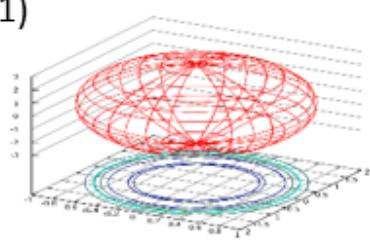

(3)  
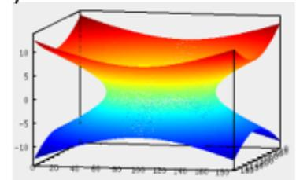

(4)  
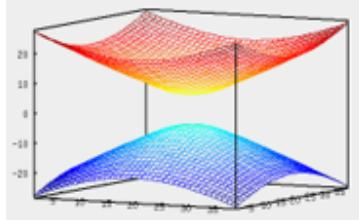

(5)  
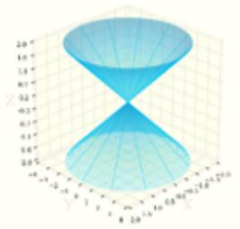

(7)  
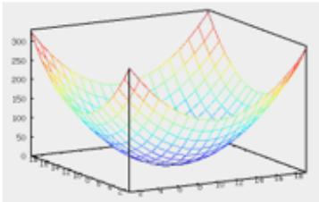

(8)  
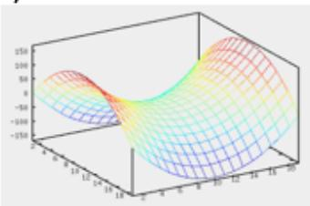

(9)  
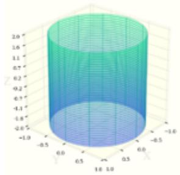

(11)  
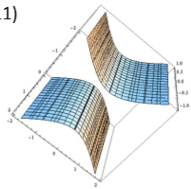

(12)  
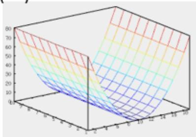

## 5.7 Цилиндрические и конические поверхности. Линей- чатые поверхности. Поверхности вращения.

∙ Цилиндрической поверхностью называется объединение всех параллельных пря- мых, которые пересекают некоторую линию 𝐿, при этом линия 𝐿 называется направ- ляющей цилиндрической поверхности, а прямые, из которых состоит поверхность, на- зываются образующими.

Пусть линия $L$ задается как линия пересечения двух плоскостей, тогда она определена системой двух уравнений

$$
\left\{ { \begin{array} { l } { F _ { 1 } ( x , y , z ) = 0 , } \\ { F _ { 2 } ( x , y , z ) = 0 . } \end{array} } \right.
$$

И пусть образующие цилиндрической поверхности имеют направляющий вектор $a ( a _ { 1 } , a _ { 2 } , a _ { 3 } )$ Точка $M ( x , y , z )$ принадлежит цилиндрической поверхности ⇐⇒ существует точка $M _ { 0 } ( x _ { 0 } , y _ { 0 } , z _ { 0 } )$ такая, что

1. $M _ { 0 } \in L ;$

2. ${ \overline { { M _ { 0 } M } } } \parallel a .$

Тогда получаем систему

$$
\left\{ \begin{array} { l l } { F _ { 1 } ( x _ { 0 } , y _ { 0 } , z _ { 0 } ) = 0 , } \\ { F _ { 2 } ( x _ { 0 } , y _ { 0 } , z _ { 0 } ) = 0 , } \\ { \displaystyle \frac { x - x _ { 0 } } { a _ { 1 } } = \frac { y - y _ { 0 } } { a _ { 2 } } = \frac { z - z _ { 0 } } { a _ { 3 } } . } \end{array} \right.
$$

Исключив из этой системы 𝑥0, 𝑦0 и $z _ { 0 }$ , получим уравнение цилиндрической поверх- ности.

∙ Канонической поверхностью называется объединение всех прямых, которые про- ходят через некоторую точку $P$ и пересекают некоторую линию $L .$ . При этом линия $L$ называется направляющей канонической поверхности, а точка 𝑃 — вершиной кано- нической поверхности.

Пусть точка $P$ имеет координаты $( x _ { 1 } , y _ { 1 } , z _ { 1 } )$ . Точка $M ( x , y , z )$ принадлежит канонической поверхности ⇐⇒ существует точка $M _ { 0 } ( x _ { 0 } , y _ { 0 } , z _ { 0 } )$ такая, что

1. $M _ { 0 } \in L ;$

2. $\overline { { P M } } \parallel \overline { { P M _ { 0 } } }$

Тогда получаем систему

$$
\left\{ \begin{array} { l l } { F _ { 1 } ( x _ { 0 } , y _ { 0 } , z _ { 0 } ) = 0 , } \\ { F _ { 2 } ( x _ { 0 } , y _ { 0 } , z _ { 0 } ) = 0 , } \\ { \displaystyle \frac { x - x _ { 1 } } { x _ { 0 } - x _ { 1 } } = \frac { y - y _ { 1 } } { y _ { 0 } - y _ { 1 } } = \frac { z - z _ { 1 } } { z _ { 0 } - z _ { 1 } } . } \end{array} \right.
$$

Исключив из этой системы $x _ { 0 }$ , 𝑦0 и 𝑧0, получим уравнение канонической повехности.

∙ Поверхность называется линейчатой, если она образована движением прямой. При этом прямые, из которых состоит линейчатая поверхность, называются прямолиней- ными образующими.

Цилиндрическая и каноническая поверхности являются линейчатыми поверхностями.

Среди поверхностей второго порядка прямолинейными образующими обладают однопо- лостный гиперболоид и гиперболический параболоид. Докажем это. Для этого рассмотрим однополостный гиперболоид. Тогда выполняется ${ \frac { x ^ { 2 } } { a ^ { 2 } } } + { \frac { y ^ { 2 } } { b ^ { 2 } } } - { \frac { z ^ { 2 } } { c ^ { 2 } } } = 1$ . Перенесем $\frac { \dot { y } ^ { 2 } } { b ^ { 2 } }$ в правую часть и распишем разность квадратов: $\left( { \frac { x } { a } } - { \frac { z } { c } } \right) \left( { \frac { x } { a } } + { \frac { z } { c } } \right) { \mathit { \Psi } } = \left( 1 - { \frac { y } { b } } \right) \left( 1 + { \frac { y } { b } } \right) { \mathit { \Psi } }$ . Составим систему. При фиксированных 𝑘 эта система определяет прямую. Причем если точка 𝑀 лежит на этой прямой, то она лежит и на однополостном гиперболоиде. Следовательно, все прямые целиком лежат на однополостном гиперболоиде.

$$
\left\{ \begin{array} { l l } { \displaystyle \frac { x } { a } - \frac { z } { c } = \left( 1 - \frac { y } { b } \right) \cdot k , } \\ { \displaystyle \frac { x } { a } + \frac { z } { c } = \left( 1 + \frac { y } { b } \right) \cdot \frac { 1 } { k } ; } \end{array} \right. \quad , k \in \mathbb { R } .\tag{5.7.1}
$$

Покажем обратное. Пусть $M _ { 0 } ( x _ { 0 } , y _ { 0 } , z _ { 0 } )$ — произвольная точка однополостного гиперболо- ида. Тогда $\frac { \bar { x _ { 0 } ^ { 2 } } } { a ^ { 2 } } + \frac { y _ { 0 } ^ { 2 } } { b ^ { 2 } } - \frac { z _ { 0 } ^ { 2 } } { c ^ { 2 } } = 1$ . Найдем $k _ { 0 }$ из уравнений:

$$
\left\{ \begin{array} { l l } { \displaystyle \frac { x _ { 0 } } { a } - \frac { z _ { 0 } } { c } = \left( 1 - \frac { y _ { 0 } } { b } \right) \cdot k , } \\ { \displaystyle \frac { x _ { 0 } } { a } + \frac { z _ { 0 } } { c } = \left( 1 + \frac { y _ { 0 } } { b } \right) \cdot \frac { 1 } { k } . } \end{array} \right.
$$

Следовательно, точка $M _ { 0 }$ лежит на прямой (5.7.1). Аналогично монжо показать, что од- нополостный гиперболоид покрывается еще одним семейством прямых:

$$
\left\{ \begin{array} { l l } { \displaystyle \frac { x } { a } - \frac { z } { c } = \left( 1 + \frac { y } { b } \right) \cdot k , } \\ { \displaystyle } \\ { \displaystyle \frac { x } { a } + \frac { z } { c } = \left( 1 - \frac { y } { b } \right) \cdot \frac { 1 } { k } . } \end{array} \right.
$$

Аналогично можно показать, что гиперболический параболоид также покрыт двумя се- мействами прямолинейных образующих. $\amalg \boldsymbol { \mathrm { \scriptscriptstyle I I } } \boldsymbol { \mathrm { \scriptscriptstyle I I } }$ него выполняется $\frac { x ^ { 2 } } { a ^ { 2 } } - \frac { y ^ { 2 } } { b ^ { 2 } } = 2 z$ . Распишем разность квадратов и получим $\left( { \frac { x } { a } } - { \frac { y } { b } } \right) \left( { \frac { x } { a } } + { \frac { y } { b } } \right) = 2 z$ . Тогда

$$
\left\{ { \begin{array} { l } { \displaystyle { \frac { x } { a } } - { \frac { y } { b } } = 2 k z , } \\ { \displaystyle { \frac { x } { a } } + { \frac { y } { b } } = { \frac { 1 } { k } } ; } \end{array} } \right.
$$

$$
\left\{ { \begin{array} { l } { \displaystyle { \frac { x } { a } } - { \frac { y } { b } } = { \frac { 1 } { k } } , } \\ { \displaystyle { \frac { x } { a } } + { \frac { y } { b } } = 2 k z ; } \end{array} } \right.
$$

∙ Поверхностью вращения линии $L$ вокруг прямой $\Delta$ называется объединение окруж- ностей, которые

1. пересекают линию $L ;$

2. имеют центры на прямой $\Delta ;$

3. лежат в плоскости, перпендикулярной $\Delta .$

Рассмотрим поверхность вращения линии 𝐿 такой, что $\left\{ { \begin{array} { l } { F _ { 1 } ( x , y , z ) = 0 , } \\ { F _ { 2 } ( x , y , z ) = 0 ; } \end{array} } \right.$ вокруг прямой ∆ такой, что ${ \frac { x - x _ { 1 } } { a _ { 1 } } } = { \frac { y - y _ { 1 } } { a _ { 2 } } } = { \frac { z - z _ { 1 } } { a _ { 3 } } }$ . Точка 𝑀 принадлежит поверхности вращения $\Longleftrightarrow$ существует точка $M _ { 0 } ( x _ { 0 } , \bar { y _ { 0 } } , z _ { 0 } )$ такая, что

1. $M _ { 0 } \in L ;$

2. $\overrightarrow { M _ { 0 } M } \perp a ( a _ { 1 } , a _ { 2 } , a _ { 3 } )$ ;

3. $\mathsf { \rho } ( M _ { 0 } , \Delta ) = \mathsf { \rho } \mathsf { ( } M , \Delta )$

Тогда получаем систему

$$
\left\{ \begin{array} { l l } { F _ { 1 } ( x _ { 0 } , y _ { 0 } , z _ { 0 } ) = 0 , } \\ { F _ { 2 } ( x _ { 0 } , y _ { 0 } , z _ { 0 } ) = 0 , } \\ { a _ { 1 } \cdot ( x - x _ { 0 } ) + a _ { 2 } \cdot ( y - y _ { 0 } ) + a _ { 3 } \cdot ( z - z _ { 0 } ) = 0 , } \\ { \rho ( M _ { 0 } , \Delta ) = \rho ( M , \Delta ) . } \end{array} \right.
$$

Исключив из этой системы 𝑥0, 𝑦0 и 𝑧0, получим уравнение поверхности вращения.