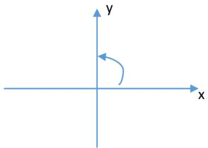
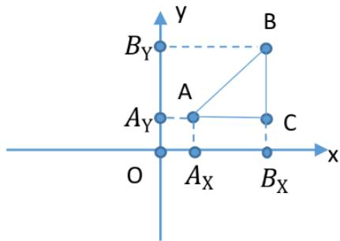
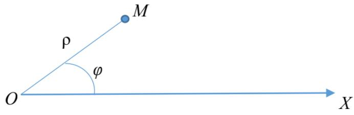
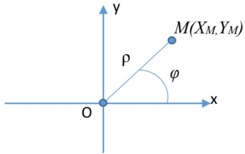
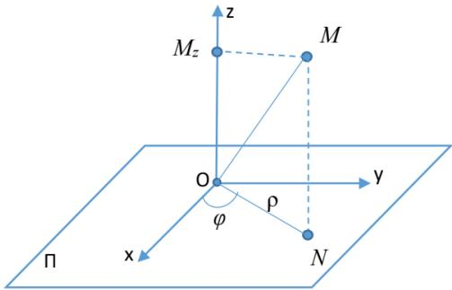
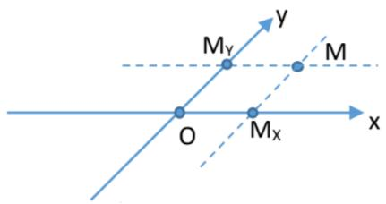
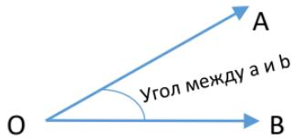
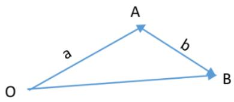

## Глава 1

## Метод координат

## 1.1 Величина направленного отрезка. Теорема Шаля. Декартова система координат на прямой.

∙ Отрезком называется часть прямой, ограниченная двумя точками. Отрезок назы- вается направленным, если указано, какая из граничных точек является начальной и какая конечной (Обозначения: 𝐴𝐵 – направленный отрезок; $| \overline { { A B } } | ~ - ~ \partial \lambda u \varkappa a$ направленного отрезка).

∙ Отрезок называется нулевым, если его начальная и конечная точки совпадают.

Длина нулевого направленного отрезка равна нулю.

∙ Прямая линия с указанным на ней направлением называется осью.

∙ Пусть дана некоторая ось $\Delta ,$ и на ней расположен направленный отрезок $\overline { { A B } }$ , ве- личиной которого на оси $\Delta$ называется число, равное:

$$
A B = \left\{ { \begin{array} { l l } { { \displaystyle | { \overline { { A } } } { \overline { { B } } } | , \ { \overline { { A } } } { \overline { { B } } } \uparrow \uparrow \Delta , } } \\ { { - | { \overline { { A } } } { \overline { { B } } } | , \ { \overline { { A } } } { \overline { { B } } } \uparrow \downarrow \Delta ; } } \end{array} } \right.
$$

Свойства величины направленного отрезка:

1. Величина 𝐴𝐵 противоположна величине 𝐵𝐴.

2. Длина $| { \overline { { A B } } } |$ равна модулю величин 𝐴𝐵.

Теорема Шаля. При любом расположении трех точек $A _ { i }$ , 𝐵 и $C$ на оси справедливо равенство $A B + B C = A C$

1. Пусть точка 𝐵 лежит между точками 𝐴 и $C ,$ тогда направленные отрезки ${ \overline { { A B } } } , { \overline { { B C } } }$ и $\overline { { A C } }$ сонаправлены. При этом $| { \overline { { A B } } } | + | { \overline { { B C } } } | = | { \overline { { A C } } } |$

(a) Если направляющие оси совпадают с направлениями отрезков, то $| { \overline { { A B } } } | = A B , | { \overline { { B C } } } | =$ $B C , \ | { \overline { { A C } } } | = A C$ . Следовательно, $A B + B C = A C$

(b) Если направляющие оси не совпадают с направлениями отрезков, то $| { \overline { { A B } } } | =$ $- A B , \ | \overline { { B C } } | = - B C , \ | \overline { { A C } } | = - A C$ . Следовательно, $- A B + - B C = - A C \Rightarrow$ $A B + B C = A C$

2. Если точка $C$ лежит между точками 𝐴 и $B ,$ то, по доказанному выше, $A C + C B =$ $A B \Rightarrow A C = A B - C B = A B + B C .$

3. Если точка 𝐴 лежит между точками 𝐵 и 𝐶, то $B A + A C = B C \Rightarrow A C = - B A + B C =$ $A B + B C$

Теорема остается справедливой, даже если некоторые точки совпадают.

Пусть на прямой $\Delta$ дана точка 𝑂, заданы единица масштаба и определенное направление.

∙ Говорят, что на прямой $\Delta$ задана декартовая система координат. При этом ось $\Delta$ называется координатной осью, а точка 𝑂 – началом координат.

Пусть точка 𝐴 — некоторая фиксированная точка на прямой $\Delta$

∙ Координатой точки 𝐴 называется число, равное величине 𝑂𝐴 направленного от- резка 𝑂𝐴. Обозначение: $X _ { A }$

Точки, расположенные по одну сторону от начала координат, имеют одинаковые по знаку координаты. Полуось, на которой все точки имеют положительные координаты, называют положительной полуосью. Аналогично с отрицательной полуосью.

Теорема. Для любых двух точек 𝐴 и 𝐵 на ∆ выполняется: $A B = X _ { B } - X _ { A } , | { \overline { { A B } } } | =$ $| X _ { B } - X _ { A } |$

♦ Рассмотрим величину направленного отрезка 𝐴𝐵. Тогда, по теореме Шаля, $A B =$ $A O + O B = O B - O A = X _ { B } - X _ { A }$ ⊠

Пусть на оси $\Delta$ заданы 2 различные точки: $A \mathrm { ~ c ~ }$ координатой $X _ { A }$ и 𝐵 с координатой $X _ { B }$

∙ Говорят, что точка 𝐶 делит направленный отрезок 𝐴𝐵 в отношении λ, если $\lambda = { \frac { A C } { C B } }$ При этом число λ называется простым отношением трех точек $A , C , B$

1. Если точка 𝐶 лежит между точками 𝐴 и 𝐵, то направляющие отрезки 𝐴𝐶 и 𝐶𝐵 сонаправлены. Следовательно, знак у них одинаковый и $\lambda > 0$ . При этом говорят, что точка $C$ делит направленный отрезок 𝐴𝐵 внутренним образом.

2. Если точка 𝐶 лежит вне отрезка 𝐴𝐵, то говорят, что она делит отрезок 𝐴𝐵 внешним образом. При этом отрезки 𝐴𝐶 и 𝐶𝐵 противоположно направлены (не сонаправлены) и, следовательно, $\lambda < 0$

3. Если $\lambda = 0 .$ , то $A C = 0$ , следовательно, $| { \overline { { A C } } } | = 0$ и точки 𝐴 и 𝐶 совпадают.

4. Если точка 𝐶 лежит за концом отрезка 𝐴𝐵, $\mathrm { \mathop { T o } } \left| { \frac { A C } { C B } } \right| = { \frac { | A C | } { | C B | } } = { \frac { | { \overline { { A C } } } | } { | { \overline { { C B } } } | } } < 1 \Rightarrow \lambda <$ $- 1 \ ( | \overline { { A C } } | > | \overline { { B C } } | )$

5. Если точка 𝐶 лежит перед началом отрезка 𝐴𝐵, то $| { \overline { { A C } } } | < | { \overline { { B C } } } |$ , тогда $- 1 < \lambda < 0$ Заметим, что $\lambda \neq - 1$ , так как в этом случае $\textstyle - 1 = { \frac { A C } { C B } }$ . Следовательно, $A C = - C B \Rightarrow$ $A C = C B \Rightarrow A$ и 𝐵 совпадают, что противоречит выбору 𝐴 и 𝐵.

Теорема. Координата точки $C _ { i }$ делящей направленный отрезок 𝐴𝐵 в отношении λ рав- на

$$
X _ { C } = \frac { X _ { A } + \lambda X _ { B } } { 1 + \lambda }
$$

♦ Из определения деления отрезка в данном отношении следует:

$$
\begin{array} { r l r } {  { \lambda = \frac { A C } { C B } = \frac { X _ { C } - X _ { A } } { X _ { B } - X _ { C } } \Rightarrow \big ( X _ { B } - X _ { C } \big ) \cdot \lambda = X _ { C } - X _ { A } \Rightarrow \lambda X _ { B } + X _ { A } = X _ { C } + \lambda X _ { C } = X _ { C } ( 1 + \lambda ) \Rightarrow } } \\ & { X _ { C } = \frac { X _ { A } + \lambda X _ { B } } { 1 + \lambda } } & { \infty } \end{array}
$$

## 1.2 Декартова прямоугольная система координат на плос- кости, в пространстве (ДПСК).

∙ Декартовой прямоугольной системой координат на плоскости называются две взаимно перпендикулярные координатные оси с общим началом координат. Ось 𝑂𝑥 называется осью абсцисс, 𝑂𝑦 — осью ординат.

∙ Система координат называется правой, если кратчайший поворот от оси 𝑋 к оси 𝑌 против часовой стрелки, иначе левой.

  
Правая ДПСК

  
Левая ДПСК

Пусть 𝑀 — некоторая точка плоскости, $M _ { x }$ и $M _ { y }$ — проекции на оси 𝑂𝑥 и $O y$ соответ- ственно.

∙ Декартовыми прямоугольными координатами точки $M ( X _ { M } , Y _ { M } )$ называются величины направленных отрезков $\overline { { O M _ { x } } } \ u \overline { { O M _ { y } } }$ на координатных осях, то есть $X _ { M } =$ $O M _ { x } , \ Y _ { M } = O M _ { y }$

Пусть $A ( X _ { A } , Y _ { A } )$ и $B ( X _ { B } , Y _ { B } )$ — две различные точки на плоскости.

Теорема. Длина направленного отрезка $\overline { { A B } }$ равна:

$$
| \overline { { { A B } } } | = \sqrt { ( X _ { A } - X _ { B } ) ^ { 2 } + ( Y _ { A } - Y _ { B } ) ^ { 2 } }
$$

♦ Построим проекции точек 𝐴 и 𝐵 на координатные оси. Обозначим через 𝐶 точку пере- сечения проекций.

По теореме Пифагора $| A B | ^ { 2 } = | A C | ^ { 2 } + | B C | ^ { 2 }$ . Тогда $| \overline { { A B } } | = \sqrt { | \overline { { A _ { x } B _ { x } } } | ^ { 2 } + | \overline { { A _ { y } B _ { y } } } | ^ { 2 } } =$ $= { \sqrt { ( X _ { A } - X _ { B } ) ^ { 2 } + ( Y _ { A } - Y _ { B } ) ^ { 2 } } } .$

Рассмотрим случай, когда отрезок $A B$ параллелен 𝑂𝑥 (или 𝐴𝐵 параллелен $O y )$ . Тогда $Y _ { A } = Y _ { B } \textrm { n } \sqrt { ( X _ { A } - X _ { B } ) ^ { 2 } + \underbrace { ( Y _ { A } - Y _ { B } ) ^ { 2 } } _ { = 0 } } = | X _ { A } - X _ { B } | = | \overline { { A B } } | = | \overline { { A _ { x } B _ { x } } } | .$ ⊠

Проведем через точки 𝐴 и 𝐵 некоторую ось. Тогда имеет смысл понятие «деление от- резка в данном отношении».

Теорема. Координаты точки $C _ { i }$ , делящей $\overline { { A B } }$ в отношении λ, равны:

$$
X _ { C } = \frac { X _ { A } + \lambda X _ { B } } { 1 + \lambda } , ~ Y _ { C } = \frac { Y _ { A } + \lambda Y _ { B } } { 1 + \lambda }
$$

♦ Построим проекции точек 𝐴, 𝐵 и $C$ на ось $O x$ . Заметим, что при любом расположении точки $C$ точка $C _ { x }$ будет иметь такой же характер расположения, как и точка 𝐶 (если 𝐶 лежит между 𝐴 и $B _ { ; }$ , то и $C _ { x }$ будет лежать между $A _ { x }$ и $B _ { x } )$ . Следовательно, $\frac { | \overline { { A C } } | } { | \overline { { C B } } | } \sp { \frac { 1 } { A _ { x } C _ { x } } } \frac { \overline { { A _ { x } C _ { x } } } } { \overline { { C _ { x } B _ { x } } } }$ имеют один знак.

По теореме Фалеса длина ${ \frac { | { \overline { { A _ { x } C _ { x } } } } | } { | { \overline { { C _ { x } B _ { x } } } } | } } = { \frac { | { \overline { { A C } } } | } { | { \overline { { C B } } } | } } \Rightarrow \left| { \frac { A _ { x } C _ { x } } { C _ { x } B _ { x } } } \right| = \left| { \frac { A C } { C B } } \right|$ . Следовательно, $\frac { A _ { x } C _ { x } } { C _ { x } B _ { x } } =$ ${ \frac { A C } { C B } } = \lambda$ и точка $C _ { x }$ делит направленный отрезок $\overline { { A _ { x } B _ { x } } }$ также в отношении λ. Следова- тельно, $X _ { C } = \frac { X _ { A } + \lambda X _ { B } } { 1 + \lambda }$

Для ординаты точки 𝐶 равенство доказывается аналогично при рассмотрении случая, $C$ когда прямая 𝐴𝐵 параллельна одной из осей. ⊠

∙ ДПСК в пространстве образуют три взаимно перпендикулярные координатные оси с общим началом координат. Треться ось $O z$ называется осью аппликатой.

∙ Система координат называется правой, если, глядя со стороны направления $O z$ , крат- чайший поворот от оси 𝑂𝑥 к оси 𝑂𝑦 осуществляется против часовой стрелки, иначе — левой.

Пусть $A ( X _ { A } , Y _ { A } , Z _ { A } )$ и $B ( X _ { B } , Y _ { B } , Z _ { B } )$ — две различные точки пространства. Тогда

$$
1 . \ | { \overline { { A B } } } | = { \sqrt { ( X _ { A } - X _ { B } ) ^ { 2 } + ( Y _ { A } - Y _ { B } ) ^ { 2 } + ( Z _ { A } - Z _ { B } ) ^ { 2 } } }
$$

2. Если 𝐶 делит 𝐴𝐵 в отношении $\lambda _ { i }$ то

$$
X _ { C } = \frac { X _ { A } + \lambda X _ { B } } { 1 + \lambda } , Y _ { C } = \frac { Y _ { A } + \lambda Y _ { B } } { 1 + \lambda } , Z _ { C } = \frac { Z _ { A } + \lambda Z _ { B } } { 1 + \lambda } .
$$

## 1.3 Полярные, цилиндрические и сферические коорди- наты. Общая декартова система координат.

∙ Полярную систему координат образуют точка, выходящий из неё луч и единичный отрезок. При этом точка 𝑂 называется полюсом, а луч $O x \mathrm { ~ - ~ }$ полярной осью.

Пусть 𝑀 — произвольная точка плоскости.

∙ Полярными координатами точки 𝑀 называются два числа $\rho , \varphi ,$ где $\rho \mathrm { ~ - ~ } \partial \mathscr { n } u \cdot$ на 𝑂𝑀 $( \rho = | \overline { { O M } } | )$ , а угол φ равен углу, на который необходимо повернуть полярную ось вокруг точки 𝑂 против часовой стрелки до совмещения ее с отрезком 𝑂𝑀.

∙ Число ρ называется полярным радиусом точки. Число φ — полярным углом точ- ки.

Заметим, что $\rho \geqslant 0$ , а φ определён с точностью до $2 \pi k .$ , где $k \in \mathbb { Z }$ . Точка $O$ имеет $\rho = 0 .$ , а φ для неё не определён (ему можно приписать любое направление).

Значение $\varphi ,$ принадлежащее $[ 0 ; 2 \pi )$ , называется главным значением $\boldsymbol { \varphi }$ Полярной осью называют точку и выходящий из неё луч.

Покажем связь между декартовой и полярной системами координат.

Расположим ДПСК и ПСК следующим образом: полюс поместим в начало координат, а полярную ось совместим с положительной полуосью $O x$ . Расположенные таким образом ДПСК и ПСК называют соответствующими друг другу.

Пусть 𝑀 произвольная точка плоскости. Тогда полярные координаты точки 𝑀 равны: $X _ { M } = O M _ { x } = \left| O M \right| \cdot \cos \varphi = \rho \cdot \cos \varphi .$

$Y _ { M } = O M _ { y } = | O M | \cdot \sin \varphi = \rho \cdot \sin \varphi$ , где $\rho = \sqrt { X _ { M } ^ { 2 } + Y _ { M } ^ { 2 } }$ , а угол φ можно найти, решив $\Bigg ( \cos { \varphi } = \frac { X _ { M } } { \rho } = \frac { X _ { M } } { \sqrt { X _ { M } ^ { 2 } + Y _ { M } ^ { 2 } } } ,$   
следующую систему:⎨ $\sin \varphi = \frac { Y _ { M } } { \rho } = \frac { Y _ { M } } { \sqrt { X _ { M } ^ { 2 } + Y _ { M } ^ { 2 } } } ;$

Цилиндрическая и сферическая системы координат в пространстве вводятся следующим образом: в пространстве зафиксируем некоторую плоскость П. Построим на ней полярную систему координат, а так же координатную ось $O z { \mathrm { ~ c ~ } }$ началом в точке $O$ и перпендикуляр- ную плоскости П.

И пусть точка $M$ — произвольная точка пространства, а точка $N - \mathrm { e } \ddot { \mathrm { e } }$ проекция на плос- кость П.

∙ Цилиндрическими координатами точки 𝑀 называются числа $\boldsymbol \rho , \boldsymbol \varphi , z ,$ где ρ и φ — полярные координаты точки 𝑁 относительно построенной полярной системы коор- динат, а 𝑧 — величина направленного отрезка 𝑂𝑀𝑧 $( z = O M _ { z } )$

∙ Сферическими координатами точки 𝑀 называются три числа $\rho , \varphi , \Theta$ , где $\rho \textrm { -- }$ длина отрезка |𝑂𝑀|, φ — полярный радиус точки 𝑁 относительно построенной поляр- ной системы координат, а Θ — угол между направленным отрезком $\overline { { O M } }$ и осью $O z$

Из определений следует, что $\rho \geqslant \mathrm { ~ 0 ~ }$ и для цилиндрических, и для сферических коорди- нат, $\Theta \in [ 0 ; \pi ]$ , а φ определён с точностью до 2𝜋𝑛, $n \in \mathbb { Z }$

Построим в пространстве ДПСК следующим образом: начало координат совпадает с точ- кой $O ,$ ось $O z$ совместим с построенной ранее осью $O z$ , а положительное направление оси $O x - \mathrm { c }$ полярной осью.

Тогда точка 𝑀 имеет следующие координаты в системах:

цилиндрическая: $\left\{ \begin{array} { l l } { X _ { M } = \rho \cdot \\cos { \varphi } . } \\ { Y _ { M } = \rho \cdot \sin { \varphi } , } \\ { Z _ { M } = z ; } \end{array} \right.$ сферическая: $\left\{ \begin{array} { l l } { X _ { M } = \rho \cdot \cos \varphi \cdot \sin \theta , } \\ { Y _ { M } = \rho \cdot \sin \varphi \cdot \sin \theta , } \\ { Z _ { M } = \rho \cdot \cos \theta . } \end{array} \right.$

∙ Общую декартову систему координат (аффинную систему координат) на плоскости образуют две пересекающие координатные оси с общим началом координат.

Пусть точка 𝑀 — произвольная точка плоскости. Построим через точку 𝑀 прямые, па- раллельные координатным осям.

∙ Общими декартовыми координатами точки 𝑀 называются величины направ- ленных отрезков $\overline { { O M _ { x } } }$ и $\overline { { O M _ { y } } }$

## Глава 2

## Векторы

## 2.1 Понятие вектора. Линейные операции $\mathbf { H a } \mathbf { \varDelta }$ вектора- ми.

∙ Вектором называется множество всех одинаково направленных отрезков равной дли- ны. Обозначение: $a , b , c \ u a u \ a , \vec { b } , \vec { c } .$

Пусть $\overline { { A B } }$ — направленный отрезок. Тогда существует единственный вектор, которому принадлежит этот отрезок. То есть любой направленный отрезок $\overline { { A B } }$ однозначно опреде- ляет вектор, который обозначается как $\overrightarrow { A B }$

Пусть заданы вектор $\vec { a }$ и некоторая точка 𝐴. Тогда существует единственная точка $B _ { : }$ такая, что $a = { \overrightarrow { A B } }$

∙ Операция построения такой точки 𝐵 называется откладыванием вектора $\vec { a }$ от точки 𝐴.

∙ Длиной вектора ⃗𝑎 называется длина любого из направленных отрезков среди его образующих. Обозначение: |⃗𝑎|.

∙ Вектор длины 0 называется нулевым. Обозначение: ${ \vec { 0 } } .$ Вектор длины 1 называет- ся единичным или ортом.

∙ Векторы называются коллинеарными, если образующие их отрезки параллельны неко- торой прямой.

∙ Векторы называются компланарными, если образующие их отрезки параллельны некоторой плоскости.

Заметим, что нулевой вектор и коллинеарен любому вектору, и компланарен любым двум другим векторам.

Пусть 𝑎 и $b - 2$ ненулевых вектора, отложенных от некоторой точки 𝑂. То есть най- дём такие точки 𝐴, и 𝐵, что $a = \overrightarrow { O A } , b = \overrightarrow { O B }$

∙ Углом между векторами 𝑎 и 𝑏 называертся угол между направленными отрез- ками $\overline { { O A } } \ u \overline { { O B } }$

Из определения следует, что угол между двумя векторами $\in [ 0 ; \pi ]$

Линейные операции над векторами:

• сложение;

• умножение на число.

Пусть 𝑎 и $b - \mathbb { \pi } \mathrm { { B a } }$ вектора. Возьмем некоторую точку $O$ и отложим от нее вектор $a = { \overrightarrow { O A } }$ Затем от точки 𝐴 отложим вектор $b = \overrightarrow { A B }$

∙ Суммой векторов 𝑎 и 𝑏 будет называться вектор $\overrightarrow { O B }$ . Обозначение: $a + b$

∙ Произведением вектора 𝑎 на действительное число 𝐴 называется вектор, длина которого равна $| A | \cdot | a |$ , а направление совпадает с направлением вектора $a _ { i }$ , если $A > 0$ и противоположно направлению вектора $^ { a , }$ если $A < 0$ . Обозначение: $A \cdot a$

Свойства линейных операций:

1. $a + b = b + a .$

♦ Пусть $a = { \overrightarrow { O A } } , \ b = { \overrightarrow { A B } }$ . На направленных отрезках $\overline { { O A } }$ и $\overline { { A B } }$ построим паралле- лограмм $O A B C$

Заметим, что векторы $\overrightarrow { C B }$ и $\overrightarrow { O A }$ сонаправлены и $| { \overline { { C B } } } | = { \underline { { | } } } { \overline { { O A } } } |$ . Следовательно, ${ \overrightarrow { C B } } = { \overrightarrow { O A } } = a$ . Путем аналогичных рассуждений получим $\overrightarrow { O C } = \overrightarrow { A B } = b$

По определению суммы векторов, вектор $\overrightarrow { O B }$ можно, с одной стороны, рассматривать как сумму векторов ${ \overrightarrow { O A } } + { \overrightarrow { A B } }$ , а с другой стороны, как сумму ${ \overrightarrow { O C } } + { \overrightarrow { C B } }$ . Следова-

тельно, $\overrightarrow { O B } = \left\{ \overrightarrow { O A } + \overrightarrow { A B } = a + b , \right.  \\  \overrightarrow { O C } + \overrightarrow { C B } = \overrightarrow { A B } + \overrightarrow { O A } = b + a ;$ $\Rightarrow a + b = b + a .$

2. $( a + b ) + c = a + ( b + c )$

3. $\vec { a } + \vec { 0 } = \vec { a } , \quad \forall \vec { a } .$

4. $\alpha ( a + b ) = \alpha a + \alpha b ,$

$$
( \alpha + \beta ) a = \alpha a + \beta a ,
$$

$$
\alpha ( \beta a ) = ( \alpha \beta ) a , \mathrm { { r } \mathrm { { J } \mathrm { { r } \it { ~ a } , \ b - \delta \mathrm { { e } \mathrm { { K } \mathrm { { r } \mathrm { { o p } \mathrm { { b } \mathrm { { I } , \ \ \alpha \alpha \beta } \alpha \beta - \mathrm { { q \mathrm { _ { H C } \mathrm { { J } \mathrm { { a } . } } } } } } } } } } } } }
$$

∙ Вектор 𝑏 называется противоположным вектору 𝑎, если его длина совпадает с дли- ной вектора 𝑎, а направление противоположно.

Из определения следует, что

1. −1 · 𝑎 = −𝑎, где вектор (−𝑎) — противоположный вектору 𝑎;

2. $1 \cdot a = a .$

∙ Разностью векторов 𝑎 и 𝑏 называется вектор, прибавив который к вектору 𝑏, по- лучим вектор 𝑎, то есть вектор $c = a - b $ , где $c + b = a$

Правило вычитания: Чтобы из вектора 𝑎 вычесть вектор 𝑏, необходимо к вектору 𝑎 прибавить вектор, противоположный вектору 𝑏, то есть $a - b = a + ( - b )$

$$
\bullet \ ( a + ( - b ) ) + b = a + ( b + ( - b ) ) = a + { \vec { 0 } } = a .
$$

## 2.2 Координаты вектора.

Пусть $a _ { 1 } , \ldots , a _ { k }$ — произвольная система векторов. $\alpha _ { 1 } , \ldots , \alpha _ { k } \mathrm { ~ - ~ }$ некоторые действитель- ные числа.

∙ Вектор $\alpha _ { 1 } a _ { 1 } + \ldots + \alpha _ { k } a _ { k }$ называется линейной комбинацией векторов $a _ { 1 } , \ldots , a _ { k } \ c \ \kappa o { \scriptscriptstyle \partial } \phi -$ фициентами $\alpha _ { 1 } , \ldots , \alpha _ { k }$

Если вектор представлен в виде линейной комбинации системы векторов (то есть 𝑏 = $\alpha _ { 1 } a _ { 1 } + \ldots + \alpha _ { k } a _ { k } )$ , то говорят, что данный вектор разложим по этим векторам системы.

∙ Базисом на прямой называется любой ненулевой вектор, параллельный этой пря- мой.

∙ Базисом на плоскости называется упорядоченная пара неколлинеарных векторов.

∙ Базисом в пространстве называется упорядоченная тройка некомпланарных век- торов.

Нулевой вектор не может быть элементом базиса.

## Теорема.

1. Любой вектор, параллельный прямой, может быть единственным образом разло- жен по базису этой прямой.

2. Любой вектор, параллельный плоскости, может быть единственным образом раз- ложен по базису на этой плоскости.

3. Любой вектор в пространстве может быть единственным образом по базису в пространстве.